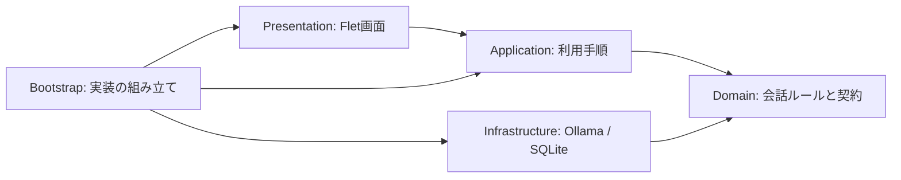
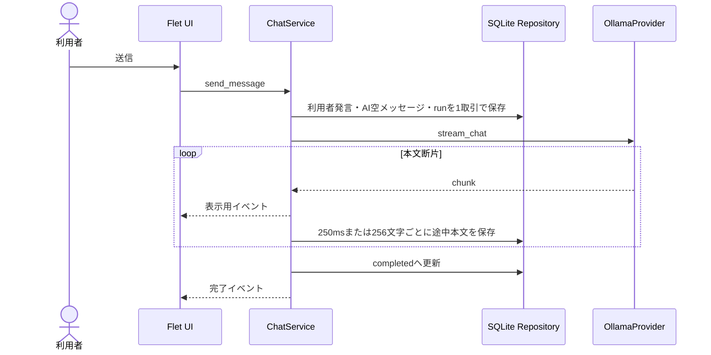

# LocalLLM マルチキャラクターチャット 初版設計書

この文書は、アプリ初版のスコープ、責務、用語、状態、データ構造、ファイル構成の正本とする。データの外部送信と承認境界は [ARCHITECTURE.md](ARCHITECTURE.md) を正本とする。

## 1. 問題

ローカルLLMを日常的に使うとき、会話、キャラクター設定、モデル設定、過去の履歴が別々に管理されると、同じ状態を再現しにくい。過去の発言を直したい場合も、元の会話を失わずに別の回答を試せる場所が必要である。

実在性は未確認: 利用頻度、現在使っている代替手段、履歴消失による具体的な被害はまだ計測していない。初版を本人が試用し、継続利用するかで問題の強さを検証する。

## 2. ゴールと成功基準

Windows PC上で外部ブラウザを起動せず、Ollamaのローカルモデルとキャラクターを1人選んで会話できるデスクトップアプリを作る。会話と設定はPC内に保存し、後からRAG、Web検索、複数キャラクター会話を追加できる境界を持たせる。初版は追加課金ゼロを固定条件とし、有料機能へ切り替える設定を持たない。

| ID | 成功基準 | 判定者 | 判定時期 |
|---|---|---|---|
| AC-01 | 外部ブラウザを起動せず、Fletのデスクトップウィンドウだけで起動できる | 利用者 | 初版受入時 |
| AC-02 | Ollamaで選択したモデルへ送信し、到着した本文を逐次表示できる | 利用者 | 初版受入時 |
| AC-03 | 応答中も会話の移動と停止操作を受け付け、画面が固まらない | 利用者 | 初版受入時 |
| AC-04 | アプリを再起動しても、会話、選択中のキャラクター、モデル設定を復元できる | 利用者 | 初版受入時 |
| AC-05 | 過去の利用者発言を書き直すと、元の続きが残ったまま新しい続きへ切り替わる | 利用者 | 初版受入時 |
| AC-06 | Ollama停止、モデル不在、DB書込み失敗を区別し、操作可能な案内を画面に表示する | 利用者 | 異常系試験時 |
| AC-07 | 会話本文とプロンプトがPC外へ送信されない | 利用者 | 通信確認時 |
| AC-08 | Pythonの型検査、単体試験、SQLite結合試験が成功する | 開発者 | 各段階の完了時 |
| AC-09 | 有料APIや有料サービスを設定せず、全機能を利用できる | 利用者 | 初版受入時 |
| AC-10 | Ollama Cloudを無効化していない環境、クラウドモデル、APIキー、費用不明Providerへの要求を送信前に拒否する | 利用者 | 無料運営試験時 |
| AC-11 | チャット時にアプリが直接開始する通信先が、登録したループバックまたはプライベートLAN内Ollamaだけであることを確認できる | 利用者 | 通信監査時 |

性能目標は仮置きとする。UIへのチャンク反映は、Ollamaから受信後250ms以内を目標とする。モデルの生成開始時間そのものは、モデルとPC性能に依存するため合否対象にしない。

## 3. やらないこと (Out of Scope)

### 初版ではやらない

- 複数キャラクターの自動会話
- ChromaDB等によるRAGと文書登録
- Web検索と外部サービスへの接続
- LLM回答本文のキャッシュ
- 自動要約、定期処理、自律操作
- クラウド同期、アカウント、複数PC同期
- Ollama Cloud、Ollama Web Search、クラウドモデル、有料・無料枠付きAPI
- APIキー、クレジットカード、請求先を登録する画面
- 会話の恒久削除。初版はアーカイブと復元だけを提供する
- Ollama以外の実動Provider。交換用の契約とテスト用Fakeだけを用意する

### 恒久的に避ける

- 承認なしの外部投稿、外部削除、課金
- 初版内で無料運営ガードを解除する設定
- 会話本文、RAG資料、プロンプトの無断外部送信
- UIからSQLite、HTTPクライアントを直接操作する実装

## 4. 代替案

| 案 | 概要 | 却下/採用理由 |
|---|---|---|
| 何もしない | OllamaのCLIや既存UIをそのまま使う | 開発費はないが、キャラクター設定と履歴分岐を一体管理する目的を検証できないため不採用 |
| 単一ファイルで試作 | Flet、Ollama通信、SQLiteを1ファイルに置く | 最短で画面は出るが、履歴分岐と将来Providerの追加時に変更範囲を限定できないため不採用 |
| 最小のレイヤー分離 | UI、利用手順、中心ルール、外部接続を分け、外部接続だけ交換可能にする | 初版の理解可能性を保ちながら、OllamaとSQLiteをテスト用実装へ差し替えられるため採用 |
| 全機能をプラグイン化 | RAG、検索、キュー、キャッシュを初版から動的プラグインとして実装する | 未検証の変更点まで抽象化し、初版の故障箇所と依存ライブラリを増やすため不採用 |

採用案への最も強い反論は、初版に対してファイル数が多く、単一ファイルより起動まで時間がかかることである。対策として、交換可能にするのはLLM、保存、将来の検索など外部境界だけとし、画面部品やServiceごとに不要な抽象クラスを作らない。初回の縦切り実装が1営業日を超える場合は分割粒度を見直す。

## 5. 採用する設計

### 5.1 用語と状態の正本

この節をアプリ内の列挙値の正本とする。

| 用語 | 意味 |
|---|---|
| conversation | 画面左側に並ぶ会話のまとまり |
| branch | ある発言から分かれた「別の続き」 |
| message | 利用者またはAIの1発言。UUIDで識別する |
| run | 1回のモデル実行。使用モデル、開始・終了、失敗を記録する |
| character version | その会話で使ったキャラクター設定の変更不可スナップショット |
| Provider | Ollama等、アプリ外部の機能を同じ呼び方で扱う差し込み口 |
| 追加課金ゼロ | 導入費、ソフト利用料、月額費、API従量課金、クラウドサーバー費が0円。既存PC、電気、通常の回線、現在利用中の開発支援環境は含めない |

| 状態 | 値 | 意味 |
|---|---|---|
| MessageState | `pending` | AI発言の保存枠はあるが、本文をまだ受信していない |
| MessageState | `streaming` | 本文を逐次受信している |
| MessageState | `completed` | 正常終了した |
| MessageState | `cancelled` | 利用者が停止した。受信済み本文は残す |
| MessageState | `failed` | 接続等で失敗した。受信済み本文は残す |
| RunState | `pending`, `running`, `completed`, `cancelled`, `failed` | モデル実行の状態 |
| MessageRole | `user`, `assistant` | 初版で保存する発言者。`system`はキャラクター版として別に保存する |
| CostMode | `strict_free` | 初版唯一の費用モード。実行時に変更できない |

### 5.2 依存方向



- `domain` はFlet、httpx、SQLiteを知らない。
- `application` は会話開始、停止、書き直し、復元の順序を管理する。
- `infrastructure` はDomainが定めた契約をOllamaとSQLiteで実現する。
- `presentation` は表示と利用者イベントの受け渡しだけを担当する。
- `bootstrap` だけが具体的な実装を選び、依存を組み立てる。

### 5.3 初版のファイル構成

```text
app/
  pyproject.toml
  src/
    main.py
    local_llm_chat/
      __init__.py
      bootstrap.py
      domain/
        __init__.py
        models.py
        states.py
        errors.py
        policies/
          __init__.py
          free_operation.py
        ports/
          __init__.py
          llm_provider.py
          repositories.py
      application/
        __init__.py
        dto.py
        services/
          __init__.py
          chat_service.py
          conversation_service.py
          profile_service.py
      infrastructure/
        __init__.py
        llm/
          __init__.py
          ollama_provider.py
        persistence/
          __init__.py
          sqlite_connection.py
          sqlite_repositories.py
          migrations/
            0001_initial.sql
        settings.py
      presentation/
        __init__.py
        flet_app.py
        controllers/
          __init__.py
          chat_controller.py
        views/
          __init__.py
          chat_view.py
          settings_view.py
        components/
          __init__.py
          conversation_sidebar.py
          message_bubble.py
          inspector_panel.py
          toast_presenter.py
  tests/
    unit/
      test_chat_service.py
      test_conversation_branching.py
      test_free_operation_policy.py
    integration/
      test_sqlite_repositories.py
      test_ollama_provider.py
    smoke/
      test_app_startup.py
```

`pyproject.toml` の実行依存は初版では `flet` と `httpx` に絞る。SQLite、UUID、JSONにはPython標準機能を使う。Ollama専用Pythonパッケージは使わず、公開されているローカルHTTP APIを `httpx` で呼ぶ。これにより通信の逐次処理とエラー変換を1か所で管理する。

Flet公式の現在の配布仕様に合わせ、Pythonは `>=3.12,<3.13` に固定する。開発時と配布物で同じ系列を使い、Python差による不具合を避ける。

### 5.4 中心となる契約

`LLMProvider` は次の責務だけを持つ。

- 接続状態を確認する
- 利用可能なモデル一覧を返す
- 会話要求を受け、本文断片を非同期に返す
- 停止要求に応じて通信を閉じる

接続先は `http://127.0.0.1:11434` と、利用者が登録したRFC 1918プライベートIPv4のOllamaに限定し、任意の外部URLは受け付けない。接続先とモデルは会話単位で保存する。Ollamaの `/api/chat` が返す改行区切りJSONを逐次解析する。画面上の体験はSSE風だが、通信形式をSSEとして実装しない。`message.content` だけを会話本文として扱い、モデル内部の `thinking` は表示・保存しない。完了チャンクの時間とトークン数はrunへ保存できる。

`FreeOperationPolicy` はProvider呼出しより前に必ず実行する。UIの非表示だけには頼らず、ServiceとProvider境界の両方で同じ要求を検査する。拒否された要求は会話メッセージを作らず、費用ガードの動作ログだけを保存する。

Repository契約は、会話、メッセージツリー、実行ログ、キャラクター版、モデル設定の保存と読取を分ける。Serviceはトランザクションの境界を指示するが、SQLは持たない。

RAGとWeb検索のProviderは、実装に必要な入力と出力が初版の利用で判明してから追加する。空のProviderや汎用プラグイン機構は先に作らない。

### 5.5 会話送信と逐次表示



- 送信の二重押下は、Controllerが同じ入力IDの実行を1件に制限する。Serviceも同一 `run_id` の再開始を拒否する。
- 画面更新は受信断片ごとではなく、最大250ms単位でまとめ、過剰な再描画を避ける。
- 会話本文は失ってはいけないため、`asyncio.Queue` に保存を委ねない。
- SQLite操作は専用の1スレッド実行器へ渡し、画面の非同期ループを止めない。書込みは直列化し、Serviceはcommit完了を待ってからOllamaへ送信する。
- 起動時に `pending` / `streaming` のまま残ったrunは `failed` とし、「前回中断」のエラーコードを付ける。
- 停止時は受信済み本文を保存して `cancelled` にする。再生成は同じ利用者発言を親に持つ新しいAI発言として作る。

### 5.6 書き直しと分岐

メッセージは `parent_message_id` で親を指す木として扱う。AI発言は `pending` / `streaming` の間だけ本文へ追記でき、`completed` / `cancelled` / `failed` の終端状態になった後は変更しない。利用者発言は作成後に上書きしない。

過去の利用者発言を書き直すときは、元発言の親を親とする新しい利用者発言を作り、`source_message_id` に元発言を記録する。新しいbranchの先頭をその発言に切り替え、元branchと元発言以降は残す。画面では現在のbranchだけを表示し、分岐点に「前の続き / 新しい続き」の切替を出す。

詳細は [ADR-0003](adr/0003-preserve-rewrites-as-message-branches.md) を正本とする。

### 5.7 SQLiteデータモデル

| テーブル | 主な列 | 役割 |
|---|---|---|
| `conversations` | `id`, `title`, `active_branch_id`, `character_version_id`, `model_profile_id`, timestamps, `archived_at` | 会話一覧と現在の選択 |
| `branches` | `id`, `conversation_id`, `parent_branch_id`, `forked_from_message_id`, `head_message_id`, timestamps | 続きの切替単位 |
| `messages` | `id`, `conversation_id`, `parent_message_id`, `source_message_id`, `role`, `content`, `state`, timestamps | 発言ツリー。生成中だけAI本文へ追記できる |
| `runs` | `id`, `conversation_id`, `request_message_id`, `response_message_id`, `character_version_id`, `provider`, `model`, `parameters_json`, `state`, timing, token counts, `error_code` | 1回の生成と再現用スナップショット |
| `characters` | `id`, `display_name`, timestamps, `archived_at` | キャラクターの同一性 |
| `character_versions` | `id`, `character_id`, `version`, `system_prompt`, `created_at` | 過去会話を再現する設定 |
| `model_profiles` | `id`, `provider`, `model_name`, `parameters_json`, timestamps | モデル選択と生成設定 |
| `app_settings` | `key`, `value_json`, `updated_at` | 画面等の小規模な設定 |
| `app_events` | `id`, `level`, `event_type`, `run_id`, `details_json`, `created_at` | 接続、保存、復旧等の動作ログ。会話本文は含めない |
| `schema_migrations` | `version`, `applied_at` | DB更新履歴 |

DBで防ぐ規則:

- UUID主キー、外部キー、列挙値の `CHECK`、キャラクター版番号の一意性
- messageの親とsourceは自分自身を参照できない
- 1つのrunは要求発言と応答発言をそれぞれ1件だけ参照する

Serviceで防ぐ規則:

- 親message、branch、conversationが同じ会話に属すること
- 利用者発言とAI発言が会話経路上で不正な順序にならないこと
- active branchのheadがそのbranchから到達可能であること
- 終端状態のmessage本文とrun設定を更新しないこと

SQLiteは `foreign_keys=ON`、WAL、`busy_timeout` を有効にする。`active_branch_id` はcommit時に必須とし、`head_message_id` はまだ発言がない空のbranchだけNULLを許す。スキーマ更新前にはDBを閉じてバックアップを作り、更新失敗時は元ファイルへ戻す。初版では物理削除を行わず、会話とプロフィールは `archived_at` で非表示にする。

このリポジトリでのDBとバックアップは、起動方法に依存しない `app/.local-data` へ置き、Git対象外にする。`LOCAL_LLM_CHAT_DATA_DIR` が明示された場合だけその許可済み保存先を優先する。Fletの開発起動ごとに変わり得る `FLET_APP_STORAGE_DATA` は、リポジトリ外へインストールした配布版のフォールバックに限定する。持ち運び版が必要になった場合は、データ移行方法を決めてから保存場所を変更する。

### 5.8 バックグラウンド処理

`asyncio.Queue` は、失っても元データから再作成できる処理だけに使う。初版には対象処理がないため、空のワーカーや差し込み口は作らない。最初の対象となる要約または埋め込みを追加するとき、ワーカーを独立したInfrastructure部品として導入する。

キューへ載せるのは、日本語訳、正史記憶候補、将来の要約・埋め込み・検索インデックス、間引き可能な性能記録など、元データから再作成できる派生処理だけとする。キューは上限付きとし、終了時は新規受付を止めて処理中タスクをキャンセルする。未処理タスクは持ち越さず、必要になった時点で元データから再計算する。資源解放は各部品2秒を上限とし、一つの部品が失敗またはタイムアウトしても残りを続行して、最後に失敗を集約する。

### 5.8.1 観測機能

観測機能はアプリ内Serviceとして実装し、OS・GPU・接続先から値を取得する部分だけを交換可能にする。初期対象はOllamaの応答時間とトークン数、このPCのCPU・RAM、`nvidia-smi`で取得できるGPU・VRAMとする。各値はrun UUID、取得元端末、取得時刻へ関連付け、SQLiteへ保存する。

LAN側はOllamaが返す実行情報を先に記録し、DGX SparkのCPU・GPU詳細は別のLAN観測部品として後から追加する。観測失敗でチャットを停止せず、値が取れない場合は「未取得」として扱う。動的プラグインの探索・インストール機構は初回実装へ含めない。

初回表示はA案とし、右側 `CONTROL DESK` へ最後に完了したrunの応答時間、生成速度、CPU、RAM、GPU、VRAMを表示する。取得元端末を明記し、未取得値は0で埋めない。履歴が蓄積した後にC案の専用性能比較画面を追加し、B案の吹き出し内常時表示は採用しない。詳細はADR-0009を正本とする。

### 5.8.2 RAG

初回RAGはUTF-8の `.txt` / `.md`、1ファイル5MiBまでを対象とする。原文は `documents`、最大800文字・120文字重複の派生断片は `chunks` へ保存する。初回検索は追加依存のないローカル文字列検索とし、結果には文書名、文書UUID、チャンクUUID、原文内の開始・終了位置を必須とする。空文書、非UTF-8、非対応形式、上限超過、パスを含む名前はDB書込み前に拒否する。同一内容はSHA-256で再利用する。詳細はADR-0010を正本とする。

UIはC案を採用し、入力欄左の添付ボタンから登録済み資料を会話単位で選択する。選択中の資料は入力欄上へ「参照候補」として表示する。AI回答には実行時の記録に基づく「資料使用あり」または「該当箇所なし」を表示し、使用時は実際にプロンプトへ渡した文書名、原文位置、チャンク本文を折りたたんで確認できる。資料未選択の会話では検索せず、従来のチャット動作を維持する。詳細はADR-0012を正本とする。

### 5.8.3 Tools/MCP

初回は、会話ごとに許可した1フォルダーのUTF-8 `.txt` / `.md`を検索・読取りする内蔵ツールと、確認済みプロファイル1件のローカルMCP `stdio` 接続を扱う。Ollamaのツール要求はApplication層の `ToolCoordinator` が許可、パス、ツール名、回数、時間、結果サイズを検査してから実行し、全結果をrunへ関連付けて監査保存する。書込み、削除、シェル、外部通信と任意の第三者MCP登録は対象外とする。安全境界と上限はADR-0014を正本とする。

UIはA案を採用し、右側 `CONTROL DESK` に許可フォルダー、利用可能ツール、実行中表示、直近結果、監査記録への導線を置く。回答吹き出しには読取件数だけを表示する。監査履歴が100件以上になるか右側だけでは追いにくくなった後、Aを残したままC案の専用 `Tool Center` を追加する。比較モックは [TOOLS_MCP_UI_OPTIONS.md](TOOLS_MCP_UI_OPTIONS.md) を参照する。

### 5.9 画面

| 案 | 狙い | 判断 |
|---|---|---|
| A: 会話中心型 | 会話一覧、本文、管理欄を同時に見せ、日常利用と設定変更を両立する | 採用。利用者が選択済み |
| B: シンプル集中型 | 設定を引き出しへ隠し、会話欄を最大化する | 複数キャラクターやモデルを頻繁に確認しにくいため不採用 |
| C: マルチキャラクター管理型 | 参加者と発言順を常時表示する | 初版の単独会話には情報が多く、後続機能を先取りするため不採用 |

採用したA案を次の配置で固定する。右側の管理欄は折りたためるが、初版はPC専用のためスマートフォン配置は作らない。

この不採用判断は初版の単独会話に対するものである。後続のグループ会話ではC案のシーン・キャスト型を基本とし、A案の非モーダルUndo通知を組み合わせることを [ADR-0020](adr/0020-use-scene-cast-group-chat-with-balanced-memory.md) で決定した。詳細は [GROUP_CHAT_DESIGN.md](GROUP_CHAT_DESIGN.md) を参照する。

```text
┌──────────┬────────────────────────┬──────────────┐
│ 会話一覧  │ キャラクター / モデル    │ キャラクター │
│          │────────────────────────│ モデル       │
│ ＋新規    │ AI: こんにちは           │ 生成設定     │
│ 日常相談  │                        │              │
│ 開発相談  │ あなた: 今日の予定は？   │ 接続状態     │
│          │ AI: 今日は……▌           │ Ollama: 正常 │
│ 設定      │────────────────────────│              │
│          │ メッセージを入力    [送信]│ [設定を保存] │
└──────────┴────────────────────────┴──────────────┘
```

- 背景は `#121212`、主要文字は `#E0E0E0` とする。
- 枠線ではなく、背景の明度差と余白で3領域を分ける。
- `MessageBubble` は役割、本文、状態、時刻、操作を入力として受ける独立部品にする。
- 送信欄には送信中だけ停止ボタンを表示する。
- `CONTROL DESK` に起動確認付きの「アプリを再起動」を置き、`Ctrl+Shift+R` でも実行できる。生成中は無効化し、新プロセスのready確認に失敗した場合は現在の画面を残す。詳細はADR-0011を正本とする。
- エラーは短いToastと、再試行や設定を開く操作を組み合わせる。内部例外やプロンプト本文は表示しない。
- アクセント色、書体、余白の数値は動く画面で確認後に決める。

### 5.10 エラーと利用者向け表示

| エラー分類 | 表示例 | 操作 |
|---|---|---|
| Ollama未起動 | Ollamaに接続できません | 再試行、接続設定を開く |
| モデル不在 | 選択したモデルが見つかりません | モデル一覧を更新 |
| クラウド無効化未確認 | 無料運営の設定を確認できません | Ollamaのローカル専用設定を案内 |
| 費用ガード拒否 | クラウドまたは費用不明の機能は利用できません | ローカルモデルを選択 |
| 生成中断 | 応答が途中で中断しました | 続きを再生成 |
| DB一時失敗 | 会話を保存できませんでした | 再試行。送信は開始しない |
| DB破損 | 保存データを開けません | バックアップ場所を案内し、書込みを停止 |
| 入力不正 | メッセージを入力してください | 入力欄へ戻る |

ログには例外種別と内部情報を残すが、会話本文は通常ログへ重複出力しない。DBを開けない場合だけ、Fletのアプリ保存領域に最小限の復旧ログをファイル出力する。DB保存が失敗したままLLM送信を続けると履歴が欠けるため、送信前の保存に失敗した場合は生成を開始しない。

### 5.11 型とテスト

- Python 3.12系を使い、公開・非公開を問わず全関数へ型注釈を付ける。
- Domainモデルは標準の `dataclass`、外部契約は `Protocol`、非同期ストリームは `AsyncIterator` を使う。
- `mypy --strict` と `pytest` を開発時の検査に使う。これらは配布実行物には含めない。
- 単体試験はFake ProviderとメモリRepositoryで、接続失敗、途中停止、DB保存失敗、書き直し分岐を先に確認する。
- 無料運営試験では、クラウド名、サイズ0のモデル、外部URL、APIキー付き設定、費用区分が不明なProviderをすべて拒否する。
- SQLite結合試験は一時DBで、外部キー、取引の巻き戻し、途中状態の復旧、マイグレーションを確認する。
- Ollama結合試験は任意実行とし、通常の自動試験はネットワークやモデルの有無に依存させない。

### 5.12 確認済みの環境と外部仕様

2026-07-16時点の環境診断では、Windows 11 Home、RAM 31.6GB、RTX 5060 Ti 16GB、Ollama 0.31.1、`gemma4:12b` のローカル接続を確認した。現在のPythonは3.11.9であり、採用するPython 3.12は未導入である。

- [Flet公式の配布仕様](https://flet.dev/docs/publish/)では、Windows向け実行物を `flet build` で作成でき、Flutterアプリ内へPythonアプリを同梱する。現在の安定対応Pythonには3.12が含まれる。
- [Flet公式の保存先仕様](https://docs.flet.dev/cookbook/read-and-write-files/)では、デスクトップアプリ用の `FLET_APP_STORAGE_DATA` が提供される。
- [Ollama公式のStreaming仕様](https://docs.ollama.com/api/streaming)では、逐次応答は改行区切りJSONで返る。
- [Ollama公式Chat API](https://docs.ollama.com/api/chat)では、`/api/chat` の `stream` は既定で有効であり、完了時に時間とトークン数が返る。
- [Ollama公式Cloud仕様](https://docs.ollama.com/cloud)では、localhostのAPIを使ってもクラウドモデルを指定するとOllama Cloudへ転送される。
- [Ollama公式FAQ](https://docs.ollama.com/faq#how-do-i-disable-ollamas-cloud-features)では、`disable_ollama_cloud` または `OLLAMA_NO_CLOUD=1` によりクラウドモデルとWeb検索を無効化できる。

### 5.13 無料運営ガード

初版は `strict_free` だけを持ち、解除スイッチを作らない。防御を次の順で重ねる。

1. Windows初版では、Ollama側で `%USERPROFILE%\.ollama\server.json` の `disable_ollama_cloud` を `true` にし、Ollamaを再起動する。公式には `OLLAMA_NO_CLOUD=1` も使えるが、別プロセスの環境変数をアプリから確実に確認できないため、環境変数だけでは初版の合格条件を満たさない。
2. このPCではアプリ起動時に `server.json` のローカル専用設定を確認する。LAN端末では利用者の確認記録がなければチャット送信を無効にする。アプリが各端末のOllama設定を無断で変更しない。
3. 接続先はHTTPのループバックまたはRFC 1918プライベートIPv4だけを許可し、公開IP、ホスト名、認証情報付きURLを拒否する。
4. モデル一覧は `/api/tags` と `/api/show` の両方で確認する。サイズが正の値で、ローカル形式を持ち、クラウドを示す名前・情報を含まないモデルだけを選択可能にする。
5. `:cloud`、`-cloud` 等の既知パターンは大文字小文字を無視して拒否する。ただし名称規則は将来変わり得るため、この判定だけを安全根拠にしない。
6. `OLLAMA_API_KEY` 等の外部APIキーは読み取らず、Authorizationヘッダーを生成しない。Provider設定にも秘密情報欄を作らない。
7. 将来のProviderは `locality` と `cost_class` を宣言し、`locality=local` かつ `cost_class=no_charge` の場合だけ呼び出す。値が欠落・不明なら拒否する。
8. 拒否は `app_events` に理由コードだけを記録し、APIキーや会話本文をログへ残さない。

費用ガードとプライバシー承認は別に判定する。将来、LAN内SearXNGのように利用料がなくても外部検索へ語句を送る機能は、無料判定を通過した後、別途プライバシー承認を必要とする。

依存パッケージとモデルは追加時にライセンスと配布条件を確認し、`THIRD_PARTY_NOTICES.md` へ記録する。モデル利用条件は無料かどうかとは別問題として扱う。個人利用の初版は未署名Windows実行物で追加課金ゼロにできるが、将来の一般配布で信頼済みコード署名証明書を求める場合、その費用は無料保証に含めない。

詳細は [ADR-0004](adr/0004-enforce-strict-free-operation.md) を正本とする。

## 6. 一方向ドア

| 決定 | 通過前に確認すること | 決定者 |
|---|---|---|
| DBスキーマを利用者データへ適用 | 分岐、キャラクター版、エクスポートに必要な項目を一時DBで検証する | 利用者 |
| アプリIDとデータ保存場所を固定 | インストール版と持ち運び版のどちらを配布するか決める | 利用者 |
| 第三者へ配布 | Flet等のライセンス、同梱物、Ollama導入手順を確認する | 利用者 |
| Web検索を有効化 | 送信される検索語を画面と試験で確認する | 利用者 |
| 有料機能を検討 | 初版とは別の費用モード、請求上限、承認、秘密情報管理を新しいADRで設計する | 利用者 |

## 7. リスクと撤退条件

| リスク | 検知 | 対応・撤退 |
|---|---|---|
| レイヤー分離が初版を遅らせる | 最初の縦切り実装が1営業日で起動しない | 抽象化をLLMと保存だけに減らす |
| Fletの逐次更新で画面が重くなる | 1000文字の応答中に入力や停止が目に見えて遅れる | 更新を250msより粗くまとめ、表示中メッセージだけ更新する |
| SQLiteの競合で保存に失敗する | `database is locked` が通常利用で再現する | 単一書込み経路を徹底し、重い派生処理を別取引へ移す |
| 分岐構造が壊れる | 親を辿れない、別会話のmessageへ到達する | 書込みを停止し、整合性検査と直前バックアップへ戻す |
| ChromaDB追加で配布が重くなる | 導入サイズや起動時間が許容できない | SQLite内ベクトルまたは別の軽量Providerを比較する |
| localhost経由でクラウドモデルが実行される | モデル名、ローカル実体、Ollamaのクラウド無効化を無料運営試験で確認する | 送信を拒否し、Ollamaをローカル専用へ設定する |
| 無料枠の終了後に費用が発生する | 無料枠やアカウントを必要とするProviderが追加される | Providerを採用せず、ローカル代替へ戻す |
| 利用が継続しない | 本人試用で1週間使われない | 高度機能へ進まず、既存ツール利用へ戻す |

## 8. 決定ログ

| # | 状態 | 内容 | 決定者 | 見直し条件 |
|---|---|---|---|---|
| D-APP-01 | 決定 | 初版は1人のキャラクターを選んで会話する | 利用者 | 単独会話の受入基準が安定した後 |
| D-APP-02 | 決定 | 書き直しは元を残すbranchとして保存する | 利用者 | 分岐操作が日常利用を妨げる場合 |
| D-APP-03 | 決定 | UIはA案の3カラム会話中心型にする | 利用者 | 実画面で会話欄が狭いと確認された場合 |
| D-APP-04 | 決定 | UIはPython + Fletのデスクトップモードにする | 利用者 | 配布試験で対象Windows環境から起動できない場合 |
| D-APP-05 | 決定 | Ollama通信はhttpxを使うProviderへ閉じ込める | 開発者 | Ollama API互換性の維持費が専用SDKより高くなった場合 |
| D-APP-06 | 決定 | 会話保存は即時、再生成できる派生処理だけキューへ送る | 開発者 | 保存がUI応答性を継続的に損なう実測が出た場合 |
| D-APP-07 | 決定 | Python 3.12系と `mypy --strict` を使う | 開発者 | Fletの安定対応版または配布先の制約が変わった場合 |
| D-APP-08 | 決定 | 初版の表示名は `Local LLM Chat` とし、カスタムアイコンは正式なブランド検討まで延期する | 利用者 | 公開配布または正式ブランドを検討するとき |
| D-APP-09 | 決定 | 初回はポータブルZIPとし、データはFletのWindows利用者専用領域へ保存する | 利用者 | 日常利用者が3人以上になるか、インストーラーが必要になったとき |
| D-APP-10 | 決定 | 初回の配布・受入対象はWindows 11 x64とする | 利用者 | Windows 10対応要望またはARM64端末が対象になったとき |
| D-APP-11 | 決定 | 初版は解除不能な `strict_free` とし、クラウド・費用不明Providerを多層で拒否する | 利用者 | 有料版を別成果物として検討するとき |
| D-APP-12 | 決定 | 次回は原文を残し、吹き出し内へローカル日本語訳を自動併記する | 利用者 | 自動翻訳の誤検出が日常会話を妨げるとき |
| D-APP-13 | 一部置換 | 翻訳は `llama3.1:latest` を既定とする | 利用者 | 誤訳が継続的に会話理解を妨げるとき |
| D-APP-14 | 決定 | 会話は `qwen3.5:9b`、4K文脈、temperature 0.3を既定とする | 利用者 | 指示不履行または待ち時間が日常会話を妨げるとき |
| D-APP-15 | 決定 | 観測はアプリ内Serviceと交換可能な取得部品で構成し、動的プラグイン化しない | 利用者 | 第三者配布の観測部品が必要になった場合 |
| D-APP-16 | 決定 | 初回は右側へ直近の観測値を表示し、履歴蓄積後に専用比較画面を追加する | 利用者 | 右側管理欄が日常操作を圧迫する場合 |
| D-APP-17 | 決定 | CONTROL DESKから新プロセスのready確認後に旧画面を閉じて再起動する | 利用者 | 開発版または配布版で起動確認が安定しない場合 |
| D-APP-18 | 決定 | Tools/MCPは会話ごとの読取許可、内蔵読取2種、信頼済みローカルMCP 1件から始める | 利用者 | 書込みまたは任意の第三者MCPが必要になった場合 |
| D-APP-19 | 決定 | Tools/MCP画面は初回A案、監査履歴が増えた後にC案を追加する | 利用者 | 監査履歴100件以上または右側で追跡しにくくなった場合 |
| D-APP-20 | 決定 | グループ会話は最大5人のC案シーン・キャスト型を基本とし、低リスク記憶更新にはA案の非モーダルUndo通知を組み合わせる | 利用者 | 右欄利用率20%未満、または会話欄の狭さに関する具体的意見が3件以上出た場合 |

## 9. 段階分け

| 段階 | 成果物 | 完了条件 | ここで止めた状態 |
|---|---|---|---|
| 1 | 契約と起動骨格 | Fletの空画面を起動し、Fake Providerの失敗系と無料運営ガードの単体試験が通る | 実データを作らず安全に破棄できる |
| 2 | Ollama縦切り会話 | 1会話を逐次表示し、SQLiteへ保存・復元できる | 単一キャラクターのローカルチャットとして使える |
| 3 | キャラクター・モデル選択 | 選択を会話単位で保存し、再起動後に復元できる | 会話ごとに人格とモデルを固定して使える |
| 4 | 書き直し分岐 | 元の会話を残して別の続きへ移動・往復できる | 初版の利用者向け機能が完成する |
| 5 | 包装と受入 | Windows配布物、異常系案内、バックアップ手順を確認する | 他のWindows PCで安全に試せる |
| 6 | ローカル日本語訳 | 原文を残し、吹き出し内へ日本語訳を非同期表示・再利用・再翻訳できる | 外国語を読めなくても会話を継続できる |
| 7以降 | RAG、観測、検索、複数キャラクター | 各機能を独立した受入基準で追加する | 直前段階のチャット機能は単独で動く |

最初の30分タスクは、Python 3.12を用意し、`app/pyproject.toml` に実行・型検査・テストの3コマンドを定義することである。この設計承認までは着手しない。
