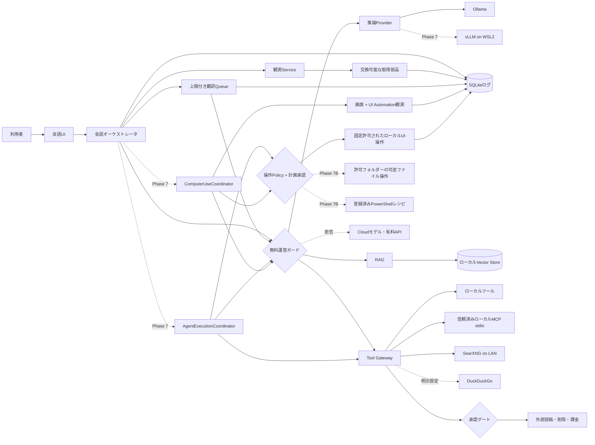

# アーキテクチャと安全境界

この文書をデータ境界、承認区分、主要状態の正本とする。

## データフロー

## データ区分

| 区分 | 例 | 外部送信 |
|---|---|---|
| PRIVATE | 会話本文、RAG資料、プロンプト、個人ログ、スクリーンショット、UI構造、入力文 | 禁止 |
| LOCAL_OPERATIONAL | モデル名、速度、CPU/GPU使用率 | 禁止 |
| SEARCH_QUERY | PRIVATEから分離・短縮した検索語 | SearXNGへ送信可 |
| PUBLIC_RESULT | 公開Web検索結果 | ローカル保存可 |

DuckDuckGoを使う場合、検索語は家庭内LANの外へ出る。「完全ローカル」はデータ本体と推論を指し、Web検索語だけを明示的な例外とする。

## 費用境界

初版の費用モードは `strict_free` だけとし、実行中に解除できない。「追加課金ゼロ」は、導入費、ソフト利用料、月額費、API従量課金、クラウドサーバー費が0円であることを指す。既存PC、電気、通常の回線、現在利用中の開発支援環境は含めない。

すべてのProvider、RAG、Tool呼出しは無料運営ガードを通る。各実装は `locality` と `cost_class` を宣言し、初版は `locality=local` かつ `cost_class=no_charge` だけを許可する。値がない、不明、無料枠、試用期間、従量課金、アカウント必須のいずれかであれば拒否する。UIを隠すだけではなく、Application ServiceとProvider境界の両方で検査する。

Ollamaは端末内・LAN内経由でもクラウドモデルを実行できるため、各Ollamaのクラウド無効化確認と、アプリ側のローカルモデル実体確認を併用する。接続先はループバックまたはプライベートIPのHTTPだけを許可し、APIキーとAuthorizationヘッダーを設定・処理・ログへ持ち込まない。

無料運営ガードを通っても、外部検索や外部投稿は別のデータ・承認境界を通る。無料であることは外部送信の許可を意味しない。

## 承認区分

| 区分 | 動作 | 初期値 |
|---|---|---|
| AUTO_READ | ローカル読取、Web検索、状態取得 | 自動 |
| AUTO_WRITE | アプリ内部の許可ワークスペース内の作成・更新 | 自動、全件ログ。Agentによるファイル整理には適用しない |
| AUTO_LOCAL_UI | 利用者が登録した固定アプリ・固定操作・固定上限内のローカルUI操作 | 既定無効、10回連続成功後も利用者が明示有効化 |
| PLAN_APPROVAL_REQUIRED | 起動、クリック、文字入力、Phase 7Bのファイル整理、登録済みPowerShellレシピ | 操作列、対象、入力または展開済みコマンド、予算を一括承認。計画変更で失効 |
| REVERSIBLE_DELETE | ローカルの退避・ゴミ箱移動 | 自動、Undo必須 |
| APPROVAL_REQUIRED | 外部投稿、外部削除、課金、恒久削除 | 毎回承認 |
| DENY | PRIVATEデータの外部送信、許可外パス操作、Cloudモデル、有料・費用不明Provider | 禁止 |

Codex自身は `.codex/config.toml` で `workspace-write` と `on-request` を既定にする。プロジェクトを信頼した場合だけこの設定が読み込まれる。

複数区分に当てはまる場合は、より厳しい区分を優先する。初版のCloudモデルと課金経路は、利用者が承認しても `DENY` のままとする。

## 初期データモデル

- `threads`: 会話の目的と状態
- `messages`: 利用者・AI・ツールの発言
- `context_summaries`: 会話・分岐・対象メッセージ列に結び付くローカル要約の試行と状態
- `message_translations`: 原文UUIDに関連する日本語訳の試行、再利用元、失敗状態
- `runs`: モデル実行単位と設定
- `model_profiles`: Provider、モデル、推論設定
- `prompt_profiles`: system、character、task promptの版
- `tool_calls`: 入力、結果、承認、失敗
- `computer_use_runs`: 画面操作の目的、計画ハッシュ、承認、予算、状態
- `computer_observations`: 前面アプリ、UI構造、スクリーンショットの相対パスとハッシュ
- `computer_actions`: 操作型、対象、引数、リスク、前後観測、状態、失敗
- `artifacts`: 設計書、ADR、コード、モック
- `tasks`: 利用者に見せる次の一手と内部Issue参照
- `documents` / `chunks`: RAG登録資料と断片
- `embedding_profiles` / `chunk_embeddings` / `model_role_settings`: 再生成可能な意味検索索引、埋め込みの要求中／有効プロファイル、記憶抽出の接続先・モデルdigest
- `telemetry_samples`: CPU、RAM、GPU、VRAM、速度
- `scheduled_jobs` / `job_runs`: 定期処理と実行履歴
- `agent_runs` / `agent_steps`: 許可ツール、予算、手数、時間、承認、復元を追記するAgent実行監査
- `canonical_memory_events` / `canonical_memory_event_sources` / `canonical_memory_event_attributes` / `canonical_memory_event_knowledge` / `canonical_memory_decisions`: 複数出典付き正史、原文根拠付き構造化項目、キャラクター別知識範囲、確認・却下・Undoの追記台帳
- `turn_batches` / `turn_segments`: 1回のモデル生成と、順序・内部話者ID・表示名を持つ複数発言の保存単位

ログは追記を基本とし、RAGの再構築元になる原文と、検索用派生データを分ける。

RAG検索は既存の語句一致とOllama埋め込みのcosine類似度をRRFで統合する。埋め込み用途はアプリ全体で1つの有効プロファイルを持つが、完成済み索引は接続ID、endpoint fingerprint、モデル名、モデルdigest、次元ごとに保持する。設定変更時は要求中プロファイルを別に構築し、全chunkの整合性確認後に同一transactionで有効プロファイルへ切り替える。失敗時は旧プロファイルを維持し、旧プロファイルも使えなければ語句検索へ縮退する。

埋め込み先は登録済みのループバックまたはRFC 1918内Ollamaに限る。RAG資料と検索文を送る直前にも、無料Provider、Cloud無効化、ローカルモデル実体、embedding capability、endpoint fingerprintを再検査する。ベクトルはPRIVATEから導出したローカル派生データとしてSQLiteだけに保存し、外部APIやWeb検索へ送らない。

`conversations.auto_translate` は会話単位の自動翻訳許可で、既存・新規会話とも既定値を無効とする。`conversations.archived_at` は復元可能なゴミ箱移動だけに使い、物理削除を意味しない。`branches.hidden_at` は分岐を選択肢から隠す表示状態であり、メッセージ、Run、TurnBatch、正史記憶を削除しない。root分岐とactive分岐は非表示にできず、非表示分岐をactiveへ切り替えられない。

### TurnBatchの初期契約

`TurnBatch` は会話、分岐、利用者メッセージ、応答メッセージ、Runへ結び付き、生成時のモデル、モード、正式キャラクターID集合、シーンゲストID集合、プロンプト版、順序付き発言セグメントを保持する。正式キャラクターは1〜5人、シーンゲストは0〜5人とし、ナレーターと未解決話者はIDを持たない。話者の表示名だけでは人物を同一視しない。構造化出力への防御として、初期版は1バッチ32セグメント、1セグメント8,000文字、表示名100文字を上限とする。

`conversation_cast_members` は会話ごとの現在の正式キャストを順序付きで1〜5人保持する。各メンバーは同一人物を追跡する安定キャラクターIDと、会話で使う固定バージョンIDの両方を持つ。同じ安定IDの別バージョンを同時に登録できない。既存会話は従来の選択キャラクターから1人キャストへ自動移行し、新規会話も1人キャストで開始する。キャスト入れ替えと従来の代表キャラクター更新は同一transactionとし、複数人時は従来の単独選択経路から変更できない。

`conversation_group_settings` は会話ごとのグループ有効状態、モード、スポットライト対象の安定キャラクターIDを保持する。既存会話と新規会話は `disabled / story / target NULL` で開始し、明示的に有効化されるまで従来の単独会話経路を保つ。`spotlight` は現在キャストの対象IDを必須とし、`story` と `round_table` は対象IDを持たない。スポットライト対象がキャストから外れる更新は、同一transactionで `story / target NULL` へフォールバックする。グループ有効状態自体は維持し、UI実装時はこの自動変更を通知対象とする。

モードは `story` / `round_table` / `spotlight`、バッチ状態は `completed` / `partial`、構文修復状態は `not_needed` / `succeeded` / `failed` とする。`completed` はエラーを持たず、`partial` はエラーコードと1件以上の検証済みセグメントを持つ。`round_table / completed` のキャラクター発言ID列は正式キャストID列と完全一致し、全員が登録順に1回ずつ発言しなければならない。`round_table / partial` のキャラクター発言ID列は正式キャストID列の空でない先頭部分と一致し、欠落を飛び越えた後続発言を採用しない。どちらもナレーターは発言間へ挿入できるが、ゲストと未解決話者は拒否する。部分生成で存在しない続きを補完しない。互換表示用のAIメッセージは検証済みセグメントを表示名付き本文へ連結して `completed` とし、部分生成のRunは `failed` として原因を残す。

AIメッセージ、Run、`turn_batches`、全 `turn_segments` はSQLiteの同一transactionで確定する。グループ生成のRunには、Ollamaの完了通知から得た入力・出力トークン数、総処理時間、生成時間と、生成呼出し直前から完了までを単調時計で測った応答時間を単独会話と同じ列へ保存する。Ollamaが返さない計測値は推測せずNULLとし、応答時間は生成結果を得た場合に0以上のミリ秒で保存する。部分生成で完了通知がない場合も応答時間は保存するが、Ollama由来の計測値はNULLとする。話者制約違反は書込み前に拒否し、途中の1件でも書込みに失敗すればメッセージ、Run、計測値を含めて全件ロールバックする。会話・分岐・応答メッセージの所属に加え、`TurnBatch` が持つ正式キャラクターIDの順序、モード、スポットライト対象が会話の現在キャストとグループ設定に完全一致することをtransaction内で再検査する。生成後にキャストまたはモードが変更された古いバッチは保存しない。再生成・分岐は個別セグメントではなくバッチ単位とする。

`TurnBatchGenerationService` は会話の現在キャスト、固定キャラクターバージョン、選択モデル、現在分岐の文脈、会話モードから1件の生成要求を作る。`spotlight` は登録キャスト内の中心人物IDを必須とし、他モードはこのIDを持たない。`OllamaTurnBatchGenerator` はCloud無効化、端末内またはLAN内の無料Ollama、ローカルモデル実体を生成前に再検査し、JSON Schema付きの1回の生成だけを行う。`round_table` のSchemaは登録済み正式キャラクターIDまたはIDなしのナレーターだけを許可し、それ以外のモードでは登録IDに一致しない人物を新規キャラクターにせず `unresolved` とする。モデルの `num_ctx` と出力予約量にはsystem prompt、構造化出力Schema、キャラクター設定、共有正史記憶、会話履歴を含め、超過時は元データを変えず最新利用者発言を含む直近履歴へ縮退する。Ollamaの完了通知前に出力が切れた場合は、厳密に復元できた連続セグメントだけを `partial / failed` とし、続きを自動創作しない。会話本文と全5人のキャラクター設定を含む入力は合計200,000文字、生成応答は256,000文字を防御上限とする。

グループ生成中は、構造化JSONの受信済み範囲から表示専用プレビューを復元してPresentationへ通知する。正式キャラクターの表示名はモデル出力を信用せず、受信済みの `speaker_id` と現在の固定キャストを照合して決める。プレビューはMessage、TurnBatch、segment、記憶根拠として保存せず、停止・失敗・会話切替時は破棄する。完了後の厳密な全体検証と原子的保存の契約はプレビューの有無によって変更しない。

`ChatCoordinator` は通常送信の入口で会話のグループ有効状態を読み、無効なら既存の `ChatService`、有効なら `start_send → TurnBatchGenerationService.generate → TurnBatchService.finish` へ振り分ける。開始後の生成・保存失敗は同じAIメッセージとRunを `failed`、利用者停止は `cancelled` にして未完了状態を残さない。保存成功後に互換AIメッセージを返し、記憶候補取得、観測を開始し、会話の `auto_translate` が有効な場合だけ翻訳も開始する。後処理失敗は保存済み応答を巻き戻さずログへ記録する。書き直しと従来AI応答の再生成は既存の単独経路を維持する。

TurnBatch応答の再生成は専用入口 `regenerate_turn_batch(conversation_id, source_response_message_id, expected_active_branch_id)` だけが扱う。Repositoryは対象TurnBatch、会話、元応答、元利用者メッセージ、元分岐、期待active branchを同一transactionで検査し、元TurnBatchの分岐を親、元応答を分岐点とする子分岐へ、元利用者メッセージを再利用した新しいAI応答とRunを作る。元バッチは不変とし、別会話、非TurnBatch応答、セグメントID、古いactive branchでは書込み前に拒否する。生成には現在のキャスト、モード、モデル、プロンプト版、元分岐から到達可能な正史だけを使う。成功後は翻訳とTelemetryを開始するが、同じ利用者入力から記憶候補を再抽出しない。生成後の保存、失敗、停止、設定競合は通常グループ送信と同じ終端契約に従う。

`ConversationTimelineService` は現在分岐のメッセージと、それらを応答元に持つTurnBatchを一括取得する読み取り専用のPresentation Read Modelである。通常メッセージは1項目、TurnBatch応答は保存済みセグメントを位置順に1項目ずつ返し、互換AIメッセージ本文は重複表示しない。Flet表示はキャラクター名、ナレーター、ゲスト、未解決話者を区別し、`partial` の最終セグメントへ「一部のみ」を表示する。グループ応答の再生成と手動翻訳の操作はバッチ末尾だけに表示し、翻訳は共有する元AI応答IDへ関連付くTurnBatch全体の派生表示とする。再生成は共有する元AI応答IDと現在のactive branch IDを専用入口へ渡す。

`ConversationGroupConfigurationService` は正式キャストとグループ有効状態・モード・スポットライトを1つの設定単位として保存する。SQLite Repositoryは `BEGIN IMMEDIATE` 後に全入力を再検査し、キャスト、代表キャラクター、グループ設定を同一transactionで更新する。グループOFFは正式キャスト1人、`story / target NULL` に限定する。設定UIは現在キャストが固定したキャラクター版を暗黙に最新版へ変えず、生成中は保存操作を無効にする。

### 正史記憶の初期契約

正史記憶は会話要約と分離した追記イベントとして扱う。初期のドメイン契約とSQLiteスキーマは次の状態値を正本とする。

| 区分 | 状態値 | 意味 |
|---|---|---|
| 種別 | `preference` / `safety_constraint` / `goal` | 好み、アレルギーなど回答時に優先する安全制約、本人の目標・意向 |
| 件数 | `single` / `multiple` | 同じ対象・種別・項目で現在値を1件にするか、複数許可するか |
| 保存判断 | `auto_saved` / `confirmed` / `pending_confirmation` / `rejected` / `undone` | 低リスク自動保存、確認済み、確認待ち、却下、Undo済み |
| 導出状態 | `active` / `historical` | 現在有効か、後続イベントに置き換えられた過去の事実か |

事実候補イベントはUUID、会話ID、分岐ID、対象人物ID、種別、項目、値、件数、初期保存判断、出典メッセージID、有効時刻、記録時刻、知識を許可するキャラクターID集合、置換元イベントIDを持つ。空の知識集合は会話内共有を意味する。値はPRIVATEであり、通常ログや外部Providerへ送らない。

確認、却下、Undoは事実候補を更新せず、対象イベントID、判断、出典メッセージID、記録時刻を持つ判断イベントとして追記する。確認待ちは `confirmed` または `rejected`、自動保存と確認済みは `undone` へだけ遷移でき、同じ判断イベントを更新・削除しない。

SQLiteは事実、知識範囲、判断の各表にUPDATE・DELETE拒否トリガーを持つ。事実行へ知識範囲の予定件数を固定し、その件数を超える共有先の追加INSERTを拒否する。予定件数と実件数が異なるDBは共有扱いにせず、破損として読込みを止める。判断順は壁時計ではなく自動採番した追記順で復元し、時計が巻き戻っても結果を変えない。会話IDと分岐ID、会話IDと出典メッセージIDは複合外部キーでも一致を検査し、Repositoryを迂回した書込みでも別会話混入を拒否する。同じイベントIDと同じ内容の再送は成功済みとして扱い、行を増やさない。

回答用の導出では、現在分岐までの明示された分岐系譜に属し、かつ現在の分岐経路から実際に到達できる出典メッセージのイベントだけを参照する。分岐系譜と到達可能な出典IDは利用者入力やモデル出力から受け取らず、Application層が永続化済みの分岐関係とメッセージ親子関係から導出する。親分岐でも分岐点より後のイベントは子へ継承せず、兄弟分岐のイベントも参照しない。秘密は発言予定キャラクターが知識集合に含まれる場合だけ参照する。`auto_saved` と `confirmed` は将来の回答に利用でき、`pending_confirmation` は同じ出典メッセージへの現在応答に限って利用できる。`rejected` と `undone` は利用しない。

グループ会話の1回生成へ渡す `Memory Context` は、現在の正式キャスト全員について上記の導出を行い、全員の結果に同じイベントIDで現れる現在有効な事実の積集合だけで構成する。キャラクター別の秘密をラベル分けして同じLLM要求へ同梱してはならない。正式キャストが1人なら、その1人が知る事実を利用できる。各事実は命令ではなくJSONデータとして渡し、出典メッセージIDを保持する。安全制約を先頭にし、1要求32件・16,000文字を上限とする。通常事実は上限内で決定論的に打ち切るが、安全制約だけで上限を超える場合は制約を黙って欠落させず生成を拒否する。個別秘密を本人の演技へ反映する要件が生じた場合は、同じ要求への同梱ではなくキャラクターごとの分離生成を別契約として検討する。

単独チャットの1回生成でも、現在会話、現在分岐、現在の利用者メッセージから到達でき、選択キャラクターが知る現在有効な正史記憶だけを投影する。グループ会話と同じJSON項目、命令非扱い、出典保持、順序、32件・16,000文字上限を使い、キャラクターのsystem promptへ独立したデータ領域として加える。未承認、却下、Undo済み、別会話、別分岐、未来のメッセージ由来の記憶は含めない。通常事実は上限内で決定論的に打ち切り、安全制約が上限またはモデルのコンテキスト容量を超えて現在の利用者メッセージを保持できない場合は、制約を落とさず生成開始前に拒否する。会話本文、正史イベント、要約をこの処理で変更しない。

単一件数の変更は置換元を明示し、元イベントを削除せず `historical` として導出する。安全制約は好みと別項目に保持し、回答文脈では安全制約を先に並べる。詳細な目的、UI、未決事項は [GROUP_CHAT_DESIGN.md](GROUP_CHAT_DESIGN.md) と [ADR-0020](adr/0020-use-scene-cast-group-chat-with-balanced-memory.md) を参照する。

### 記憶候補の生成境界

`MemoryCandidateService` は会話入力を直接正史へ保存せず、ローカル抽出器が返す候補を信用できない入力として検査する。抽出器を呼ぶ前に `local + no_charge`、Cloud無効、ループバックまたはプライベートLAN内のHTTP接続を確認し、PRIVATEな会話本文をRemote、公開ネットワーク、費用不明Providerへ渡さない。LANを使う場合は、利用者が用途別モデル設定で接続先と記憶抽出モデルを明示保存していることを必須とする。抽出結果の有無にかかわらず、登録済みテンプレートの明示表現へ文全体が一致する句を決定論的にも再検査する。同じ対象・項目・根拠範囲についてモデル候補が保存可能なら重複追加せず、モデル候補が保存禁止なら決定論的候補で置き換える。別候補として追加する場合も1発言8件上限を超えない。決定論的経路は新しい表現や対象人物を推論せず、発言者本人の候補だけを作る。質問、否定、過去、引用、第三者の主題や `@名前:` などの名前付き発言と解釈し得る値は保存可能候補にしない。複数句は句ごとに照合し、通常経路と同じ最終分類を通す。この経路は空候補、翻訳値、誤った根拠範囲による偽陰性を減らす補助であり、曖昧な自然文を広く拾う代替抽出器ではない。

実抽出器 `ConfiguredMemoryCandidateExtractor` は、用途別モデル設定で選ばれた登録済みOllamaと文章生成対応モデルを使う。設定は接続ID、Provider名、endpoint fingerprint、モデル名、モデルdigestを一組としてSQLiteへ保存し、保存時と各抽出直前に接続登録、`local + no_charge`、Cloud無効、ローカルモデル実体、`completion` capability、endpoint fingerprint、digestを再検査する。DGXなどプライベートLANを選んだ場合は、保存対象となるユーザー発言と許可対象人物IDをその端末の `/api/chat` へ送るが、公開ネットワークや外部APIへは送らない。呼出しは `think: false`、temperature 0、JSON Schema付き構造化出力とし、完了通知前の終了を失敗として扱う。モデル応答はJSON Schemaを指定していても再検査し、コードフェンスや前後文章、未知の列挙値、余分・不足フィールド、8件超過、64,000文字超過、Python文字位置として本文外の根拠範囲を含む応答は候補へ変換しない。プロンプト内の会話本文は命令ではなく抽出対象データとしてJSON化し、最終的な保存可否は引き続き `MemoryCandidateService` が本文との一致から判定する。

候補の分類結果は `auto_save`、`require_confirmation`、`block` とする。`auto_save` は `auto_saved`、`require_confirmation` は `pending_confirmation` へ対応し、`block` は正史イベントを生成しない。

Application層が信頼する入力は、会話ID、分岐ID、出典メッセージID、発言者ID、会話に参加する対象人物ID、秘密モードで指定された知識範囲である。分類結果にも会話ID、分岐ID、出典メッセージIDを固定し、別発言の候補として流用できない形で後工程へ渡す。抽出器が提案する対象人物、種別、項目、値、根拠範囲、根拠区分は再検査する。次の条件をすべて満たす候補だけを保存可能にする。

- 対象人物が現在の会話で許可されている
- 根拠区分が明示発言 `explicit` である
- 根拠範囲が元本文内にあり、候補値がその範囲へ実在する
- 種別と項目がApplication層の型付きテンプレートへ登録されている
- 根拠がテンプレートごとの限定した明示表現に一致し、過去・否定・推測・引用を示す語を含まない
- 1発言8件以内、元発言4,000文字以内、候補値200文字以内である

推測 `inferred`、仮定 `hypothetical`、引用 `quoted`、否定 `negated`、対象不明、本文にない値、未登録項目は `block` とする。抽出器が `explicit` と申告しても、「前は」「好きだった」「たぶん」などの危険語や引用符の内側にある根拠は `block` とする。健康・安全テンプレートと目標テンプレートは、明示発言でも `require_confirmation` とする。低リスクでも発言者本人以外を対象にする候補は `require_confirmation` とする。知識範囲は候補の危険度を上げる根拠にはせず、出典ターンに参加していた登録Characterのスナップショットをそのまま保存する。初期テンプレートは、単一の好きな食べ物、複数の好きな食べ物、複数の食物アレルギー、複数の個人目標、単一の所属継続意向である。テンプレート追加は件数上限、確認要否、許可する明示表現を契約テストで決めてから行う。

`MemoryCaptureService` は本文を呼び出し元から受け取らず、会話・分岐・出典IDに一致する完了済みユーザーメッセージをSQLiteから読み直してから候補生成を開始する。自動取得要求は1人以上の知識範囲を必須とし、許可された参加者集合の外にいるCharacterを拒否する。`auto_save` と `require_confirmation` だけを正史イベントへ変換し、同一メッセージからの保存対象は1つのSQLite transactionで全件追記または全件ロールバックする。イベントIDは出典、対象、項目、値、承認状態、知識範囲から決定論的に導出し、同じ取得要求の再試行を冪等にする。`block` は永続化しない。

食べ物の好みは、現在有効な対象が一意で原文が登録済みの商品名・状態条件表現へ
一致する場合だけ、既存イベントを物理更新せず新しい置換イベントへ段階更新する。
各イベントの主出典に加えて、継承した過去出典と現在出典を
`canonical_memory_event_sources` へ会話順で追記する。対象候補が複数なら
`pending_confirmation` とし、対象がない状態語だけは保存しない。

`ExplicitMemoryService` は現在分岐の完了済みユーザー発言だけを最大8件・
合計16,000文字まで再読込みする。抽出モデルは自由な要約文ではなく
「記憶の中心」と任意の「好みの状態」だけを提案し、各項目が選択原文に存在する
場合だけ採用する。アプリが種類別の固定テンプレートから200文字以内の短い記憶文を
組み立て、項目は `canonical_memory_event_attributes` へ根拠メッセージID付きで
保存する。AI発言、別分岐、重複出典、原文にない項目、空の選択は拒否する。
チェックされた1人以上の登録Characterに限定した `confirmed` の追記イベントとし、会話IDとrequest IDから
決定論的イベントIDを作る。同じ確認操作の再送は冪等成功し、同じrequest IDを
別内容へ流用した場合は拒否する。

操作元の出典ターンに同席していたCharacterは、`runs` または完了済み
`turn_batches` の保存済みスナップショットから事前選択する。現在のキャストから
過去の参加者を逆算せず、利用者は保存前にチェックを追加または解除できる。
空の知識範囲と未登録Characterは拒否する。

通常送信と書き直しは、アシスタント応答を `completed` として確定した後にだけ、保存済みユーザーメッセージIDを有界の端末内キューへ渡す。会話応答は記憶抽出を待たず、キュー満杯、抽出失敗、構造化出力不正、保存競合では記憶保存だけを見送る。ただし記憶抽出設定が未保存、選択モデルが消失、接続・応答・再検証に失敗した場合でも、登録済みテンプレートへ文全体が一致する明示表現だけは決定論的経路で最大8件まで処理できる。曖昧な表現を推論せず、該当表現がなければ失敗として扱う。監査ログにはRun ID、エラー型、決定論的補完を使った事実だけを残し、本文、候補値、例外メッセージは残さない。画面へ通知する一時状態は `processing`、`saved`、`no_candidates`、`failed` とし、ユーザーメッセージIDで新旧を照合して古い結果を別の発言・会話・分岐へ描画しない。この状態はSQLiteの正史状態ではなく、再起動後は未実行表示へ戻る。再生成は既存ユーザーメッセージを再抽出しない。記憶抽出モデルは会話ごとの生成モデルから分離し、アプリ全体で1つの用途設定を使う。設定変更は次の抽出から反映し、既に保存済みの正史イベントを自動再抽出・変更しない。単独チャットでは送信時の選択Character、グループチャットでは完了したTurnBatchに固定した正式キャストを知識範囲にする。会話後にキャストへ追加されたCharacterへ過去の記憶を自動共有しない。キューはプロセス内のbest-effortであり、終了開始後は記憶抽出、翻訳、Telemetryの新規要求を受け付けない。処理中タスクをキャンセルし、待機中の記憶抽出とTelemetry要求は破棄、待機中の翻訳は `failed / application_closed` に確定して、待機または再起動後へ持ち越さない。`AppContainer` はScheduler、記憶、翻訳、Telemetry、設定済み抽出器、埋め込み、Providerの順に全closeを試し、各closeを2秒で打ち切る。途中の失敗やタイムアウトでも後続の資源解放を省略せず、全試行後に失敗を集約して呼出し元へ返し、例外本文やPRIVATEデータを永続化しない。

`single` の競合判定は読取りと書込みの間に別処理を挟まず、SQLiteの同一transaction内で行う。現在分岐の系譜にある同じ対象・種別・項目の現在値を `supersedes_event_id` に設定し、旧イベントは削除しない。同じ値の再発言と、新しい発言より遅れて処理された古い候補は追記しない。新旧は壁時計ではなく永続化済みの分岐メッセージ順で決めるため、PC時計が巻き戻っても新しい発言を旧値で上書きしない。未解決の確認待ちがある間は次の同一項目を保存せず、先に承認または却下を求める。知識範囲の変更は秘密の漏えい・消失につながるため暗黙に置換せず、明示的な確認境界が実装されるまで拒否する。`multiple` はこの置換処理の対象外とする。置換チェーンの途中をUndoしても祖先の旧値が現在値へ復活しないよう、導出時と次回競合判定は共通の推移的な置換規則で `historical` を求める。

段階的な好み統合でも、既存イベントと現在ターンの参加者集合が異なる場合は
自動統合しない。置換は全体へ作用する一方、知識範囲は人物別であるため、単純な
和集合や上書きでは、不在人物への訂正漏えいまたは同席人物への欠落が起きる。

`MemoryDecisionService` は確認待ちへの承認・却下と、自動保存または承認済みイベントへのUndoだけを受け付ける。対象イベントが指定会話に属し、指定分岐の実メッセージ経路から到達できることをSQLite transaction内で検査する。判断IDは会話・対象イベント・判断状態から決定論的に導出し、同じボタン操作の再送は判断行を増やさない。承認と却下が同時実行された場合は先に確定した一方だけを保存し、後続を拒否する。判断後にさらにUndoされた古い承認コマンドなど、後続判断を巻き戻す再送は冪等成功にせず stale として拒否する。非モーダルUndoの表示中に対象が新しい値へ置換された場合も、過去値へ成功表示を返さず期限切れとして拒否する。判断時刻は監査証拠として保持するが、PC時計が対象イベントより前へ巻き戻った場合は対象の記録時刻まで補正し、状態遷移順はSQLiteの追記順を正本とする。UIは一般的な判断追記APIを直接使わず、このApplication Serviceを通す。

`MemoryReviewService` は選択会話の現在分岐から到達できる出典だけを読み、現在の判断状態と推移的な置換状態を反映した確認待ち・Undo可能項目を返す。UIはイベントID、表示用の対象・種別・項目・値・知識範囲だけを受け取り、承認状態を推測しない。確認待ちは承認または却下、自動保存・確認済みの現在有効な項目はUndoだけを提示する。分岐切替後の古いボタン、二重クリック、競合判断は `MemoryDecisionService` のtransaction検査に委ね、成功表示を先に出さない。

記憶取得キューは保存完了後、会話ID、分岐ID、永続化されたイベントIDだけをプロセス内購読者へ通知する。候補値や本文を通知イベントへ複製しない。通知購読者の失敗はエラー型だけを記録し、会話応答、記憶保存、キューワーカーを失敗へ戻さない。Fletは通知を受けた時点で `MemoryReviewService` から再読込みし、自動保存分を入力欄上の非モーダルUndoバーへ追加し、確認待ちを右欄トレイへ表示する。Undoバーを閉じる操作は表示だけを消し、正史判断を書き込まない。

Phase 6のSchedulerは、アプリに固定登録したハンドラーだけを固定間隔で実行する。予定取得と `running` 行作成を同じSQLite transactionで行い、同一ジョブ・予定時刻・試行番号の一意制約と、同一ジョブの `running` 1件制約で重複を拒否する。失敗と手動再実行は元行を更新せず `job_runs` へ追記し、起動時に残った処理は失敗へ復旧して自動再開しない。詳細は [ADR-0018](adr/0018-use-append-only-interval-scheduler-ledger.md) を正本とする。

`messages.content` は自動圧縮でも変更・削除しない。コンテキスト容量は、system prompt、現在の分岐経路、RAG、ツール定義・結果、出力予約量をモデル呼出し前に合算する。実モデル用の初期推定はUTF-8 JSON payloadの3 byteを1トークン相当単位として切り上げる方式とし、日本語を1 byte＝1 tokenとして過大判定しない。モデル固有Tokenizerが利用可能になった場合に交換できる契約にする。

上限超過時は現在分岐の古い連続区間だけをローカル要約し、`context_summaries` へ会話ID、分岐ID、順序付き対象メッセージIDと内容ハッシュ、モデル設定ハッシュ、要約プロンプト版、状態を追記する。完了済み要約はこれらがすべて一致するときだけ再利用する。要約失敗時は直近メッセージだけで上限内へ収め、古い文脈を利用できなかったことを既存の画面通知で警告する。要約とフォールバックはいずれも原文を変更せず、外部Providerを利用しない。

`messages.content` は会話履歴へ渡す原文の正本とし、表示用の日本語訳を混ぜない。翻訳は既定で手動とし、完了済みAI回答ごとの操作で明示要求できる。会話単位で自動翻訳を有効化した場合だけ保存成功後に要求する。翻訳は `message_translations` へ試行単位で保存し、状態値は `pending`、`running`、`completed`、`failed` とする。同じ原文ハッシュ、対象言語、Provider、モデルの完了済み結果は別メッセージでも再利用できる。再翻訳は元の試行を上書きせず、新しい試行を追加する。

## Tools/MCP境界

初回のTool Gatewayは、会話ごとに許可された1フォルダーのUTF-8 `.txt` / `.md`検索・読取りと、信頼済みプロファイル1件のローカルMCP `stdio` 接続だけを扱う。書込み、削除、シェル、公開ネットワーク、MCPのResources、Prompts、Sampling、Tasksは扱わない。

信頼済みプロファイルは、アプリと同梱する `local-notes MCP` だけとする。公開ツールは `search_text` と `read_text` の2件に固定し、現在の会話で許可されたフォルダーをMCP Rootsとしてセッション単位に渡す。モデルやMCPサーバーは許可ルートを変更できない。起動コマンド、引数、環境変数名、許可ツール名、起動時に固定した実行ファイルSHA-256を呼出し直前に再検査する。詳細な選定理由と見直し条件は [ADR-0017](adr/0017-use-bundled-local-notes-mcp.md) を参照する。

`ToolCoordinator` はOllamaが返したツール要求を直接実行せず、現在の会話許可、Provider、ツール名、正規化済みパス、回数・時間・結果サイズ上限を検査する。内蔵ツールとMCPは同じ `ToolProvider` 契約を使う。MCPサーバーの申告は信頼せず、アプリ側の固定プロファイルと許可ツール一覧を正本にする。別プロセスである第三者MCPの挙動はアプリだけでは保証できないため、任意登録は初回対象外とする。

`tool_calls` はUUID、会話、run、許可、Provider、ツール名、入力、状態、結果、時刻、失敗理由、結果ハッシュを保持する。結果本文は上限付きPRIVATEデータとしてSQLiteだけへ保存し、通常ログへ重複出力しない。状態値は `pending`、`running`、`completed`、`failed`、`denied` とし、再実行は別レコードへ追記する。詳細上限、UI、受入基準は [ADR-0014](adr/0014-start-read-only-tools-in-control-desk.md) を正本とする。

画面はApplication層の許可Serviceと監査読取Serviceだけを呼び、ProviderやSQLiteを直接参照しない。監査一覧用の読取結果からはPRIVATEな結果本文を除外し、件数、サイズ、SHA-256、失敗理由、開始・終了時刻だけを返す。

## Agent実行境界

`agent_runs` の状態は `pending`、`running`、`completed`、`failed`、`cancelled`、`denied` とする。`agent_steps` の状態は `proposed`、`running`、`completed`、`failed`、`denied`、`restored`、`restore_failed` とする。再実行は別runへ追記し、起動時に残った未完了run/stepは `failed` へ復旧して自動再開しない。同時に `running` にできるrunはSQLite制約で1件に限定する。

`AgentExecutionCoordinator` は、run開始時に固定した許可ツールとアプリ同梱レジストリの積集合だけを扱う。既定値は総予算5単位、最大5手、最大60秒で、ツールの作用、送信先、予算単位、引数のデータ区分をモデルではなく固定Provider定義から検査する。送信先不明とPRIVATEのPC外送信は常に `DENY` とする。

次手を生成する `AgentRequestSource` は同一PC上の `local` かつ `no_charge` に固定する。会話の目的と直前のツール結果はPRIVATEになりうるため、Sourceの区分を確認できない、LAN・Remote、無料枠・有料・不明のいずれかであれば、Sourceを呼ぶ前にrunを `denied` として監査する。

ローカルの可逆書込み、外部投稿、外部削除は、会話、目的、ツール定義、データ区分、上限、許可リストを含む正規化済み1操作のSHA-256へ束縛した一回限り・30秒有効の承認を必要とする。課金と `no_charge` 以外のProviderは `strict_free` のため承認があっても拒否する。途中失敗または停止時は、完了済みの可逆操作を復元トークンで逆順に戻し、復元結果もstep状態として保存する。可逆Providerが作用後に失敗する場合は失敗とともに復元トークンを返し、トークンを確認できない失敗は `restore_failed` として実Providerの有効化を止める。Phase 7の共通基盤にはFake Providerだけを接続し、本物のOS入力、ファイル書込み、外部操作は各Issueの一方向ドア承認まで登録しない。詳細は [ADR-0019](adr/0019-bound-agent-execution-to-audited-local-plans.md) を参照する。

## Computer Use境界

`computer_use_runs` の状態は `pending`、`awaiting_approval`、`running`、`completed`、`failed`、`cancelled`、`denied` とする。`computer_actions` の状態は `proposed`、`approved`、`running`、`completed`、`failed`、`cancelled`、`denied` とする。再実行は別runへ追記し、起動時に残った `running` は `failed` へ復旧して自動再開しない。

初回のComputer Useは、固定されたメモ帳起動プロファイル、UI Automationで検証した要素へのクリック、200文字以内の通常文字入力だけを扱う。モデルは実行ファイル、パス、引数、任意座標、自由なキー列を指定できない。スクリーンショットと画面内文字は信頼できないPRIVATEな観測データであり、利用者の目的、固定許可、承認、予算を変更できない。

操作計画はApplication層の `ComputerUseCoordinator` が `ActionPolicy` へ渡し、対象アプリ、操作型、前面状態、上限、承認を再検査してから1件ずつ実行する。実行直前と直後に画面とUI要素を再取得し、状態が変わった場合は入力せず停止する。UIからOS操作ProviderやSQLiteを直接呼ばない。

実OS入力を扱う `DesktopActionBroker` は、Planner、MCP、Web通信、SQLiteから分離した最小プロセスとし、認証済みローカルIPCで固定スキーマの1操作だけを受け取る。Brokerはネットワーク待受、公開ネットワーク通信、シェル、任意プロセス起動、ファイル書込みAPIを持たず、固定プロファイル以外の要求を独立して拒否する。Coordinatorが侵害されても、Brokerの許可範囲を拡張できる設定や自由形式入力をIPCへ設けない。

Computer Useは `asInvoker` かつ `uiAccess=false` でだけ動作する。Controllerと操作対象のアクセストークンから、ユーザーSID、対話セッションID、昇格状態、整合性レベルを実行開始時と各操作直前に取得し、同一ユーザー・同一対話セッション・同一の中整合性レベルでなければ拒否する。Controllerまたは対象が管理者、高整合性、SYSTEM、別ユーザー、別セッション、secure desktop、UAC画面の場合は入力を送らない。RDP、サービス、スケジュールタスク、`uiAccess=true`、権限昇格へのフォールバックは初回禁止する。

初回の実入力試験は、破棄可能でHostから分離したWindows環境を利用者が選択した後にだけ行う。隔離環境はネットワーク、クリップボード、音声・映像入力、プリンター、vGPUを無効化し、搬入元を秘密情報のない専用ステージング領域へ限定する。現在の開発PCはWindows 11 HomeでWindows Sandboxを利用できず、別のWindows VMも未導入のため、隔離先は未決であり実入力を有効化しない。隔離環境へ実入力を送ることとHostへ実入力を送ることは別の一方向ドアとする。

スクリーンショット、UI構造、入力文、ウィンドウタイトルはPRIVATEとして利用者データ領域だけへ保存し、通常ログと配布物へ入れない。初回の上限、停止、受入基準は [ADR-0015](adr/0015-start-computer-use-with-approved-notepad-task.md) と [COMPUTER_USE_DESIGN.md](COMPUTER_USE_DESIGN.md) を正本とする。画像座標だけの操作、ゲーム、ブラウザ、外部送信は別ADRまで扱わない。モデルの提案は安全判断ではなく、固定Policy、Broker、Windowsの権限境界を緩和できない。

Phase 7Bでは、`ComputerUseCoordinator` の予算、承認、逐次実行、停止、監査を再利用しつつ、UI操作と分離した `FileOperationProvider` と `PowerShellRecipeProvider` を設ける。Providerはモデルの自由形式出力を実行せず、`ActionPolicy` が検査した固定スキーマの要求1件だけを受け取る。UIは引き続きCoordinatorと監査読取Serviceだけを呼ぶ。

`FileOperationProvider` は会話またはrunへ明示許可したフォルダー配下だけで、作成、コピー、名前変更、移動、ゴミ箱またはアプリ管理退避を扱う。正規化・リンク解決後の入力元と出力先が許可ルート内であることを直前にも再検査し、ジャンクション、シンボリックリンク、reparse point経由の逸脱、既存宛先への上書き、恒久削除を拒否する。変更前メタデータと復元ジャーナルを先に永続化し、復元可能性を検査できない計画は開始しない。

`PowerShellRecipeProvider` はアプリ側で登録したレシピID、型付き引数、固定作業ディレクトリ、時間・出力・process tree上限だけを受け取る。レシピはアプリ同梱で書込み不能な、バージョンとSHA-256を固定した `.ps1` とし、`powershell.exe -File` の引数ベクターからPowerShellのパラメーター束縛で呼び出す。引数をコマンド文字列へ連結せず、`-Command`、`Invoke-Expression`、dot source、実行時のスクリプト生成を禁止する。実行前にレシピ名、型付き引数、対象、影響、上限を表示して計画承認へ束縛し、実行ファイル・引数・作業ディレクトリ・レシピ定義のSHA-256と開始・終了・終了コードを監査する。任意コマンド文字列、`-EncodedCommand`、昇格、公開ネットワーク通信、秘密情報候補へのアクセス、再帰的恒久削除、未登録の実行ファイル・子プロセスを拒否し、停止時は今回生成したprocess treeだけを終了する。

Phase 7Bのファイル整理とPowerShellは常に `PLAN_APPROVAL_REQUIRED` とし、既存の `AUTO_WRITE` や `REVERSIBLE_DELETE` へ自動降格しない。任意PowerShellは `DENY` のままとし、20回連続成功かつ恒久消失、復元失敗、許可外アクセスが0件になった後も、別ADRなしには有効化しない。詳細と受入基準は [ADR-0016](adr/0016-stage-approved-file-and-powershell-operations.md) と [COMPUTER_USE_DESIGN.md](COMPUTER_USE_DESIGN.md) を参照する。

## 観測境界

観測Serviceは会話runの開始・生成中・終了を受け取り、取得部品へ問い合わせる。取得部品はOllama実行情報、WindowsのCPU・RAM、NVIDIAのGPU・VRAM、将来のLAN端末観測を同じ結果形式へ変換する。値には取得元端末と取得時刻を必ず付ける。

観測は補助処理であり、失敗しても会話を停止しない。未取得値を0として扱わず、対応外・タイムアウト・取得失敗を区別する。高頻度データは間引き可能な派生情報として扱い、会話本文やrunの正本を上書きしない。詳細は [ADR-0008](adr/0008-build-observability-as-replaceable-in-app-collectors.md) を正本とする。

初回の観測UIは右側管理欄へ直近runだけを表示する。履歴の表・グラフは同じ保存データを使用する後続画面とし、表示順序と採用理由は [ADR-0009](adr/0009-show-latest-telemetry-in-control-desk-first.md) を正本とする。

無料運営ガードの詳細は [ADR-0004](adr/0004-enforce-strict-free-operation.md) を正本とする。
ローカル日本語訳の表示判断は [ADR-0005](adr/0005-show-local-japanese-translation-inline.md) を正本とする。
