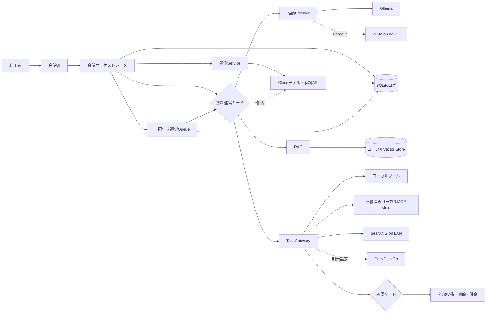

# アーキテクチャと安全境界

この文書をデータ境界、承認区分、主要状態の正本とする。

## データフロー

## データ区分

| 区分 | 例 | 外部送信 |
|---|---|---|
| PRIVATE | 会話本文、RAG資料、プロンプト、個人ログ | 禁止 |
| LOCAL_OPERATIONAL | モデル名、速度、CPU/GPU使用率 | 禁止 |
| SEARCH_QUERY | PRIVATEから分離・短縮した検索語 | SearXNGへ送信可 |
| PUBLIC_RESULT | 公開Web検索結果 | ローカル保存可 |

DuckDuckGoを使う場合、検索語は家庭内LANの外へ出る。「完全ローカル」はデータ本体と推論を指し、Web検索語だけを明示的な例外とする。

## 費用境界

初版の費用モードは `strict_free` だけとし、実行中に解除できない。「追加課金ゼロ」は、導入費、ソフト利用料、月額費、API従量課金、クラウドサーバー費が0円であることを指す。既存PC、電気、通常の回線、現在利用中の開発支援環境は含めない。

すべてのProvider、RAG、Tool呼出しは無料運営ガードを通る。各実装は `locality` と `cost_class` を宣言し、初版は `locality=local` かつ `cost_class=no_charge` だけを許可する。値がない、不明、無料枠、試用期間、従量課金、アカウント必須のいずれかであれば拒否する。UIを隠すだけではなく、Application ServiceとProvider境界の両方で検査する。

Ollamaは端末内・LAN内経由でもクラウドモデルを実行できるため、各Ollamaのクラウド無効化確認と、アプリ側のローカルモデル実体確認を併用する。接続先はループバックまたはプライベートIPのHTTPだけを許可し、APIキーとAuthorizationヘッダーを設定・処理・ログへ持ち込まない。

無料運営ガードを通っても、外部検索や外部投稿は別のデータ・承認境界を通る。無料であることは外部送信の許可を意味しない。

## 承認区分

| 区分 | 動作 | 初期値 |
|---|---|---|
| AUTO_READ | ローカル読取、Web検索、状態取得 | 自動 |
| AUTO_WRITE | 許可ワークスペース内の作成・更新 | 自動、全件ログ |
| REVERSIBLE_DELETE | ローカルの退避・ゴミ箱移動 | 自動、Undo必須 |
| APPROVAL_REQUIRED | 外部投稿、外部削除、課金、恒久削除 | 毎回承認 |
| DENY | PRIVATEデータの外部送信、許可外パス操作、Cloudモデル、有料・費用不明Provider | 禁止 |

Codex自身は `.codex/config.toml` で `workspace-write` と `on-request` を既定にする。プロジェクトを信頼した場合だけこの設定が読み込まれる。

複数区分に当てはまる場合は、より厳しい区分を優先する。初版のCloudモデルと課金経路は、利用者が承認しても `DENY` のままとする。

## 初期データモデル

- `threads`: 会話の目的と状態
- `messages`: 利用者・AI・ツールの発言
- `message_translations`: 原文UUIDに関連する日本語訳の試行、再利用元、失敗状態
- `runs`: モデル実行単位と設定
- `model_profiles`: Provider、モデル、推論設定
- `prompt_profiles`: system、character、task promptの版
- `tool_calls`: 入力、結果、承認、失敗
- `artifacts`: 設計書、ADR、コード、モック
- `tasks`: 利用者に見せる次の一手と内部Issue参照
- `documents` / `chunks`: RAG登録資料と断片
- `telemetry_samples`: CPU、RAM、GPU、VRAM、速度
- `scheduled_jobs` / `job_runs`: 定期処理と実行履歴

ログは追記を基本とし、RAGの再構築元になる原文と、検索用派生データを分ける。

`messages.content` は会話履歴へ渡す原文の正本とし、表示用の日本語訳を混ぜない。翻訳は `message_translations` へ試行単位で保存し、状態値は `pending`、`running`、`completed`、`failed` とする。同じ原文ハッシュ、対象言語、Provider、モデルの完了済み結果は別メッセージでも再利用できる。再翻訳は元の試行を上書きせず、新しい試行を追加する。

## Tools/MCP境界

初回のTool Gatewayは、会話ごとに許可された1フォルダーのUTF-8 `.txt` / `.md`検索・読取りと、信頼済みプロファイル1件のローカルMCP `stdio` 接続だけを扱う。書込み、削除、シェル、公開ネットワーク、MCPのResources、Prompts、Sampling、Tasksは扱わない。

`ToolCoordinator` はOllamaが返したツール要求を直接実行せず、現在の会話許可、Provider、ツール名、正規化済みパス、回数・時間・結果サイズ上限を検査する。内蔵ツールとMCPは同じ `ToolProvider` 契約を使う。MCPサーバーの申告は信頼せず、アプリ側の固定プロファイルと許可ツール一覧を正本にする。別プロセスである第三者MCPの挙動はアプリだけでは保証できないため、任意登録は初回対象外とする。

`tool_calls` はUUID、会話、run、許可、Provider、ツール名、入力、状態、結果、時刻、失敗理由、結果ハッシュを保持する。結果本文は上限付きPRIVATEデータとしてSQLiteだけへ保存し、通常ログへ重複出力しない。状態値は `pending`、`running`、`completed`、`failed`、`denied` とし、再実行は別レコードへ追記する。詳細上限、UI、受入基準は [ADR-0014](adr/0014-start-read-only-tools-in-control-desk.md) を正本とする。

## 観測境界

観測Serviceは会話runの開始・生成中・終了を受け取り、取得部品へ問い合わせる。取得部品はOllama実行情報、WindowsのCPU・RAM、NVIDIAのGPU・VRAM、将来のLAN端末観測を同じ結果形式へ変換する。値には取得元端末と取得時刻を必ず付ける。

観測は補助処理であり、失敗しても会話を停止しない。未取得値を0として扱わず、対応外・タイムアウト・取得失敗を区別する。高頻度データは間引き可能な派生情報として扱い、会話本文やrunの正本を上書きしない。詳細は [ADR-0008](adr/0008-build-observability-as-replaceable-in-app-collectors.md) を正本とする。

初回の観測UIは右側管理欄へ直近runだけを表示する。履歴の表・グラフは同じ保存データを使用する後続画面とし、表示順序と採用理由は [ADR-0009](adr/0009-show-latest-telemetry-in-control-desk-first.md) を正本とする。

無料運営ガードの詳細は [ADR-0004](adr/0004-enforce-strict-free-operation.md) を正本とする。
ローカル日本語訳の表示判断は [ADR-0005](adr/0005-show-local-japanese-translation-inline.md) を正本とする。
