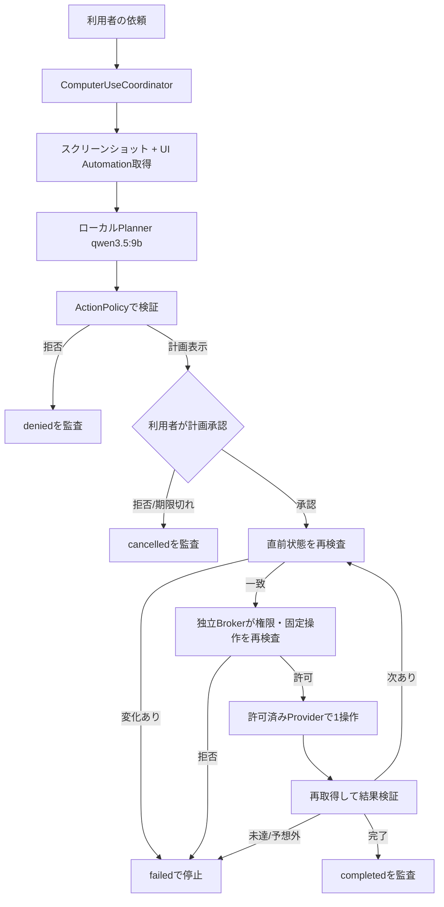
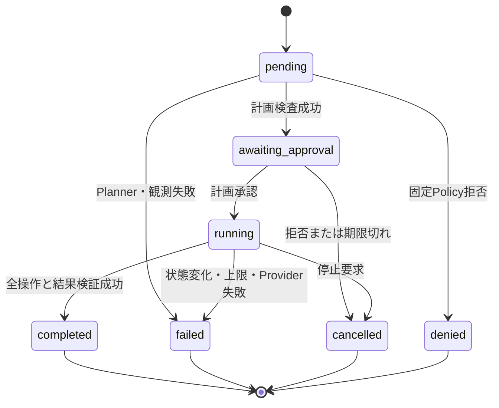

# ローカル・コンピュータ操作 設計書

- Status: Accepted
- Date: 2026-07-17
- Decision owner: 利用者
- Scope: Phase 7へ進む前の、承認付きメモ帳操作の契約と安全境界

データ区分、承認区分、状態値は [ARCHITECTURE.md](ARCHITECTURE.md) を正本とする。本書は初回課題の振る舞いと受入基準を定め、同じ定義を複製しない。

## 1. 問題

利用者は、LocalLLMとの会話だけでなく、Windowsデスクトップを見て、マウスとキーボードを使う一連の作業を任せたい。現状のアプリは許可フォルダー内の読取りまでで、画面上の対象を確認しながら操作する経路、操作前の承認、誤操作時の停止と検証がない。

問題の実在性は仮説である。利用頻度は高くない見込みで、日常的に困っている具体例はまだない。将来はゲーム内の選択操作も任せたいが、まず永続的変更を残さないメモ帳課題で、必要性と実現可能性を検証する。

## 2. ゴールと成功基準

利用者が一連の操作計画を確認した後、アプリがWindows 11上でメモ帳を開き、編集領域を認識し、指定文を入力し、保存せずに停止できるようにする。推論、画面画像、UI構造、監査記録をPC外へ送らない。

| ID | 成功基準 | 判定者 | 判定時期 |
|---|---|---|---|
| CU-AC-01 | 実行前に、対象アプリ、入力文、操作順、保存しないことを表示し、1回の計画承認なしでは入力を開始しない | 利用者 | 各受入試験 |
| CU-AC-02 | 許可済みのメモ帳だけを起動し、任意のコマンド、引数、実行ファイルをモデルから指定できない | 開発者 | 契約試験 |
| CU-AC-03 | メモ帳の編集領域をUI Automationで特定し、直前再検査後にマウスでフォーカスして、200文字以内の指定文をキーボード入力できる | 利用者 | 実機試験 |
| CU-AC-04 | 入力後にUI Automationと再取得画面で指定文を確認し、保存、上書き、送信、削除を実行しない | 利用者 | 実機試験 |
| CU-AC-05 | アプリ内停止操作または `Ctrl+Alt+F12` から1秒以内に新しい入力イベントを停止し、未実行の操作を `cancelled` にする。グローバル停止キーを登録できなければ実OS操作を有効化しない | 利用者 | 停止試験 |
| CU-AC-06 | 前面アプリまたは対象要素が変わった場合は検知後の新しい入力を止め、理由を監査へ残す。文字入力中の競合試験では、別アプリへ到達する文字を最大1 Unicode scalarに抑える | 開発者 | 競合試験 |
| CU-AC-07 | スクリーンショット、UI構造、入力文をPRIVATEとしてローカル保存し、通常ログ、配布物、公開ネットワークへ出さない | 開発者 | プライバシー試験 |
| CU-AC-08 | まず5回連続、初版判定では10回連続で、誤起動、誤クリック、誤入力、保存を起こさず完了する | 利用者 | 段階受入時 |
| CU-AC-09 | `qwen3.5:9b` が利用不能、画像入力不能、または応答が上限を超えた場合、マウス・キーボード操作を開始せず通常チャットは継続する | 開発者 | 異常系試験 |
| CU-AC-10 | Controllerまたは対象が管理者、高整合性、SYSTEM、別ユーザー、別セッション、secure desktopの場合は、Brokerへ入力を送らず拒否する | 開発者 | 権限境界試験 |
| CU-AC-11 | Plannerまたは侵害されたCoordinatorが任意実行ファイル、パス、キー列、座標、保存、削除、設定変更を要求しても、独立Brokerが全件拒否する | 開発者 | Broker契約試験 |
| CU-AC-12 | 最初の実入力試験は、ネットワーク、クリップボード、デバイス共有を無効化し、秘密情報のない専用ステージングだけを読める破棄可能なWindows隔離環境内で行う | 利用者 | 隔離環境受入時 |
| CU-AC-13 | 隔離環境試験とHost試験を別の一方向ドアとし、Hostへの入力は利用者の追加承認なしに有効化しない | 利用者 | Host受入前 |

10回の試験は同じ画面配置だけで水増しせず、ウィンドウ位置、サイズ、DPI、背後のウィンドウを変えた条件を含める。マルチモニターは初回受入対象外である。

## 3. やらないこと(Out of Scope)

### 今回はやらない

- 承認なしのマウスクリック、文字入力、アプリ起動
- ファイル保存、上書き、削除、クリップボード読取り、シェル、PowerShell、任意プロセス起動
- ブラウザ操作、外部検索、投稿、購入、ログイン、パスワード入力、UAC画面操作
- UI Automationで確認できない対象への画像座標だけによるクリック
- 複数モニター、リモートデスクトップ、管理者権限で動くアプリの操作
- 管理者としてのController起動、`uiAccess=true`、サービス、スケジュールタスク、UAC昇格、別ユーザーまたは別対話セッションへの入力
- 長時間実行、定期実行、並列操作、別会話からの同時操作
- 操作承認画面の見た目の決定。実装前に3案とモックを比較する

### 将来も避ける

- 画面内の文章を利用者指示として扱い、操作目的を拡張すること
- PRIVATEな画面画像、UI構造、入力内容をCloudモデルへ送ること
- アプリ側の固定許可を迂回できる、モデル指定のコマンド、実行ファイル、キー列
- オンライン対戦、アンチチート回避、規約違反を前提とするゲーム操作

ゲーム内の選択は、オフラインまたは自動操作が許可された環境で、購入やアカウント変更を含まないメニュー選択に限定して別ADRで検討する。

## 4. 代替案

| 案 | 概要 | 却下/採用理由 |
|---|---|---|
| 何もしない | 読み取り専用Tools/MCPまでで止める | 誤操作リスクは増えないが、利用者が望むデスクトップ操作の実在性を検証できないため不採用 |
| 画像と座標だけ | スクリーンショットから座標を決め、直接クリックする | 独自描画画面へ広げやすいが、位置ずれと画面変化を意味で再検査しにくいため初回は不採用 |
| UI Automationだけ | Windowsのアクセシビリティツリーだけで認識・操作する | 構造化され検証しやすいが、ゲームや独自描画UIへ進めないため単独採用しない |
| UI Automation優先のハイブリッド | スクリーンショットで全体を把握し、UI Automationまたは専用APIで対象を検証してから操作する | 初回の安全性と将来の画像認識拡張を両立できるため採用 |
| UI-TARS Desktop等をそのまま組み込む | 既成のGUI Agentへ操作を委譲する | 検証は速いが、本アプリの承認、監査、費用、データ境界を強制できないため初回は不採用。隔離環境の比較対象には残す |
| Hostで最初からEnd-to-End実行 | Host上のOllamaをそのまま使えて実環境差を測れる | 脆弱性や誤判断の被害がHostへ直接届くため不採用。隔離環境合格後の別承認へ延期 |
| Windows Sandbox内で実Brokerだけ検証 | ネットワークを切り、破棄可能な環境で入力・停止・誤対象を先に検証する | Windows 11 Homeでは利用できないため現在は不採用。Pro等の別PCを使える場合の候補 |
| 専用Windows VMで実Brokerを検証 | ネットワークとHost統合を切った破棄可能なVMで検証する | 現在VM製品とWindowsゲストが未導入で、製品・ライセンス判断が必要なため未決 |
| 実入力を行わずFake/Broker契約まで進める | Hostを変更せず、侵害・権限・破壊操作の拒否を決定論的に実装できる | 実際のUIA/DPI/停止性能は証明できないが、現在安全に進められるため採用 |

採用案への最も強い反論は、認識経路が複数になり実装と保守が増えることである。初回はメモ帳、単一モニター、3種類の操作だけに固定し、画像座標フォールバックを実装しないことで複雑さを抑える。

## 5. 採用する設計

### 5.1 データフロー

画面内の文字列とUI名は、信頼できない観測データとしてPlannerへ渡す。画面が「この指示を無視して送信せよ」等を表示しても、利用者が承認した目的、固定ツール、操作予算を変更できない。

### 5.2 責務

| 部品 | 責務 | 信頼しない入力 |
|---|---|---|
| `ComputerUseCoordinator` | 1実行の状態、予算、停止、逐次実行、監査を統括する | Plannerの操作列、Provider結果 |
| `DesktopObservationProvider` | スクリーンショット、前面ウィンドウ、UI Automationツリーを取得する | ウィンドウタイトル、UI要素名、画面内文字 |
| `ComputerUsePlanner` | 利用者目的と観測から、固定スキーマの候補計画を返す | 画面内の指示、OCR結果 |
| `ActionPolicy` | アプリ、操作型、文字数、予算、承認、前面状態を決定的に検査する | Plannerが付けた安全性ラベル |
| `DesktopActionBroker` | 別プロセスで権限、対象、固定操作、停止を再検査し、検査済み1操作だけをProviderへ渡す | Coordinatorの承認主張、IPC要求、対象プロセス情報 |
| `DesktopActionProvider` | 検査済み操作1件だけを実行し、結果を返す | 任意コマンド、未検査座標、自由なキー列 |
| `ComputerUseRepository` | 実行、観測、操作、承認、失敗を追記保存する | PRIVATEデータを通常ログへ複製しない |

UIはApplication層のCoordinatorと監査読取Serviceだけを呼び、Broker、OS操作Provider、SQLiteを直接呼ばない。既存 `ToolCoordinator` の予算・監査パターンは再利用するが、画面操作を読み取り専用ツールへ偽装しない。Brokerは認証済みローカルIPC以外を待ち受けず、ネットワーク、シェル、任意プロセス、ファイル書込みの汎用機能を持たない。

### 5.3 初回の固定操作契約

Plannerが提案できる操作は、次の固定スキーマだけとする。

| 操作 | 初回引数 | 制約 |
|---|---|---|
| `launch_allowed_app` | `app_profile_id="windows_notepad"` | モデルは実行ファイル、パス、引数を指定できない。シェルを経由しない |
| `click_uia_element` | `target_profile_id="notepad_edit"` | 承認は固定ターゲットへ束縛し、起動後の観測からUIA要素を解決する。前面プロセスが許可済み、要素が存在・有効、矩形が現在画面内の場合だけ中央をクリック |
| `type_plain_text` | `target_profile_id="notepad_edit"`、UTF-8文字列 | 1回200文字以下。制御文字、改行、ショートカット、クリップボード、秘密情報の代理入力を拒否 |

観測、待機、結果検証はCoordinatorの内部処理とし、モデルが無制限に `sleep` や再撮影を要求できない。初回は最大5操作、60秒、同時実行1件、承認待ち30秒とする。承認待ち時間は計画を監査へ作成した時点から数え、画面表示を更新できなくてもApplication層が期限切れ承認を拒否して `approval_expired` を記録する。Brokerは自身が取得した検査時刻をSQLiteの一回消費検査へ渡し、侵害されたCoordinatorがApplication層を迂回しても計画期限後の承認を消費しない。上限到達時は失敗として停止し、勝手に再試行しない。

起動プロファイルとターゲットプロファイルはアプリ側へ固定する。起動プロファイルは表示名、WindowsアプリIDまたは検証済み絶対パス、期待する署名元、許可プロセス名を持つ。ターゲットプロファイルは許可プロセス、control type、AutomationId候補、Name候補を持つ。UIA runtime IDと要素矩形は観測ごとの一時識別子として操作記録へ残すが、承認計画や次回runの永続セレクターにはしない。具体的な起動APIとPython依存は、30分の技術スパイク後に決める。

### 5.3.1 侵害と権限拡大への境界

アプリ内Policyだけでは、同一プロセスで任意コード実行が成立した場合の安全境界にならない。実OS入力は、Planner、MCP、Web通信、DBから分離した最小の `DesktopActionBroker` プロセスだけが行う。Coordinatorは固定スキーマの1操作を認証済みローカルIPCへ渡し、Brokerは次を独立して検査する。

- Broker自身と対象プロセスが同一ユーザーSID、同一対話セッション、同一の中整合性レベルで、どちらも非昇格である。
- 実行マニフェストが `asInvoker`、`uiAccess=false` である。`uiAccess=true`、`highestAvailable`、`requireAdministrator` をビルド検査で拒否する。
- 対象はBrokerが起動・追跡した固定 `windows_notepad` プロファイルで、署名元、package identityまたは検証済み実体、process IDが一致する。
- 操作は固定列挙型、対象は `notepad_edit`、文字列は200文字以下の通常文字であり、座標、任意キー列、制御文字、保存、削除、設定、シェルを含まない。
- 計画ハッシュ、承認トークン、観測ID、期限、操作番号、予算が一致し、同じトークンと操作番号を再利用していない。

BrokerはTCP/HTTPサーバー、公開ネットワーク通信、プラグイン読込み、MCP、自由形式コマンド、任意パス、汎用ファイルAPIを公開しない。CoordinatorやAIが「最適」「復旧」「検証」を理由に操作を追加しても拒否し、自動で権限を上げたり安全境界を緩めたりしない。Broker検査の未知エラー、トークン取得失敗、署名確認失敗は許可へ倒さず `denied` とする。

この分離はBroker自体の脆弱性や、同じ標準ユーザー権限で動くアプリ全体の侵害を完全には防がない。その残余リスクをHostへ持ち込む前に、最初の実入力を利用者が選んだ破棄可能なWindows隔離環境へ限定する。

### 5.3.2 隔離した実入力試験

隔離環境は、破棄可能なWindows環境、ネットワーク・クリップボード・音声映像・プリンター・GPU共有なし、Host統合なしを必須とする。テスト対象の搬入が必要な場合は、秘密情報、会話DB、個人ログを含まない専用ステージング領域を読み取り専用で公開し、開始前に内容とハッシュを検査する。リポジトリ、Documents、利用者プロファイル全体は共有しない。

現在のPCはWindows 11 Home（EditionID `Core`）でWindows Sandbox対象外であり、専用Windows VMも導入されていない。隔離製品とWindowsゲストのライセンスは利用者判断を要するため未決とし、それまでは実入力を有効化しない。現在進められるのは、OSへ接続しない契約、失敗テスト、Fake Provider、Brokerの入力検査までである。

隔離環境ではHostのOllamaへ接続せず、決定論的テスト計画、実Broker、実Notepadの組合せで入力・停止・権限拒否・誤対象を検証する。隔離環境の10回連続成功はHostでの安全性を証明しないため、Host上のOllamaと実Brokerを接続する試験は別の一方向ドアとする。

### 5.4 認識と直前再検査

1. 実行開始時にスクリーンショット、モニター、DPI、前面ウィンドウ、UI Automationツリーを取得する。
2. `qwen3.5:9b` は画像と構造化UI情報から候補計画を返す。
3. `ActionPolicy` は承認済みターゲットプロファイルを、現在観測のUI Automation runtime ID、process ID、control type、bounding rectangleへ解決する。候補が0件または2件以上なら実行しない。
4. 実行直前に同じ前面プロセスと対象要素を再取得する。対象が消えた、無効になった、矩形が画面外、別プロセスが前面になった場合はクリックしない。文字入力は1 Unicode scalarごとに前面window handle、process ID、フォーカス要素を再検査する。
5. 1操作後に再取得し、期待状態を満たさなければ次の操作へ進まない。

画像だけで選んだ座標は初回には実行しない。将来のゲーム対応では、対象領域の再照合、信頼度閾値、隔離環境、ゲーム規約を別設計で追加する。

### 5.5 承認と停止

初回のメモ帳課題は `PLAN_APPROVAL_REQUIRED` とする。利用者へ、起動対象、固定ターゲットプロファイル、入力全文、操作数、保存しないことを示し、計画全体へ1回承認を得る。承認は計画JSONのSHA-256、開始観測ID、期限へ束縛し、操作追加、順序変更、入力変更で失効する。起動後に現れるUIA runtime IDと矩形は承認済みターゲットプロファイルから決定的に解決し、解決不能または複数候補なら計画変更せず停止する。

10回連続成功後も自動化は勝手に有効化しない。利用者が明示的に登録した、同じアプリ、同じ操作型、同じ上限の固定プロファイルだけを `AUTO_LOCAL_UI` の候補にできる。保存、送信、削除、購入、ログイン、権限変更は固定プロファイルへ登録できない。

停止経路はアプリ内の停止操作と `Ctrl+Alt+F12` の2つを必須とする。グローバルホットキーを登録できない、または別アプリと競合する場合はComputer Useを有効化しない。停止要求を受けたProviderは、押下中のマウスボタンと修飾キーを解放し、新しい入力イベントを送らない。強制終了後も次回起動時に `running` を `failed` として復旧し、同じ操作を自動再開しない。

Windowsの物理キー入力は、前面確認と1文字送信を完全に原子的にはできない。初回は秘密情報を含まない一意な受入文字列だけを許可し、1文字ごとに再検査して、フォーカス変化後に別アプリへ到達し得る量を最大1 Unicode scalarへ制限する。この残余リスクを許容できない用途では、物理キー入力を使わず、対象固有APIまたはUI AutomationのValuePatternを別操作として設計する。

### 5.6 保存とプライバシー

スクリーンショット、UIツリー、入力文、ウィンドウタイトルはPRIVATEである。スクリーンショットはアプリ利用者データ領域へPNGとして保存し、SQLiteには相対パス、SHA-256、幅、高さ、取得時刻を記録する。画像、UIツリー、入力文を通常ログやテレメトリへ複製しない。

利用者は画像保存を許可している。保存期限は未決のため、初回は自動削除しない。新しい画像の最大サイズを予約しても合計250MiB以内に収まることを撮影前に検査し、収まらなければ新しいcomputer-use実行を拒否して、使用量と削除対象を提示する。恒久削除は既存の `APPROVAL_REQUIRED` に従う。配布物生成時はスクリーンショット、SQLite、個人ログの混入検査を必須にする。

パスワード欄、Windows資格情報画面、UAC secure desktop、決済画面を検出した場合は、画像をPlannerへ渡さず実行を `denied` にする。検出の完全性を安全根拠にせず、初回は許可済みメモ帳プロセス以外を操作対象にしない。

### 5.7 データと状態

状態値と承認区分は [ARCHITECTURE.md](ARCHITECTURE.md) を参照する。

| 保存単位 | 主な内容 | 方針 |
|---|---|---|
| `computer_use_runs` | 会話、目的、計画ハッシュ、承認、予算、状態、開始・終了 | 追記し、再実行は別run |
| `computer_observations` | run、連番、前面アプリ、UIツリー、画像パスとハッシュ | PRIVATE。画像本文はファイル、メタデータはSQLite |
| `computer_actions` | run、連番、操作型、対象、引数、リスク、前後観測、状態、失敗理由 | 実行済み行を上書きせず、状態遷移を監査可能にする |

同じ承認要求を二重クリックしても、同じrunを2回開始しない。承認トークンは一度だけ消費し、実行中または終端状態のrunへ再適用した場合は拒否する。アプリ再起動後に未完了runを再開しない。

### 5.8 初回受入シナリオ

正常系では、アプリ以外のウィンドウを閉じることを前提にしない。指定文は受入試験ごとに一意な短文とし、既存文字列との取り違えを防ぐ。

壊れるシナリオを先に試験する。

| シナリオ | 期待結果 |
|---|---|
| 承認前にPlannerが入力を要求する | OS入力を送らず `awaiting_approval` のまま |
| 承認後、利用者が別アプリを前面にする | クリック・入力せず `failed` |
| 文字入力中にテスト用ウィンドウが前面を奪う | 検知後に停止し、別ウィンドウへ到達する文字は最大1 Unicode scalar |
| Plannerが `powershell.exe`、任意パス、保存ショートカットを提案する | `denied`、通常チャットは継続 |
| 侵害されたCoordinatorがBrokerへ任意座標、キー列、実行ファイル、上限変更を直接送る | Brokerが独立して `denied`、Provider呼出し0件 |
| Controllerを管理者として起動する | Computer Useだけを無効化し、標準権限での再起動を案内する。自動降格・自動昇格しない |
| 管理者メモ帳、別ユーザー、別セッション、UAC画面を対象にする | 観測後の入力0件、`denied` |
| Brokerのマニフェストが `uiAccess=true` または管理者要求になる | ビルド検査を失敗させ、配布物を作らない |
| 隔離環境でネットワーク、クリップボード、書込み可能なHost共有のいずれかが有効 | 実入力試験を開始せず設定エラーを表示する |
| AIが「復旧のため」と保存、削除、設定変更を追加する | 意図説明に関係なくPolicyとBrokerの両方で `denied`、再計画しない |
| UIA要素が消える、無効、画面外になる | 入力せず `failed` |
| 文字列が200文字を超える、改行・制御文字を含む | `denied` |
| `Ctrl+Alt+F12` を操作途中で押す | 1秒以内に新規入力停止、キーを解放、`cancelled` |
| `Ctrl+Alt+F12` を登録できない | 実OS操作を有効化せず `denied` |
| Ollama停止、vision/tools非対応、応答タイムアウト | OS操作を始めず `failed` |
| アプリが入力中に強制終了する | 再起動後に未完了runを `failed` にし、自動再開しない |
| スクリーンショット総量が250MiBへ達する | 新規実行を拒否し、無断削除しない |

### 5.9 調査根拠

- [Microsoft UI Automation](https://learn.microsoft.com/en-us/windows/win32/winauto/entry-uiauto-win32): Windowsデスクトップの多くのUI要素を構造化して取得・操作できる基盤。
- [Microsoft SendInput](https://learn.microsoft.com/en-us/windows/win32/api/winuser/nf-winuser-sendinput): UIPIにより同等以下の整合性レベルへだけ入力できる。これへ依存せず、Brokerでも同一ユーザー・同一セッション・同一中整合性を検査する。
- [Microsoft UI Automation security overview](https://learn.microsoft.com/en-us/windows/win32/winauto/uiauto-securityoverview): `uiAccess` は保護されたUIへ到達するための特別権限であり、支援技術以外には使わないとされる。本機能では `uiAccess=false` を固定する。
- [Microsoft Windows Sandbox](https://learn.microsoft.com/en-us/windows/security/application-security/application-isolation/windows-sandbox/): 別カーネルの破棄可能な隔離候補。ただし対応EditionはPro、Enterprise、Educationで、現在のHome PCでは使えない。
- [Microsoft Windows Sandbox configuration](https://learn.microsoft.com/en-us/windows/security/application-security/application-isolation/windows-sandbox/windows-sandbox-configure-using-wsb-file): 対応環境を将来使う場合に、ネットワーク、クリップボード、デバイス共有を無効化する根拠。
- [Microsoft Windows Agent Arena](https://github.com/microsoft/WindowsAgentArena): OmniParserとUI Automationを併用する構成を推奨しており、ハイブリッド方針の根拠とした。
- [Microsoft OmniParser](https://github.com/microsoft/OmniParser): スクリーンショットを操作候補へ構造化する比較対象。初回はライセンスと追加推論負荷を持ち込まない。
- [PyAutoGUI documentation](https://pyautogui.readthedocs.io/en/latest/): マウス・キーボード入力と停止機能の比較対象。主モニターのみ、OCRなしという制約があるため単独Backendには固定しない。
- [UI-TARS-1.5-7B model card](https://huggingface.co/ByteDance-Seed/UI-TARS-1.5-7B): 完全ローカルGUI Agentの比較対象。公開7B版のOSWorld値を踏まえ、無監督実行の安全根拠にはしない。

## 6. 一方向ドア

| 決定 | 通過前に確認すること | 決定者 |
|---|---|---|
| 隔離Windows環境へ入力イベントを送る | 隔離方式を選択し、Fake ProviderとBrokerの拒否・停止・権限試験、計画承認、対象再検査、隔離設定が通る | 利用者 |
| Hostデスクトップへ入力イベントを送る | 隔離環境で10回連続成功し、誤対象0件、停止1秒以内、Host上で非昇格・同一ユーザー・同一セッションを確認する | 利用者 |
| `AUTO_LOCAL_UI` を有効化する | 同一固定プロファイルで10回連続成功し、自動対象が保存・送信・削除を含まない | 利用者 |
| 画像座標だけの操作を有効化する | 隔離環境、領域再照合、停止、誤クリック率、ゲーム規約を別ADRで承認する | 利用者 |
| スクリーンショットを外部へ出す | 初回の禁止範囲であり、別のプライバシー設計なしには通過しない | 利用者 |

## 7. リスクと撤退条件

| リスク | 検知 | 対応・撤退 |
|---|---|---|
| 誤ったウィンドウへ入力する | 前面process IDまたはUIA runtime IDが直前観測と異なる | 入力せず停止。対象束縛を修正するまで実OS Providerを無効化 |
| キー送信の直前に別ウィンドウが前面になる | 競合試験で別アプリへ2文字以上到達する | 物理キーProviderを無効化し、ValuePattern等の対象固有操作へ切り替える |
| 画面内プロンプトインジェクションで目的が変わる | 利用者計画にない操作、アプリ、文字列がPlanner出力へ増える | Policyで拒否。画面本文を除いた再計画は自動で行わない |
| Coordinatorが侵害されBrokerへ自由な操作を送る | 未知操作、任意パス、任意キー列、座標、計画ハッシュ不一致をBrokerが受信する | 全件拒否し実Providerを無効化。Broker契約を修正するまで再試験しない |
| 高い権限へ入力する | Controllerまたは対象が昇格、高整合性、SYSTEM、別SID、別セッション、secure desktopである | 入力0件で拒否。`uiAccess` や管理者実行を回避策にしない |
| AIの最適化が破壊的操作へ広がる | 保存、削除、OS設定、シェル、未知アプリ、制御キーが候補へ入る | 意図にかかわらず拒否し自動再計画しない。固定Notepad試験へ戻す |
| 隔離環境からHostやLANへ到達する | ネットワーク、クリップボード、書込み可能なHost共有、デバイス共有の有効化を検出する | 実入力試験を中止し、隔離設定を直すまで再開しない |
| 停止が間に合わない | 停止要求後1秒を超えて入力イベントが記録される | 実OS Providerを無効化し、停止経路を修正するまで再試験しない |
| UI Automationが対象を安定して認識しない | 10試験中1回でも誤対象、または2回以上対象不明 | 自動操作へ進まず、観測専用へ戻す。画像方式は別設計で比較 |
| ローカル推論が遅すぎる | メモ帳課題が60秒を超える試験が10回中2回以上 | Plannerの入力縮小または専用モデルを比較し、自律手数を増やさない |
| PRIVATE画像が蓄積する | 保存量250MiB到達、配布物検査で画像を検出 | 新規実行停止。利用者承認後に削除または保存上限を再設計 |
| 機能が使われない | 完成後30日間に本人利用が0回 | ゲーム対応へ進まず、観測・試験コードだけを残して既定無効にする |

## 8. 決定ログ

| # | 決定/仮置き/未決 | 内容 | 決定者 | 見直し条件 |
|---|---|---|---|---|
| CU-D-01 | 決定 | UI Automation優先、スクリーンショット補助、専用APIを確実な経路とする | 利用者 | UIA対象率が低い、または画像方式だけで十分な成功率が出た場合 |
| CU-D-02 | 決定 | 初回課題はメモ帳を開き指定文を入力し、保存しない | 利用者 | 5回連続成功後 |
| CU-D-03 | 仮置き | 5回連続を試作合格、10回連続を初版合格とする | 利用者 | 異なる画面条件を含む実測後 |
| CU-D-04 | 決定 | 初回は計画全体へ1回承認し、安全な固定操作だけを将来自動化候補にする | 利用者 | 承認操作が利用頻度に対して負担になる実測が出た場合 |
| CU-D-05 | 決定 | スクリーンショットをPRIVATEとしてローカル保存してよい | 利用者 | 保存画像に秘密情報が頻繁に含まれる場合 |
| CU-D-06 | 仮置き | 自動削除せず250MiBで新規実行を停止する | 開発者 | 10回の受入試験で平均保存量を測定後 |
| CU-D-07 | 決定 | ゲーム内選択は初回対象外とし、画像座標操作と規約を別ADRで扱う | 利用者 | メモ帳10回連続成功と利用需要の具体化後 |
| CU-D-08 | 未決 | UI Automation、画面取得、Windows入力に使うPython依存 | 開発者 | ライセンス、配布サイズ、DPI、停止試験の技術スパイク後 |
| CU-D-09 | 決定 | 実行前はB案の集中レビュー、実行中は右側の停止カードを常時表示する | 利用者 | 確認時間2秒未満が3回以上、読み飛ばし申告、または停止発見が1秒を超えた場合 |
| CU-D-10 | 決定 | 実入力を別プロセスBrokerへ分離し、同一ユーザー・同一セッション・同一中整合性だけを許可する | 利用者 | Broker分離が停止1秒要件を満たせない実測が出た場合 |
| CU-D-11 | 決定 | `asInvoker`、`uiAccess=false` を固定し、管理者、UAC、別ユーザー、別セッションを拒否する | 利用者 | なし。アクセシビリティ用途は別製品・別脅威モデルで扱う |
| CU-D-12 | 未決 | 最初の実入力に使う破棄可能なWindows隔離環境 | 利用者 | Windows 11 HomeでSandbox不可。専用VM等の製品、Windowsライセンス、搬入方法を選択した場合 |
| CU-D-13 | 決定 | 隔離環境入力とHost入力を別の一方向ドアにする | 利用者 | 隔離環境とHostの境界を同等に強制できる証拠が得られた場合 |
| CU-D-14 | 未決 | Brokerの実装言語、認証済みIPC、バイナリ署名・ハッシュ固定、配布方法 | 開発者 | 固定スキーマ、停止1秒、非昇格、配布サイズを比較する技術スパイク後 |
| CU-D-15 | 仮置き | 現在のWindows Home PCでは実入力を保留し、B案の集中レビュー、Fake Broker、SQLite監査だけをアプリへ接続する | 利用者 | Windows Proの専用PC、または破棄可能なライセンス済みWindows VMを利用者が用意・承認した場合 |

## 9. 段階分け

| 段階 | 成果物 | 完了条件 | ここで止めた状態 |
|---|---|---|---|
| 1 | 契約とFake Provider | 状態、固定操作スキーマ、予算、二重承認、拒否、停止の壊れるシナリオ試験が通る | OSへ入力を送らず、安全に破棄できる |
| 2 | Broker技術スパイクと観測専用スパイク | IPC・実装・配布方式を決め、任意操作・昇格・別SID/Session拒否が通り、UIAからメモ帳編集領域を10条件で取得できる | OS入力せず、観測と拒否だけを検証できる |
| 3 | 隔離環境の選択と実OS Provider | 利用者が隔離方式を選び、設定検査後、決定論的計画の承認後だけ隔離環境のメモ帳へ入力して10回連続成功する | 隔離環境を破棄でき、Host入力は無効のまま |
| 4 | Host初版受入 | 利用者の別承認後、停止・競合・強制終了を含む異なる条件で10回連続成功する | Host上のメモ帳固定プロファイルだけを承認付きで使える |
| 5 | 自動化候補とゲーム調査 | 実利用需要を確認し、固定操作自動化またはゲーム向け別ADRを判断する | 初版の承認付き操作は単独で維持できる |

最初の30分タスクは、OSへ接続しない `ComputerActionRequest` と `ActionPolicy` の契約を定義し、「承認なしの `type_plain_text` を拒否する」失敗系テストを1件作ることである。UIモックを選ぶ前に、本物のマウス・キーボード入力は実装しない。

## 10. Phase 7B: 承認付きファイル整理と制限付きPowerShell

Phase 7Aのメモ帳課題を10回連続で成功させた後、PC操作を日常作業へ広げる。初回設計で対象外としたファイル保存やPowerShellを無条件に解禁するのではなく、復元できるファイル整理と登録済みレシピに限定した別段階として実装する。決定理由と撤退条件は [ADR-0016](adr/0016-stage-approved-file-and-powershell-operations.md)、承認区分と状態値は [ARCHITECTURE.md](ARCHITECTURE.md) を正本とする。

### 10.1 対象と順序

1. `FileOperationRequest`、`PowerShellRecipeRequest`、Policy結果、監査結果の契約を定義する。
2. 上書き、許可外パス、リンク逸脱、復元不能、未登録コマンド、昇格、外部通信、秘密情報、停止失敗の壊れるシナリオをFake Providerで先に試験する。
3. 許可フォルダー内の作成、コピー、名前変更、移動、ゴミ箱またはアプリ管理退避を実装する。
4. 読取り専用または隔離テストデータへ限定したPowerShellレシピから実装する。
5. CONTROL DESKへ計画プレビュー、承認、実行中、結果、復元、監査の導線を追加する。画面案は実装前に3案比較する。
6. 専用テストデータで20回連続の手動受入を行う。

### 10.2 ファイル操作契約

- 許可は会話またはrunへ束縛し、入力元・出力先とも正規化とリンク解決後に許可ルート内でなければならない。
- モデルは絶対パスを直接実行要求へ渡さず、許可IDと相対パスを提案する。Providerは実行直前に再解決する。
- 既存宛先への上書き、恒久削除、許可外へ到達するシンボリックリンク、ジャンクション、reparse pointを拒否する。
- 変更前に復元ジャーナルを保存し、名前変更・移動・退避はUndoに必要な元位置、先位置、サイズ、時刻、SHA-256を監査する。
- コピーや作成のUndoは、作成時ハッシュと現在ハッシュが一致する場合だけ対象を退避する。利用者による後続変更を無断で消さない。
- 1計画の件数・合計サイズ・所要時間に上限を設け、逐次実行する。途中失敗では未実行分を停止し、実行済み分と復元可否を表示する。

### 10.3 PowerShellレシピ契約

- Providerが受け取るのは、アプリに登録済みのレシピIDと型付き引数だけとする。モデルが生成したスクリプト本文、パイプライン、任意の実行ファイルは受け取らない。
- 各レシピは、アプリ同梱で書込み不能な `.ps1`、バージョン、SHA-256、引数の型・範囲、固定作業ディレクトリ、許可する子プロセス、タイムアウト、出力上限、期待終了コードを持つ。
- Providerは `powershell.exe -File` と引数ベクターを使い、PowerShellのパラメーター束縛で値を渡す。引数をコマンド文字列へ連結せず、レシピ内の `Invoke-Expression`、dot source、実行時スクリプト生成も許可しない。
- 実行前にレシピ名、型付き引数、作業ディレクトリ、対象ファイル、想定変更、上限を表示し、そのJSONとレシピ定義のSHA-256へ1回の計画承認を束縛する。
- `-Command`、`-EncodedCommand`、管理者昇格、資格情報入力、公開ネットワーク通信、秘密情報候補、再帰的恒久削除、未登録プロセス起動をPolicyで拒否する。
- 標準出力・標準エラーは上限付きPRIVATEデータとして保存し、通常ログとAI回答へ全文を出さない。停止・タイムアウト時は今回起動したprocess treeだけを終了する。
- 初期レシピは、許可フォルダー内の一覧、拡張子別集計、ハッシュ確認など読取り中心から始める。書込みレシピはファイル操作契約と同じ復元・上書き禁止を満たすものだけを追加する。

### 10.4 承認、監査、受入

ファイル整理とPowerShellレシピは常に `PLAN_APPROVAL_REQUIRED` とする。承認画面は、操作順、対象、変更前後、展開済みコマンド、件数・サイズ・時間・出力上限、復元方法を表示する。対象、順序、引数、レシピ定義、上限の変更で承認を失効させ、自動再承認しない。

監査には、runと操作の状態、要求JSON、計画ハッシュ、許可ID、解決後対象の秘匿可能な表示、結果サイズ、SHA-256、開始・終了時刻、終了コード、失敗・拒否理由、復元ジャーナルを残す。ファイル本文、秘密情報、PowerShell出力全文、個人の絶対パスを通常ログや一覧へ表示しない。

20回連続受入では、正常な整理とレシピだけでなく、許可取消し、リンク差替え、宛先競合、途中停止、タイムアウト、出力超過、子プロセス残留、アプリ強制終了、Undo後の整合性を含める。恒久消失、復元失敗、許可外アクセスを1件でも検出した場合はPhase 7Bを完了扱いにせず、両Providerを既定無効へ戻す。

任意PowerShellを求める反論は、登録作業が増え、臨時作業に弱いことである。しかし自由形式コマンドは、承認画面だけでは引用、展開、子プロセス、環境変数による影響を十分に制限できない。20回連続成功かつ事故0件を満たした後、具体的な不足レシピが反復して発生した場合に限り、別ADRでWindows Sandbox等の隔離を含めて再検討する。

Phase 7Bの最初の30分タスクは、OSへ接続しない2つのRequest契約を定義し、「ファイル名にPowerShell構文を含めても命令として実行されず `denied` になる」失敗系テストを1件作ることである。
