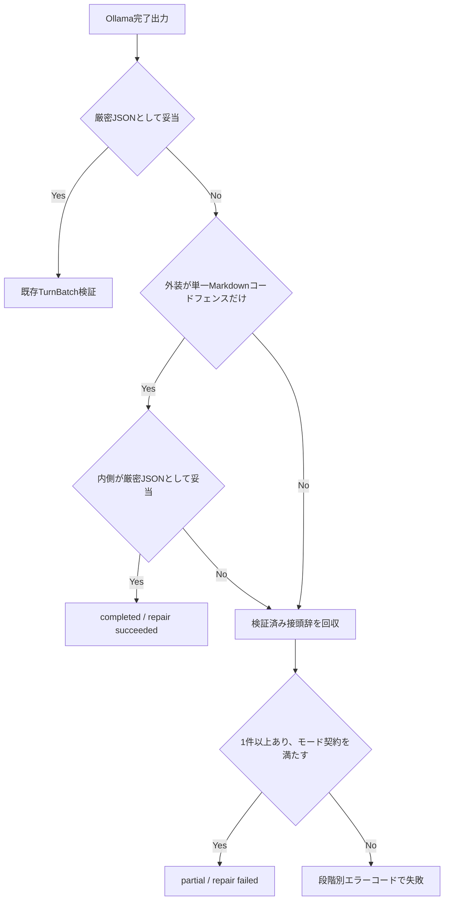

# 会話品質とグループ生成回復 設計書

## 1. 問題

利用者は、既存のAIキャラクターチャットよりも信頼関係の積み重ねを体感できる会話を求めている。しかし現在のグループ会話は、`story` と `round_table` の両方で各キャラクターが独立した回答を並べやすく、直前の発言を受けた補足、反論、相づち、感情の変化が弱い。

2026-07-22時点のローカル監査では、直近7日間のRun 68件中10件が失敗している。失敗は `gemma4:31b` と `gemma4:e4b` に集中し、内訳は `OllamaUnavailable` 4件、`ValidationError` 5件、`ReadError` 1件だった。5件の `ValidationError` はグループ会話が有効な会話で発生したが、失敗理由が型名へ丸められ、構造化JSONのどの検証段階で失敗したか追跡できない。

同じGemma 4、同じ2人のキャラクター設定、履歴を含まない合成入力ではグループ生成が完了した。このため、モデルの恒常的な非対応ではなく、会話内容または確率的な構造化出力の揺れが原因である可能性が高い。

## 2. ゴールと成功基準

判定者は利用者、判定時期は実Ollama受入時とする。

- `story` と `round_table` の各6シナリオ、計12シナリオで、各発言が「利用者の最新発言」または「同じTurnBatch内の直前発言」と意味的につながる。
- 12シナリオで、利用者が言っていない台詞、行動、感情、同意をキャラクターが確定事実として捏造しない。
- 12シナリオで、同一内容の言い換えだけを続けるキャラクター発言を0件にする。
- 構造化出力の異常を、本文をログへ残さず安全な段階別エラーコードで判別できる。
- Markdownコードフェンスで包まれただけの完全なJSONは、追加のモデル呼出しなしで `completed / succeeded` として保存できる。
- 出力が途中で壊れた場合は、先頭から連続する検証済みセグメントだけを `partial / failed` として保持し、存在しない続きを生成しない。
- 対象ユニット・統合テスト、`mypy --strict`、秘密情報検査が成功する。

会話の自然さはモデルとキャラクター設定にも依存するため、「競合サービスより常に優れる」は自動試験の合否条件にしない。利用者が12シナリオ中9件未満しか自然と判定しない場合は、今回のプロンプト契約を不合格とする。

## 3. やらないこと（Out of Scope）

今回は次を行わない。

- クラウドLLM、外部記憶サービス、会話本文の外部送信
- Zetaの非公開プロンプト、画面、キャラクター資産の模倣
- 会話ごとの「好感度」や「信頼度」を単一数値として永続化すること
- キャラクターごとの逐次Ollama呼出し、または生成失敗時の自動再生成
- キャラクター設定、正史記憶、既存メッセージの破壊的な書換え
- 新しいUI、DBテーブル、状態値の追加
- `OllamaUnavailable` と `ReadError` の自動再送。生成本体の再送は重複回答を作るため、別の契約で扱う。

## 4. 代替案

| 案 | 概要 | 却下／採用理由 |
|---|---|---|
| 何もしない | 現在のプロンプトと `ValidationError` を維持する | 失敗原因を追えず、自然さの完了条件もないため不採用 |
| モデルだけ変更する | Gemma 4を使わず、既定モデルへ固定する | 直近ではGemma 4も成功しており、利用者のモデル選択と原因診断を失うため不採用 |
| 失敗時に同じ生成を自動再送する | 構造化出力が壊れたら温度0で1回再送する | 空回答は減る可能性があるが、待ち時間、停止、重複生成、再現性の契約が増えるため今回は不採用 |
| 2段階生成にする | 会話計画を作ってから台詞を生成する | 接続品質を高めやすいが、通常時の待ち時間と失敗点が約2倍になるため初回更新では不採用 |
| 契約強化と決定論的回復 | 接続規則をプロンプトへ追加し、完全JSONの外装だけを修復し、壊れた出力は検証済み接頭辞だけ保持する | 外部送信、DB変更、追加生成なしで品質と診断可能性を改善できるため採用 |

## 5. 採用する設計

状態値、TurnBatch、保存境界、正史記憶の正本は [ARCHITECTURE.md](ARCHITECTURE.md) とし、この文書へ複製しない。

### 5.1 会話接続契約

`group-turn-v3` は次をモデルへ要求する。

1. TurnBatch全体で、最新の利用者発言に直接応答する。
2. 2件目以降のキャラクター発言は、利用者発言だけへ独立回答せず、直前のキャラクター発言を受けて補足、反論、質問、感情反応、行動のいずれかを進める。
3. 同じ結論または説明を言い換えるだけの発言を追加しない。
4. キャラクター設定と共有正史に根拠のない親密さ、合意、秘密、関係変化を確定しない。
5. 利用者の台詞、行動、感情、同意をモデル側で書かない。
6. `story` は場面の連続性を保ち、時間・場所・所持品を説明なしに飛ばさない。
7. `round_table` は登録順を守りつつ、後続話者がそれ以前の発言へ新しい観点を追加する。

### 5.2 構造化出力の信頼境界

Ollama出力は外部入力として扱う。処理順は次とする。

コードフェンス修復は、出力全体が1つのフェンスであり、言語ラベルが空または `json` で、フェンス外が空白だけの場合に限定する。フィールド追加、話者ID補完、発言順変更、本文生成は行わない。

接頭辞回収は、`segments` 配列の先頭から完全に復号・検証できる連続セグメントだけを対象にする。`round_table` では正式キャスト順の空でない先頭部分に一致するところで止める。後続に正しい発言があっても、不正な発言を飛び越えて採用しない。

### 5.3 診断コード

永続化するグループ出力エラーコードは `ARCHITECTURE.md` を正本とする。コードは構文、ルート、セグメント、話者、モード契約、回収不能を区別する。ログとRunには会話本文、キャラクタープロンプト、モデル出力を保存せず、コード、出力文字数、SHA-256、モデル名、モードだけを記録可能とする。初回実装では既存Runの `error_code` だけを更新し、監査項目追加は必要性が確認されるまで行わない。

### 5.4 冪等性と失敗半径

同じ文字列の解析を2回行っても同じDraftまたは同じエラーコードになる。回復処理はモデル呼出し、DB書込み、設定変更を行わない。失敗時に影響するのは現在のRunだけで、過去のメッセージ、TurnBatch、正史記憶を変更しない。

## 6. 一方向ドア

今回通過する一方向ドアはない。DBスキーマ、公開API、外部送信、既存状態値を変更しない。

将来、信頼度の永続化、2段階生成、自動再送を採用する場合は、データ移行、待ち時間、停止、重複実行を別ADRで承認してから実装する。

## 7. リスクと撤退条件

| リスク | 検知 | 対応・撤退 |
|---|---|---|
| 指示が多くなりキャラクター性が弱まる | 12シナリオ中3件以上で口調・価値観が崩れる | `group-turn-v2` の文面へ戻し、接続規則を減らす |
| 接続を意識しすぎて全員が同意する | 反論可能な6シナリオ中4件以上で差異が消える | 「補足、反論、質問」の選択を強める |
| 部分回収が不正発言を表示する | 話者ID、順序、空本文のどれかが試験を通過する | 回収を無効化し、完全失敗へ戻す |
| 修復がモデル出力を意味的に改変する | フェンス除去以外の差分が発生する | 修復処理を削除する |
| Gemma 4の完全失敗が続く | 合成20ターンで完全失敗が2件以上 | モデル別の構造化出力互換性と再送を別設計する |

## 8. 決定ログ

| # | 決定／仮置き／未決 | 内容 | 決定者 | 見直し条件 |
|---|---|---|---|---|
| CQ-01 | 仮置き | 初回は追加モデル呼出しなしで会話契約と決定論的回復を改善する | Codex | 合成20ターンで完全失敗が2件以上 |
| CQ-02 | 仮置き | 利用者の台詞・行動・感情・同意をモデル側で確定しない | Codex | 利用者が明示的に利用者役の描写を求めた場合 |
| CQ-03 | 仮置き | 信頼度を単一数値として永続化しない | Codex | 正史記憶だけでは関係変化を表現できない実例が3件以上 |
| CQ-04 | 仮置き | 12シナリオ中9件以上を自然さの初回合格線とする | Codex | 評価者が2人以上になった場合 |
| CQ-05 | 決定 | PRIVATEな実会話由来12シナリオは本文をGitへ残さず、集計だけを受入記録へ保存する | Codex | 利用者が別の評価セットを指定した場合 |
| CQ-06 | 決定 | v3〜v5は合格線9/12を満たさず、プロンプト規則の追加を打ち切る | Codex | キャラクター設定の入力契約が変わった場合 |
| CQ-07 | 決定 | 話者ごとの逐次生成v6は接続品質を改善しなかったため採用しない | Codex | 別モデルまたは型付きキャラクター設定で再評価する場合 |
| CQ-08 | 決定 | 個別設定を低優先度データとして渡すv7も改善がなく、採用しない | Codex | モデル側で命令階層の保証が追加された場合 |
| CQ-09 | 未決 | 自由文資産を保持しつつ、生成入力を型付きカードへ変換する設定コンパイラを別設計する | 利用者 | キャラクターらしさ低下を許容できるか判断後 |

## 9. 段階分け

1. 最初の30分で、失敗分類、コードフェンス修復、会話接続規則の壊れるユニットテストを追加する。この時点では本番挙動は変わらない。
2. 最小実装で対象テストを通し、既存のTurnBatch保存契約が不変であることを確認する。この時点でローカルモデルなしでも決定論的回復を検証できる。
3. 実Ollamaの合成入力で `story` と `round_table` を確認する。この時点で不合格でも既存データは壊れず、プロンプト版を戻せる。
4. PRIVATEな実会話12シナリオを利用者が評価する。この時点で初めて自然さの完了判定を行う。

予備受入の集計と撤退判断は [会話品質のPRIVATE受入記録](acceptance/CONVERSATION-QUALITY-2026-07-22.md) を参照する。自然さの最終判定者は引き続き利用者とする。
