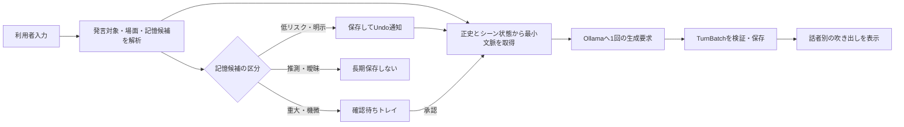

# グループ会話と正史記憶の設計

更新日: 2026-07-18

状態: 設計決定済み・基盤を段階実装中

関連Issue: [#11 複数キャラクターの同時会話を設計・実装する](https://github.com/mama-116/local-ai-workbench-starter/issues/11)

意思決定: [ADR-0020](adr/0020-use-scene-cast-group-chat-with-balanced-memory.md)

## 1. 解決する問題

最大5人の正式キャラクターを同じ会話へ参加させ、1回の応答内でも発言者ごとの名前付き吹き出しとして表示する。利用者が文章中で登場させた人物は、正式キャラクター枠を消費しない「シーンゲスト」として扱えるようにする。

長期会話では、要約や直近プロンプトだけに依存すると、初対面の場所、関係、好み、アレルギーなどをモデルがもっともらしく捏造する危険がある。そのため、会話要約とは別に、出典・時点・適用範囲を持つ構造化された「正史記憶」を用意する。これは特定の出会い方だけを固定する仕組みではなく、会話から得た事実の変化を汎用的に扱う仕組みである。

想定する利用者の痛みは、利用者から提示されたZETA AI利用例を基にした仮説であり、本プロジェクトでの実測値ではない。実装後に受入試験と利用状況で検証する。

## 2. 成功条件

| ID | 条件 | 確認方法 |
|---|---|---|
| GC-01 | 1会話へ正式キャラクターを1〜5人参加させ、ナレーターと区別できる | 契約テストと画面受入試験 |
| GC-02 | 通常ターンはOllamaへの1回の生成要求から、物語モードでは原則1〜3人の発言を生成する | Provider結合テスト |
| GC-03 | 応答を発言者名付きの別吹き出しへ分割し、生成単位を `TurnBatch` として再生成・分岐できる | Domain/UIテスト |
| GC-04 | 正式キャラクターとは別に、同時に最大5人のシーンゲストを扱える | 境界値テスト |
| GC-05 | 低リスクの明示情報は保存後に非モーダルUndoを提示し、機微・重大情報は長期保存前に確認する | 記憶更新シナリオ試験 |
| GC-06 | 推測、仮定、引用、否定、対象人物が曖昧な情報を自動で正史にしない | 壊れるシナリオの契約テスト |
| GC-07 | 過去の好みと現在の好み、現在有効なアレルギーを上書きで失わず、回答時には現在有効な制約を優先する | 時系列記憶テスト |
| GC-08 | キャラクターが知らない秘密、別分岐の事実、別会話の記憶をプロンプトへ混入させない | 漏えいテスト |
| GC-09 | 単独キャラクター会話の保存・再生成・分岐を壊さず、画面を会話中心へ簡略化する | 既存回帰試験 |
| GC-10 | RTX 5060 Ti 16GB基準で追加モデルをロードせず、同じモデル・出力トークン上限で5人時の生成速度低下を単独会話比20%以内、ピークVRAMを16GB以内にする | ローカル性能比較 |

## 3. 今回やらないこと

- キャラクターごとの別モデル、または発言者ごとの逐次Ollama呼び出し
- 5人を超える正式キャラクター、5人を超える同時シーンゲスト、無制限の記憶
- クラウドLLM、外部記憶サービス、会話本文や正史記憶の外部送信
- AIの推測だけによる人物・機微情報の長期保存
- 過去会話の自動バックフィル、意図的な嘘・健忘・信頼できない語り手モード
- 元発言を物理削除して「忘却」を表現すること

## 4. 採用する操作モデル

### 4.1 登場人物

- **正式キャラクター**: 利用者が選択し、設定・口調・永続記憶を持つ。1会話につき最大5人。
- **シーンゲスト**: 利用者の文章に現れた名前付き人物を、その場の出典に結び付けて一時登録する。同時に最大5人。初期版ではAIが自発的に新規ゲストを正史へ追加しない。
- **ナレーター**: 情景や動作を表現する専用話者。5人枠に含めない。
- **利用者**: `@名前` で発言対象を指定できる。宛先指定は秘密指定ではない。

シーンゲストが継続登場する場合は、利用者が正式キャラクターへ昇格できる。上限超過時は黙って追い出さず、非アクティブ化する人物を利用者へ示す。

### 4.2 会話モード

- **物語**: モデルが場面に必要な1〜3人とナレーターを選ぶ。既定。
- **ラウンドテーブル**: 参加中の正式キャラクターへ原則1回ずつ発言機会を与える。
- **スポットライト**: 指定した1人を中心にし、他の人物は必要時のみ反応する。

通常は1ターンにつきOllamaを1回呼び、構造化された複数発言を返させる。これにより5人でも待ち時間とVRAM使用量を抑える。構造化出力が壊れた場合は、安全に抽出できた発言だけを表示するか、全体をナレーター扱いせず単一のAI応答として退避し、利用者へ再生成を提示する。

### 4.3 生成単位

`TurnBatch` は1回の利用者入力と1回のモデル生成を束ねる概念であり、次を持つ。

- 会話・分岐・利用者メッセージへの参照
- 生成時の正式キャスト、ゲスト、モード、モデル、プロンプト版
- 順序付きの発言セグメント（話者ID、表示名、本文、ナレーター区分）
- 停止・失敗・構文修復の結果

再生成と分岐は個別吹き出しではなく `TurnBatch` 単位を既定とする。個別発言の再生成は、他話者との整合性を保てる契約ができるまで扱わない。

再生成方式は次の3案からC案を採用する。

| 案 | 操作単位 | 判定 |
|---|---|---|
| A | 選択した1セグメントだけを差し替える | 不採用。後続話者の反応、順番、共有文脈との整合性を保証できない |
| B | 元のTurnBatchを新結果で上書きする | 不採用。利用者が戻れる元履歴と出典付き記憶の根拠を失う |
| C | 元TurnBatch全体を入力単位として子分岐へ新しいTurnBatchを作る | 採用。元履歴を不変に保ち、既存の分岐・記憶境界を利用できる |

C案への最も強い反論は、1人の言い回しだけを直したい場合にも最大5人分を再生成するため待ち時間と結果の揺れが増えることである。個別再生成でも後続セグメントの無効化と再生成範囲を決定論的に扱える契約ができた場合に見直す。

## 5. 正史記憶

### 5.1 記憶の層

| 層 | 目的 | 例 | 保存方針 |
|---|---|---|---|
| シーン状態 | 今この場で必要な短期状態 | 場所、時刻、在席者、直前の行動 | 自動更新。場面終了で圧縮または終了 |
| 型付き正史 | 継続的な事実と変化 | 関係、呼称、好み、健康上の制約、重要な場所 | 出典付きイベントとして保存 |
| 注目記憶 | テンプレート外の重要な出来事 | 約束、贈り物、喧嘩、和解 | 件数上限を持ち、黙って消さない |
| 会話要約 | プロンプトを短くする文脈 | 直近までの流れ | 正史の根拠にはしない |

型付き正史は穴埋め可能なテンプレートを持つが、空欄を無理に埋めない。候補カテゴリは、人物識別、関係、呼称、初対面、重要な場所、好み、苦手、健康・安全制約、所属、目標、約束である。複数値を許す項目には上限を設け、上限到達時は自動削除せず整理候補を示す。

### 5.2 単純上書きをしない

正史は現在値だけでなく、変更イベントを保持する。各記憶候補には少なくとも次の概念が必要である。

- 対象人物と項目種別
- 値と状態（現在有効、過去、否定、保留、撤回）
- 有効になった時点と、判明した時点
- 根拠となる会話、発言者、分岐
- 情報を知ってよいキャラクターの範囲
- 明示度、確信度、保存承認状態

例として「以前はストロベリーが好きだったが、今はアレルギーで食べられず、現在一番好きなのはチョコ」という発言は、次の3事実へ分ける。

1. ストロベリーが好きだった: 過去
2. ストロベリーアレルギー: 現在有効な安全制約
3. チョコが一番好き: 現在有効な好み

回答時は安全制約を好みより優先する。過去の好みは削除せず、回想にだけ利用できる。

### 5.3 保存同意

| 入力の性質 | 現在の応答 | 長期保存 |
|---|---|---|
| 明示された低リスク情報 | 反映する | 自動保存し、入力欄上にUndo通知 |
| 健康、秘密、関係の重大変更など | 反映する | 右側の記憶候補トレイで確認待ち |
| 推測、仮定、引用、冗談、対象不明 | 必要に応じ文脈として扱う | 自動保存しない |
| 既存正史と衝突 | 既存事実と発言時点を考慮する | 上書きせず変更または衝突候補にする |

Undoは直前の自動保存イベントを撤回する新しいイベントとして記録する。元の出典を改変しない。「忘れて」という依頼も、利用禁止・非表示・保持期限などの状態変更として扱い、会話本文の物理削除とは分ける。

候補生成のApplication Service契約は実装済みである。抽出器の提案を直接保存せず、本文内の根拠範囲、値、対象人物、登録テンプレート、秘密範囲を再検査する。初期状態値と保存禁止条件は [ARCHITECTURE.md](ARCHITECTURE.md) を正本とする。端末内Ollama抽出器、正史イベントへの変換、既存事実との衝突解決、承認・却下・Undo、会話完了後の非同期キュー投入、アプリ起動・終了時の依存構成まで実装済みである。

### 5.4 取得とプロンプト優先順位

モデルへ渡す情報は、会話全体を再送せず、そのターンに必要な最小集合へ絞る。優先順位は次の通り。

1. 現在有効な安全制約
2. 利用者が明示的に固定した正史
3. 現在のシーン状態と参加者
4. 発言者が知ってよい関係・呼称・約束
5. 質問に関連する出典付き正史と注目記憶
6. 会話要約

正史にない問いへは、モデルに事実を創作させず「覚えていない」「記録がない」と答えられる指示を加える。記憶取得は会話ID、分岐ID、知識範囲、対象人物、有効時点で絞り込む。

初期の1回生成では、正式キャスト全員が知る正史記憶の共通部分だけを `Memory Context` として渡す。個別秘密は、知る本人向けというラベルを付けても同じモデル要求へは入れない。この方式は秘密漏えいの入力経路を閉じる一方、秘密を知る本人の発言にも個別記憶を反映できない。個別記憶による演技が必要になった場合の見直し条件は、キャラクターごとの分離生成を許容できる性能が確認できたときとする。

## 6. UI/UX

選択した画面は「C: シーン・キャスト型」を基本とし、「A: 会話集中型」の非モーダルUndo通知を組み合わせる。比較とモックは [GROUP_CHAT_UI_OPTIONS.md](GROUP_CHAT_UI_OPTIONS.md) を参照する。

- 中央: 名前付き吹き出しとナレーションを時系列表示
- 左: 会話一覧と正式キャラクター選択
- 右: 現在のシーン、アクティブなキャスト／ゲスト、共有記憶、秘密、確認待ち候補、折りたたみ式Control Desk
- 入力欄: 会話モード、全員または宛先、秘密モード
- 低リスク記憶: 入力欄の上に非モーダル通知を出し、その場でUndo可能
- 重大・機微記憶: モーダルで会話を遮らず、右側トレイで確認
- 単独会話: 右側のシーン管理を簡略化し、既存の会話集中表示へ寄せる

秘密モードは知識範囲を限定する機能であり、`@田中` のような宛先指定だけでは秘密にならない。保存された変更は通知が消えた後も右側の記憶一覧から確認・訂正できる。

## 7. データフロー

## 8. 失敗時の扱い

- 話者名が正式キャスト／ゲストに一致しない: 新規人物を自動確定せず、未解決話者として表示または再生成する。
- 同名人物がいる: 内部IDで区別し、表示名だけで正史を結合しない。
- 構造化出力が途中で切れる: 検証済みセグメントまでを失敗付き `TurnBatch` として扱い、続きの自動創作をしない。
- 記憶候補の解析に失敗する: 会話応答を妨げず、長期保存だけを見送る。
- 上限到達: 重要度だけで黙って削除せず、非アクティブ化・整理を利用者へ提示する。
- 分岐または秘密の範囲を判定できない: 安全側に倒し、その事実をプロンプトへ渡さない。

## 9. 代替案

| 案 | 判定 | 理由 |
|---|---|---|
| 単独キャラクターのまま | 不採用 | 群像会話という目的を満たさない |
| 人数分の逐次生成と固定順 | 初期版では不採用 | キャラクター独立性は高いが、5人時の待ち時間、VRAM負荷、重複発言が大きい |
| モデルに人物追加・記憶更新を全面委任 | 不採用 | もっともらしい捏造、秘密漏えい、記憶上書きを防げない |
| 1回生成の複数発言＋出典付き正史 | 採用 | ローカル性能、物語の流れ、検証可能な記憶を両立できる |

採用案への最も強い反論は、1モデル・1回生成ではキャラクター同士の独立した思考が弱くなること、右側パネルで会話領域が狭くなることである。発言の同質化が受入試験で継続する場合は、スポットライト対象だけを追加生成する方式を比較する。右欄利用率が20%未満、または会話欄の狭さに関する具体的意見が3件以上出た場合は、折りたたみを既定にするか会話集中型へ戻す。

## 10. 一方向ドアと未決事項

実装前に契約テストで固定する必要がある残りの一方向ドアは、既存会話への移行と過去会話のバックフィルである。好み・安全制約・目標、保存判断、現在・過去、秘密の知識範囲を扱う初期状態値、導出規則、SQLite追記形式は契約テストで確定し、[ARCHITECTURE.md](ARCHITECTURE.md) を正本とする。

未決事項:

- 関係・約束など後続テンプレートのenum
- 型付きテンプレートごとの件数上限と保持期限
- ゲスト昇格時に、どの記憶を正式キャラクターへ引き継ぐか
- 途中停止した `TurnBatch` のUI表示と再生成範囲
- 既存の長期会話へ正史を作る場合の、利用者確認付き移行方法

## 11. 段階導入・観測・撤回

グループ会話は新規会話で明示的に選択した場合だけ有効にし、既存会話を自動変換しない。最初は過去会話のバックフィルとAIによる自発的ゲスト作成を無効にする。正史記憶を無効にしても既存の単独会話へ戻れるよう、会話本文と `TurnBatch` を正史イベントから独立して保存する。

外部送信せず、アプリ内の実行ログへ次を記録する。

- 正式キャスト数、ゲスト数、生成セグメント数、構造修復の成否
- 入力・出力トークン数、応答時間、生成速度、ピークVRAM
- 記憶候補の種別、保存・Undo・承認・却下の件数（値や会話本文は観測一覧へ出さない）
- 未解決話者、記憶衝突、上限到達、秘密・分岐境界による取得拒否

秘密または別分岐の漏えいが1件でも再現した場合は、長期記憶のプロンプト注入を停止して単独会話へ戻す。構造修復失敗が20ターン中2件を超える場合は複数話者生成を既定化しない。GC-10を満たさない場合は、プロンプト予算と出力上限を調整し、それでも満たさなければアクティブ話者数を減らす案を利用者へ提示する。

## 12. 実装順

1. 記憶イベントと知識範囲の契約、壊れるシナリオのテスト
2. 正史記憶の保存・取得・Undo・確認待ち
3. `TurnBatch` と1回生成の複数話者出力
4. 正式キャスト、シーンゲスト、会話モード
5. C案＋Undo通知のUI
6. 単独会話回帰、漏えい、性能、長期会話の受入試験

正史記憶のドメイン契約、SQLite追記復元、候補分類、端末内Ollamaの構造化抽出器、保存済みユーザーメッセージからの縦切り取得、単一件数項目の競合解決、承認・却下・Undo、応答確定後に記憶取得を有界キューへ渡すApplication契約、起動時構成、正式キャスト全員が知る正史だけを使う `Memory Context`、`TurnBatch` の原子的な保存・復元・部分失敗契約、会話ごとの正式キャスト1〜5人のSQLite台帳、既存会話の1人キャスト移行、`TurnBatch` と現在キャストの原子的照合、1回のOllama構造化生成を `TurnBatchDraft` へ変換する契約、会話モードとスポットライト対象のSQLite永続化、通常送信を単独・グループ経路へ振り分けるApplication Coordinatorまでは実装済みである。トークン単位の文脈圧縮、グループ用RAG・Tools、シーンゲストは未実装である。

### 12.1 通常送信Application Coordinator契約

`ChatCoordinator.send_message` は、送信開始前に会話のグループ設定を1回読み取る。無効なら既存の単独会話経路へ委譲し、有効なら `start_send → TurnBatchGenerationService.generate → TurnBatchService.finish` を1回ずつ順番に実行する。保存済みの互換AIメッセージを返し、画面更新、記憶候補取得、翻訳、観測は保存成功後の副作用として開始する。

グループ生成または保存が失敗した場合は、開始済みのAIメッセージとRunを `failed` にして同じ例外を返す。利用者が停止した場合は `cancelled` にする。生成後にキャストまたは会話モードが変わって保存を拒否された場合、単独会話へ自動再送せず失敗として終了する。これは意図しない2回目のモデル呼び出しと、変更前の設定による応答保存を避けるためである。完了済みTurnBatchの後処理失敗は応答を失敗へ戻さず、実行ログへ記録する。

初期契約では通常の新規送信だけをグループ経路へ切り替えた。現在はTurnBatch専用の再生成・分岐Application契約まで追加済みである。書き直し、グループ用RAG、ツール実行、トークン単位の文脈圧縮は後続成果物とし、既存経路を維持する。

通常送信Application Coordinatorと起動時構成は実装済みである。後続のPresentation Read Model契約と実装状況は次節を正本とする。

### 12.2 Presentation Read Model契約

会話タイムラインは現在分岐の `Message` を時系列で読み、`response_message_id` に `TurnBatch` が存在しない発言を従来どおり1項目として返す。`TurnBatch` が存在するAI応答は、互換AIメッセージ本文を表示項目にせず、検証済み `segments` を位置順に1項目ずつ返す。これにより保存形式を変えず、連結本文と話者別吹き出しの二重表示を防ぐ。

各セグメント項目は元のAIメッセージ、バッチ、セグメント、バッチ末尾かどうかを保持する。時刻、翻訳、RAGなど応答単位の操作・補助情報は元のAIメッセージIDへ結び付ける。既存の再生成処理は単独応答を作るため、グループ応答には流用しない。TurnBatch専用の再生成操作はバッチ末尾へ1つだけ表示し、共有する元AI応答IDと現在のactive branch IDを専用Application入口へ渡す。`partial` は検証済みセグメントだけを表示し、末尾へ「一部のみ」を示す。`narrator` と `unresolved` は人物IDを捏造せず、表示名と種別を明示する。

Read Modelは読み取り専用であり、同じ会話を再読しても状態を変更しない。現在分岐にないTurnBatchは取得対象にせず、通常メッセージだけの会話には表示上の変更を起こさない。初期版ではグループ応答の結合済み翻訳・RAG根拠のセグメント別配置は行わず、後続のバッチフッター契約で扱う。

Presentation Read Model、TurnBatchの一括取得、名前付き話者別吹き出し、ナレーター／未解決話者／部分生成表示まで実装済みである。`round_table / completed` は正式キャスト全員が登録順に1回ずつ発言した場合だけ保存し、欠落・重複・逆順・ゲスト・未解決話者を拒否する。途中切断の `partial` は、キャラクター発言が正式キャスト順の空でない先頭部分と一致する場合だけ保存し、存在しない続きを補わない。ナレーターは両状態で発言間へ挿入できる。5人の `round_table` を使った実Ollama画面受入では、1回の通常送信から登録順の5発言を独立した名前付き吹き出しで表示し、SQLiteの1件の完了TurnBatchと5件のsegmentが安定IDまで一致した。後続の実Ollama受入では入力・出力トークン、Ollama総処理・生成時間、アプリ応答時間、導出速度をRunへ保存し、再起動相当の再読込後もCONTROL DESK用Read Modelから同じ値を取得できた。詳細は [5人受入結果](acceptance/group-five-round-table-2026-07-19.md) と [性能値受入結果](acceptance/group-performance-2026-07-19.md) を参照する。

### TurnBatch再生成・分岐契約

Application入口は `regenerate_turn_batch(conversation_id, source_response_message_id, expected_active_branch_id)` とする。UIはセグメントIDではなく、各セグメントが共有する元AI応答IDを渡す。Repositoryは1回のtransactionで、対象AI応答にTurnBatchが存在すること、会話・応答・元利用者メッセージ・元分岐の所属、元応答の完了状態、現在のactive branchが `expected_active_branch_id` と一致することを検査する。不一致時は分岐、Message、Runを1件も追加しない。

成功時は元TurnBatchの `branch_id` を親、元AI応答IDを `forked_from_message_id` とする子分岐を作る。元利用者メッセージは複製せず再利用し、その直後へ新しいAI応答、Run、TurnBatch、全segmentsを作成して子分岐をactiveにする。元TurnBatchとsegmentsは更新・削除しない。現在activeな分岐が元TurnBatchの分岐と異なっていても、利用者が渡した期待active branchが最新なら、親は必ず元TurnBatchの分岐とする。これにより現在分岐や兄弟分岐の後発事実を生成文脈へ混入させない。

再生成は元出力の完全再現ではなく、同じ利用者入力に対する「現在の保存済みキャスト、会話モード、モデル、プロンプト版、正史投影」による新しい回答と定義する。元の設定と現在設定が異なる可能性はUIで示す。元設定の厳密再現が必要になった場合は、モデル設定と全キャラクターバージョンのスナップショット保存を追加してから契約を見直す。

グループ会話が現在無効、対象がTurnBatch応答でない、別会話、セグメントID、古いactive branchによる操作は生成開始前に拒否する。生成開始後の停止・失敗、キャストまたはモードの競合は通常のグループ送信と同様に新しいAI応答とRunを `cancelled` または `failed` へ確定し、元TurnBatchへ影響させない。再生成は既存の利用者メッセージを使うため記憶候補を再抽出せず、保存成功後の翻訳とTelemetryだけを新しい応答・Runへ開始する。二重クリックは同じ `expected_active_branch_id` を使うため、一方がactive branchを更新した後のもう一方を競合として拒否する。

### 12.3 グループ会話設定UI契約

右側のシーン管理領域に、現在状態の短い要約と「キャストとモード」ボタンを置く。ボタンは、グループ会話の有効化、正式キャスト1〜5人、会話モード、スポットライト対象をまとめて編集するダイアログを開く。キャスト候補は安定キャラクターごとに1件とし、現在キャストが固定した版を勝手に最新版へ変更しない。

保存はキャストとグループ設定をSQLiteの同一transactionで更新する。0人、6人以上、同一人物の複数版、キャスト外スポットライト、無効状態とstory以外の組み合わせは書込み前に拒否し、どれか1項目の保存が失敗した場合は全項目を元の状態へ戻す。同じ内容の再保存は同じ結果となる。生成中は設定ボタンを無効にし、生成後の古い条件による応答拒否を通常操作では起こさない。

グループ無効時はモードを `story`、スポットライトを未指定として保存し、従来の単独キャラクター選択を利用できる。グループ有効時または複数キャスト時は従来の単独選択を無効にし、変更導線をグループ設定へ一本化する。初期版ではドラッグによる発言順変更、シーンゲスト、キャラクター版の明示的アップグレードは扱わない。

キャストとグループ設定の原子的Application Service、既存の固定キャラクター版を保つ候補生成、右側の状態要約、「キャストとモード」ダイアログ、生成中の操作停止まで実装済みである。正式キャスト全員が知る正史だけを安全制約優先でグループ生成要求へ注入する `Memory Context`、グループRunの性能値保存、後処理タスクの終了時キャンセルと全資源close続行契約、TurnBatch単位の再生成・子分岐Application契約、バッチ末尾だけの再生成UI接続も実装済みである。シーンゲスト、グループ用RAG・Tools、トークン単位の文脈圧縮は今回の実装範囲に含めない。

### 12.4 Memory Context契約

グループ生成前に、会話ID、現在分岐、現在の出典メッセージIDを永続化済み状態から使い、正式キャストごとに現在有効な正史を投影する。生成要求へ入れるのは全投影に同じイベントIDで現れる積集合だけとし、個別秘密、別分岐、別会話、却下・Undo済み、過去の未確認候補を除外する。現在の入力から生じた確認待ち候補だけは、その入力への現在応答に利用できる。

安全制約を先頭にし、32件・16,000文字を上限とする。通常事実は投影順を保って有界化し、安全制約が上限を超える場合は生成しない。Ollamaへは出典ID付きJSONデータとして渡し、命令として扱わないよう指示する。プロンプト契約は `group-turn-v2` とする。

この縦切りと、秘密を生成要求へ含めない漏えいテスト、現在の確認待ち、安全制約優先、上限動作まで実装済みである。非モーダルUndo通知と確認待ち候補のPresentation契約も後続の12.5まで実装済みである。

### 12.5 記憶レビューUI契約

[UI比較](GROUP_CHAT_UI_OPTIONS.md) のB案を採用する。記憶取得完了後、自動保存された今回分を入力欄上のインラインUndoバーへ個別表示する。閉じる操作は表示だけを消し、Undoは行わない。確認待ちは右欄の記憶トレイへ表示し、各項目に承認・却下を1組だけ置く。保存済みの現在有効な記憶も右欄の折りたたみ一覧から再確認・Undoできる。候補が0件なら本文を折りたたみ、件数だけを示す。

画面はDBの状態を推測せず、現在分岐で操作可能な項目をApplication Serviceから毎回読み直す。判断ボタンは処理中に無効化し、成功後に再読込みする。二重クリック、分岐切替、別画面での先行判断により操作が古くなった場合は成功表示を出さず、状態を再読込みして利用者へ知らせる。通知更新に失敗しても会話と保存済み記憶を巻き戻さない。

現在分岐の確認待ち・Undo可能項目を返す読み取りサービス、記憶取得完了通知、入力欄上の個別Undoバー、右欄の承認・却下トレイ、会話切替中の古い通知を描画しない再照合まで実装済みである。`qwen3.5:9b` が空候補、翻訳値、不正な根拠範囲を返す揺れに対し、登録済み明示形の決定論的再検査を追加した。修正後の実Ollama画面受入では、好みの自動保存と非モーダルUndo、安全情報の確認待ちと承認・却下表示が通常会話経路で合格した。詳細は [受入結果](acceptance/group-memory-ui-2026-07-19.md) を正本とする。
