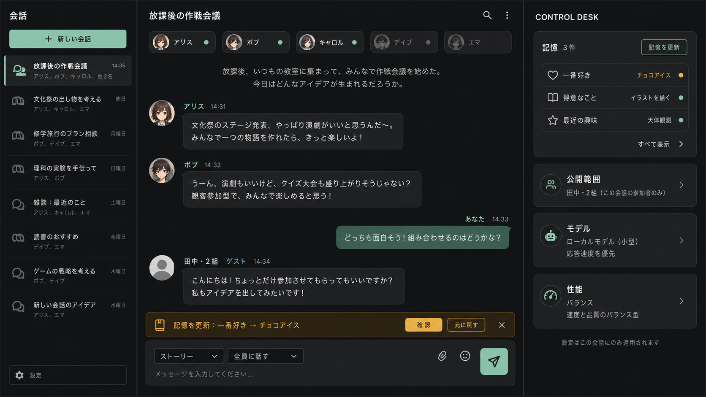
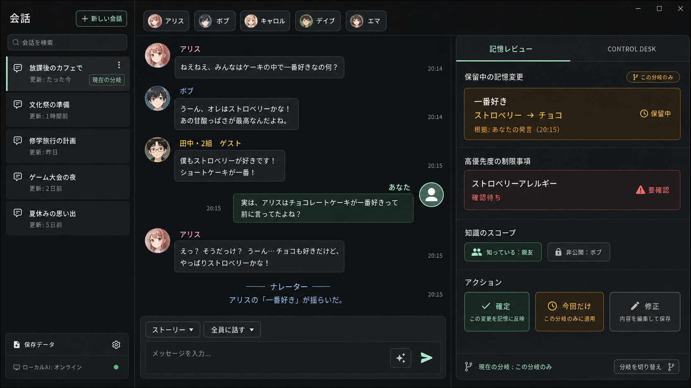
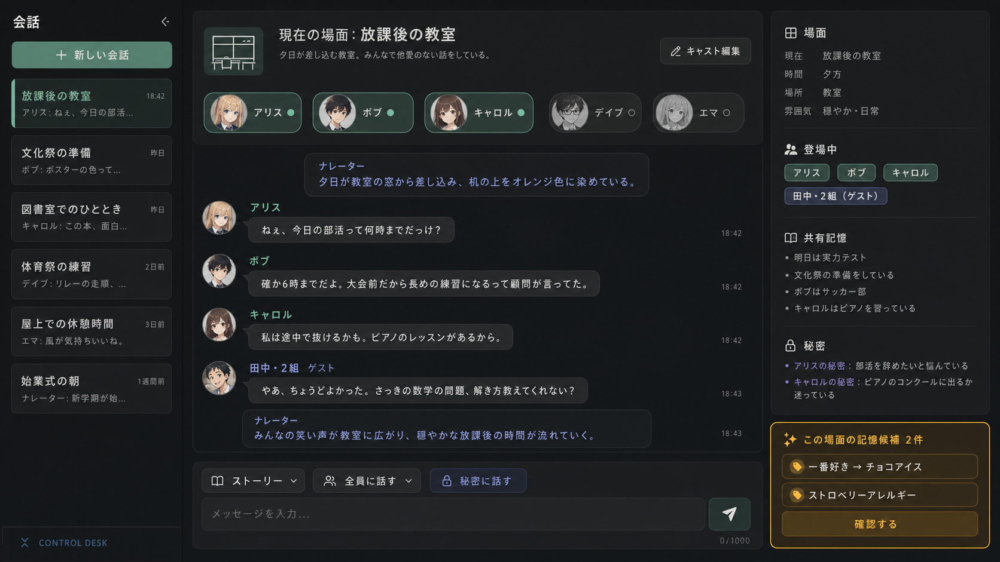

# グループ会話 UI 3案比較

更新日: 2026-07-18

状態: C案を基本に、A案の非モーダルUndo通知を採用

## 記憶のUndo・確認待ち操作（2026-07-19）

採用済みのシーン・キャスト画面へ記憶判断を追加する操作だけを比較する。いずれも低リスク記憶のUndo、確認待ちの承認・却下、会話をモーダルで止めないことを必須とする。

| 案 | 中心となる操作 | 向いている人 | 採用理由 | 強い反論 |
|---|---|---|---|---|
| A: SnackBar＋確認トレイ | 保存ごとに画面下の通知でUndoし、確認待ちは右欄で判断 | 通知を短時間だけ見たい人 | 会話領域を常時使わず、既存UIへの変更が小さい | 複数件が連続すると通知を見逃しやすい |
| B: インラインUndoバー＋確認トレイ | 入力欄の上に今回保存分を一時表示し、右欄で確認待ちを判断 | 長い会話を続けながら記憶を確実に扱いたい人 | 複数件を個別Undoでき、通知が消えても右欄に判断対象が残る | 入力欄の縦幅を一時的に使う |
| C: 右欄集約 | Undoも承認・却下も右欄だけで行う | 通知を嫌い、管理画面を自分で確認する人 | 会話欄が動かず最も静か | 保存に気付かず、誤記憶の訂正が遅れる |

推奨・採用はB。Undoバーは今回の保存分だけを表示し、閉じても記憶自体は削除しない。確認待ちトレイは0件なら折りたたむ。狭幅対応を行う段階では右欄全体をドロワーへ移す。見直し条件は、入力欄が狭いという具体的意見が3件以上、またはUndoバーを閉じずに放置する利用が半数を超えた場合とする。

- [A案モック](mockups/memory-review-a-snackbar.svg)
- [B案モック（採用）](mockups/memory-review-b-inline.svg)
- [C案モック](mockups/memory-review-c-sidebar.svg)

## 比較

| 案 | 情報階層と操作モデル | 強み | 強い反論 | 判定 |
|---|---|---|---|---|
| A: 会話集中型 | 中央の吹き出しを最大化し、記憶更新は入力欄上の通知で扱う | 没入感が高く、既存の単独会話から移行しやすい | 誰が場にいて、誰が秘密を知るかを見失いやすい | Undo通知を採用 |
| B: 記憶レビュー型 | 正史記憶と確認待ちを常時大きく表示する | 誤保存の監査と修正に強い | 日常会話でも管理画面を操作している感覚が強い | 不採用 |
| C: シーン・キャスト型 | 会話の横に場面、登場人物、共有／秘密記憶を並べる | 最大5人の群像劇と知識範囲を把握しやすい | 会話欄が狭くなり、右欄が使われない可能性がある | 基本案として採用 |

## A: 会話集中型

低リスク記憶の保存後、入力欄の上に「記憶を更新しました［元に戻す］」を短時間表示する。この通知は会話を遮らず、消えた後も記憶一覧から訂正できる。

## B: 記憶レビュー型

確認性は最も高いが、物語への没入を損ねやすい。記憶の一括整理が必要になった場合の専用画面として再検討できる。

## C: シーン・キャスト型

右側は上から、現在のシーン、アクティブな正式キャスト／ゲスト、共有記憶、秘密、確認待ち候補、折りたたみ式Control Deskとする。重大・機微な記憶候補はここで確認する。通常の低リスク更新にモーダルは使わない。

## 決定

複数キャラクター会話ではC案を基本とし、低リスク記憶更新だけA案の非モーダルUndo通知を組み合わせる。単独キャラクター会話では右側の場面管理を簡略化し、会話集中型へ寄せる。

`@キャラクター名` は発言対象の指定であり、秘密指定ではない。秘密は入力欄の専用操作で明示し、右側で知識範囲を確認できるようにする。

見直し条件は、右欄利用率20%未満、または会話欄の狭さに関する具体的意見が3件以上出た場合とする。
