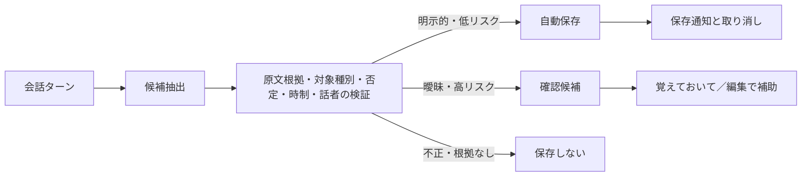

# 自動記憶の定着と明示保存の設計

更新日: 2026-07-24

状態: 実装・自動試験完了、実モデル評価は利用可能モデルの範囲で完了

関連Issue: [#48 発言を選んで現在のキャラクターへ明示記憶を保存できるようにする](https://github.com/mama-116/local-ai-workbench-starter/issues/48)

## 1. 解決する問題

現在の記憶候補生成は、会話モデル名を要求へ入れる一方、抽出先をこのPCの
Ollamaへ固定している。DGXだけに存在する会話モデルを選ぶと抽出に失敗し、
決定論的な語句抽出へ縮退する。この縮退経路が
「ちょっと溶けかけが好き」を `liked_food=ちょっと溶けかけ` として
自動保存した。

また、各発言を独立して処理するため、複数ターンで具体化された対象と条件を
1件の記憶として定着できない。

## 2. ゴールと成功基準

- 自動記憶を主経路とし、明示された低リスク情報は会話を止めずに保存する。
- 複数ターンで対象が具体化された場合、出典を失わず新しいイベントで更新する。
- 状態、温度、食感、調理法だけを食べ物として自動保存しない。
- モデル出力を直接保存せず、対象種別、原文根拠、否定、時制、話者を
  アプリ側で検証する。
- 健康、安全、秘密、第三者、衝突、曖昧な統合は確認待ちにする。
- 「覚えておいて」は自動抽出を無効化する代替ではなく、取りこぼしの再試行、
  関連発言の明示選択、保存文の編集、重要指定を行う補助経路とする。
- LocalとDGXのどちらでも、選択した記憶抽出用の接続先とモデルを同じ組として使う。
- 固定日本語fixtureで対象値、条件値、判断、出典が期待どおりになる。

判定者は自動テストとし、実Ollamaの品質評価はLocalとDGXを分けて記録する。

## 3. 今回やらないこと

- 会話本文や正史記憶を外部APIへ送ること
- 過去会話全体の自動バックフィル
- AI発言だけを根拠にした記憶保存
- 正史イベントの物理上書きまたは削除
- 正史記憶の意味検索

## 4. 採用する設計

### 4.1 自動記憶を主経路にする

低リスクで、対象と値がユーザー原文にあり、現在の発言だけで意味が完結する
候補は自動保存してUndoを表示する。

複数のユーザー発言を統合する場合も自動抽出は行う。ただし、値または対象の
補完が一意でない場合、既存正史と衝突する場合、重大・機微情報を含む場合は
自動保存せず確認待ちにする。

「スーパーカップのチョコチップ味」の会話は次のように段階更新する。

1. 「アイスが好き。チョコ味」から低リスクの好みを保存する。
2. 質問だけのターンでは変更しない。
3. 「スーパーカップのチョコチップ味」で対象を具体化する。
4. 「ちょっと溶けかけが好き」で同じ対象へ状態条件を追加する。

各更新は元イベントを消さず、複数のユーザーメッセージIDを根拠として追記する。

### 4.2 「覚えておいて」は補助経路にする

ユーザーメッセージの操作から開始し、現在の発言と候補となる先行ユーザー発言を
表示する。利用者は根拠を選択し、抽出された「記憶の中心」と、好みの場合は
「状態」を確認する。保存文はこれらの原文根拠付き項目からアプリが短く組み立て、
全文の会話口調をそのまま正史へ入れない。

抽出モデルには自由な要約文を生成させない。各項目が選択したユーザー原文に
存在する場合だけ候補として使い、抽出モデルが利用不能な場合も登録済み表現と
限定した会話接頭辞の除去だけで縮退する。原文は引用・監査用の根拠として保持し、
生成コンテキストへは確認済みの短い記憶文を渡す。

この操作は、外部送信、秘密・知識範囲、分岐、対象人物、件数上限、Undoの
既存境界を迂回しない。同じ要求IDの再試行は冪等にする。

保存画面には登録済みCharacterをチェック一覧で表示する。操作元の発言ターンに
参加していたCharacterだけを「自動：この場にいた」として事前選択し、利用者が
保存前に追加または解除できる。単独会話はそのターンの選択Character、グループ
会話は保存済みTurnBatchの正式キャストを使い、現在のキャストから過去へ逆算
しない。1人も選ばれていない状態は保存せず、新しい記憶で空集合を「全員」と
解釈しない。

段階更新の前後で参加者集合が変わった場合、置換イベントだけでは人物ごとの
新旧知識を正確に表せないため自動統合しない。旧知識を新参加者へ広げることも、
新しい訂正を不在だった人物へ遡及させることもしない。

### 4.3 用途別モデル設定

選択済みのA案を採用する。既存の「用途別モデル設定」へ `記憶抽出` を追加し、
登録済みのこのPCまたはDGXと、その接続先に存在する生成対応モデルを選ぶ。
Embedding設定とはプロファイルを共有しない。

接続先、モデル名、モデルdigestを一組として保存し、実行直前にもローカル／
プライベートLAN、無料運営、Cloud無効、モデル実体を再確認する。

## 5. 処理フロー

## 6. 失敗時の扱い

- 選択モデルが接続先にない: 自動保存せず、記憶抽出の失敗を表示する。
- 抽出器が利用不能: 完全文として安全性を証明できる登録済み表現だけを処理する。
- 状態語しか得られない: 保存しない。先行対象が一意なら統合候補として再評価する。
- 複数の対象候補がある: 確認待ちにする。
- 保存競合: 元イベントを上書きせず、再読込み後に確認待ちへ戻す。
- 手動補助の抽出失敗: 選択した原文を編集欄に残し、利用者が中止または修正できる。

## 7. 検討した代替案

### 7.1 すべて「覚えておいて」で保存する

誤保存は減るが、利用者が毎回操作しなければならず、自然な会話から記憶が
定着するという目的を満たさないため採用しない。高リスク情報の確認経路としては
残す。

### 7.2 モデルが抽出した内容をすべて自動保存する

実装は単純だが、今回確認された「ちょっと溶けかけ」を食べ物として保存する
誤りを防げないため採用しない。固定評価で誤保存ゼロを維持でき、実利用の
取り消し率が十分低い場合にだけ自動保存対象を段階的に広げる。

## 8. リスクと撤退条件

最も強い反論は、複数ターンの統合によりモデルが別の対象やAI発言を混ぜ、
誤記憶を強化することである。根拠はユーザー発言だけに限定し、対象値と条件値が
出典原文に存在しない候補は保存しない。

固定評価で誤った自動保存が1件でも発生した場合、その分類の自動保存を停止して
確認待ちへ戻す。秘密または別分岐の漏えいが1件でも発生した場合は、複数ターン
統合を停止する。

## 9. 決定ログ

| 状態 | 内容 | 決定者 | 見直し条件 |
|---|---|---|---|
| 決定 | 自動記憶を主経路、「覚えておいて」を補助経路にする | 利用者 | 誤保存が日常利用を妨げる場合 |
| 決定 | 記憶抽出モデルはA案の用途別モデル設定へ置く | 利用者 | 設定の発見性に問題が出た場合 |
| 決定 | 明示保存は短い確認文を表示し、内部では項目・状態・根拠を分離する | 利用者 | 要約の訂正頻度が高く原文範囲選択の方が速い場合 |
| 仮置き | 複数ターン統合も低リスクかつ一意なら自動保存する | Codex | 固定評価で誤保存が1件発生した場合 |
| 決定 | 記憶抽出設定の初回は未設定とし、明示保存までは安全な決定論的抽出だけを使う | Codex | 初回導入時の取りこぼしが許容できない場合 |

## 10. 段階導入

- [x] 日本語fixtureと壊れるシナリオの契約テストを追加する。
- [x] 記憶抽出の接続先・モデル設定契約を追加する。
- [x] 複数出典を保持する候補生成契約を追加する。
- [x] 自動保存の段階更新を実装する。
- [x] 「覚えておいて」補助UIを実装する。
- [x] 記憶抽出をLocal／DGX、Embeddingを利用可能な実モデルで評価する。

「覚えておいて」は完了済みユーザー発言の操作から開始し、現在分岐にある
直近8件までのユーザー発言を選択できる。合計16,000文字、短文化後200文字を
上限とする。「記憶の中心」と「好みの状態」の各項目が選択原文に存在する場合
だけ、チェックされた1人以上の登録Characterが知る `confirmed` 記憶として追記する。項目は
`canonical_memory_event_attributes` へ根拠メッセージID付きで保存し、原文一覧、
短い表示文と分離する。同一request IDの再送は同じイベントへ収束し、既存の
保存済み一覧とUndoを再利用する。

段階更新では、現在有効な食べ物の好みが一意な場合に限り、商品名や状態条件を
新しい置換イベントとして追記する。旧イベントと出典は削除せず、
`canonical_memory_event_sources` に会話順で保持する。対象候補が複数なら
自動保存せず確認待ちにする。

実モデル評価の詳細は
[2026-07-24 Local／DGX評価](acceptance/hybrid-rag-memory-evaluation-2026-07-24.md)
を参照する。
