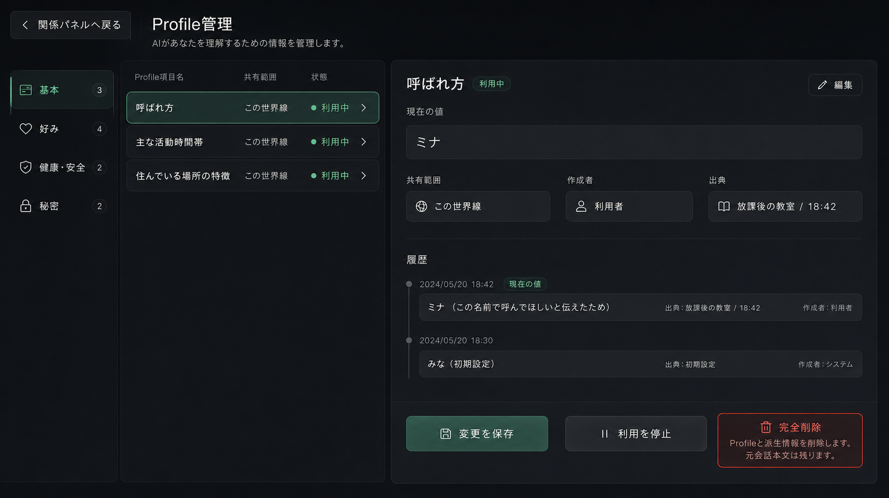
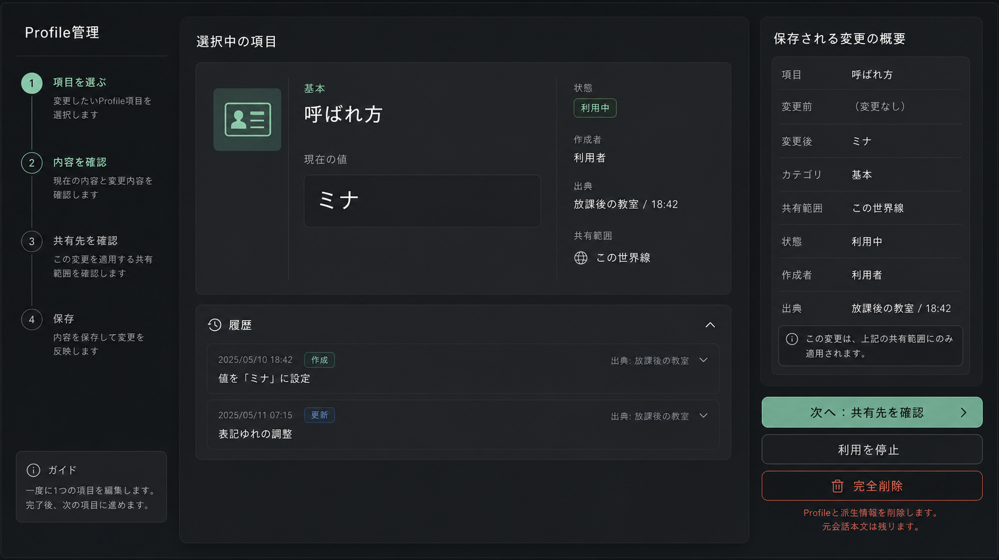
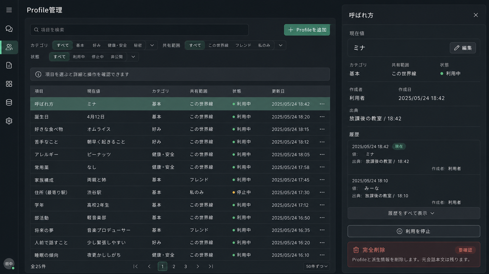

# Profile管理UI 3案比較

作成日: 2026-07-26

対象: 世界線単位のProfile管理

採用: A案「2ペイン管理型」

比較用モックは同じ1440×900、同じダークテーマ、同じ人物・Profileデータで作成した。どの案も、右側関係パネルの「Profile管理」から1クリックで開くこと、元会話を残す完全削除範囲を事前表示することを共通条件とする。

## 比較

| 案 | 情報階層 | 操作モデル | 初心者の次の一手 | 誤操作対策 | 強い反論 |
|---|---|---|---|---|---|
| A: 2ペイン管理型 | 左に項目一覧、右に選択項目の現在値・出典・履歴・操作 | 一覧から選び、同じ画面の右側で編集する | 最初に左の項目を選ぶ位置が固定される | 完全削除を通常編集から分離し、範囲確認を同じ右欄へ表示できる | 横幅を使い、狭い画面では右ペインのドロワー化が必要 |
| B: ガイド型 | 「確認待ち」「最近保存」「共有中」「すべて」の順に行動別カードを積む | 推奨タスクを上から処理する | 確認待ちがある場合は最も明確 | 履歴と共有範囲がカード間に分散し、全体像を見失いやすい | 初回は親切だが、継続利用で目的の項目へ到達する操作が増える |
| C: 監査台帳型 | 時系列イベントを主にし、現在値は派生表示する | 履歴を検索し、イベント単位で確認・Undoする | 正確な出典確認には強い | 変更理由と過去状態を最も追いやすい | 日常的な値の編集に台帳用語が前面へ出て初心者には重い |

## モック

### A: 2ペイン管理型

### B: ガイド型

### C: 監査台帳型

## 決定

A案を採用する。既存B案の右側関係パネルから自然につながり、項目を選ぶ場所と操作する場所が常に同じで、現在値・作成者・出典・履歴・共有範囲を一画面で比較できるためである。確認待ち項目には右側で確定・却下を表示し、自動保存項目にはUndo、通常項目には利用停止・再開を表示する。秘密、健康、重大関係だけ明示確認し、通常編集でモーダルを連続させない。

採用案への最も強い反論は、狭幅で2ペインが窮屈になることである。狭幅受入で右欄が読めない、または項目選択後の横スクロールが発生する場合は、左一覧を先に表示して選択後に右詳細へ遷移するドロワー型へ見直す。

完全削除は「この世界線のProfile全項目と派生情報が対象」「元会話本文は残る」を同時に表示し、対象確認チェックが入るまで実行できない。値そのものを削除完了記録へ残さない。
