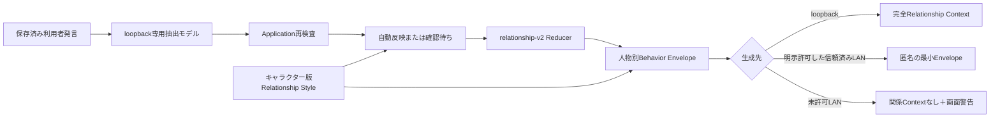

# キャラクター別の言動・関係同期 設計書

正本:

- 状態値、権限、データ境界: [ARCHITECTURE.md](ARCHITECTURE.md)
- Profile・関係形成の利用目的: [RELATIONSHIP_PROFILE_DESIGN.md](RELATIONSHIP_PROFILE_DESIGN.md)
- UI比較: [RELATIONSHIP_FEEDBACK_UI_OPTIONS.md](RELATIONSHIP_FEEDBACK_UI_OPTIONS.md)
- 関係分類: [RELATIONSHIP_TAXONOMY.md](RELATIONSHIP_TAXONOMY.md)
- Issue: [#60](https://github.com/mama-116/local-ai-workbench-starter/issues/60)

## 1. 問題

実利用DBではユーザー発言59件に対して関係イベントが0件で、端末内抽出は `OllamaUnavailable` で20回失敗していた。LANにだけ存在する会話モデル名をloopback抽出器へ渡していることが直接原因である。

関係候補は応答確定後に抽出されるため、成功しても現在発言への応答は変化前の状態で生成される。加えてLAN生成では、現行の秘密保護によりRelationship Context全体を送らないため、画面上の関係値とキャラクターの言動が同期しない。

キャラクター版が持つ構造化設定は表示名とsystem promptだけであり、関係への感受性、表現、回復速度を機械検査できない。共通の「親しく話す」指示を追加すると、無口、尊大、家庭的など複数キャラクターの差を潰す。

## 2. ゴールと成功基準

配布者が固定試験と実画面で次を判定する。

- LAN会話モデルを選んでも、独立したloopback抽出モデルで関係分類が成功する。
- 同じ利用者発言の検証済み受け止めが、その発言への応答Contextへ入る。
- キャラクター4種の固定試験で、出来事分類は同じでも表現指示と許可範囲内の重みが異なる。
- 意味のある10ターン当たり3〜5回の小変化になり、挨拶、同文反復、引用、仮定、第三者言及は0回である。
- 好感度80以上で低重大度の単純反復だけでは100へ到達しない。
- 重大な低下は確認待ちで、低重大度の安全な自動反映は1クリックでUndoできる。
- 信頼済みLANへの最小Envelopeに人物名、Profile、本文、理由、履歴、IDが0件である。
- 別世界線、別分岐、別人物の秘密が単独・グループ生成へ0件混入する。

## 3. やらないこと（Out of Scope）

- 毎ターン必ず指標を変える。
- LLM出力の数値を好感度・信頼・緊張へ採用する。
- キャラクターsystem promptをRelationship Styleから自動上書きする。
- 高重大度の低下、恋愛・婚姻・性的・支配・監禁・被害関係を自動確定する。
- Profile、本文、出典、関係履歴、人物名をLANへ送る。
- 時間経過だけの自動減衰、課金・長時間利用・秘密開示による増加。

## 4. 代替案

| 案 | 概要 | 却下/採用理由 |
|---|---|---|
| 何もしない | 現行の応答後抽出と全件確認待ちを維持 | 実利用でイベント0件のため不採用 |
| 共通の好感度別プロンプト | 全キャラクターへ同じ言動表を追加 | 実装は小さいが個性を潰すため不採用 |
| 会話モデルに毎回数値を決めさせる | 応答と一緒に差分を出力 | 同期は容易だが再現性、Undo、二重処理耐性がないため不採用 |
| 共通Reducer＋版付きRelationship Style | 事実分類は共通、重みと表現はキャラクター版で決定 | 決定論と個性を両立できるため採用 |
| LANへRelationship Context全体を送る | Profileと履歴を含む既存JSONを送信 | 秘密境界を失うため不採用 |
| 匿名の最小Behavior Envelope | 明示許可した信頼済み接続だけへ表現帯を送る | 実用性と漏えい半径を両立するため採用 |

## 5. 採用する設計

### 5.1 データフロー



抽出は会話モデルと独立した `qwen3.5:9b` を既定とし、loopback `/api/tags` に実在するモデルだけを選択できる。抽出失敗は会話保存と生成を失敗へ戻さない。返答前の抽出が成功した場合だけ、同じ発言のイベントを応答Contextへ含める。応答後の再試行は決定論的イベントIDで冪等にする。

### 5.2 Relationship Style

キャラクター版は次の構造化値を持つ。列挙値の正本は `ARCHITECTURE.md` とする。

- 親しくなる速さ: `slow / standard / quick`
- 感情表現: `reserved / balanced / expressive`
- 重視するもの: `words / commitments / boundaries / shared_experience`
- 衝突時の反応: `withdraw / direct / repair_seeking`
- 回復速度: `slow / standard / quick`

既存キャラクターはすべて標準値へ互換移行する。Relationship Styleは共通安全Policyを上書きせず、報復、羞恥、脅迫、人格採点を許可しない。キャラクター編集で版を作る時だけ変更し、既存版を破壊更新しない。

### 5.3 relationship-v2

基礎差分は `relationship-v1` を維持する。Relationship Styleは次だけを許可する。

- `quick` な親密化は肯定イベントの好感度へ最大 `+1`。
- 重視対象と一致する `kept_commitment / respected_boundary / positive_interaction` は対応する好感度または信頼へ最大 `+1`。
- `quick` な回復は `repair` の信頼へ最大 `+1`、緊張へ最小 `-1`。
- すべて共通上限 `5 / 5 / 10` 内へ丸める。

新規イベントはApplicationが確定した3軸差分をイベントへ保存し、Reducerはその値だけを適用する。モデルは意味、重大度、根拠範囲を候補化できるが、差分を出力しない。既存イベントは保存済み `relationship-v1` の表から互換計算する。

低重大度、`direct`、Application再検査済みの `positive_interaction / kept_commitment / respected_boundary / repair` だけを自動反映できる。同じ意味の直前イベントと同一正規化根拠、同じ出典、同じイベントIDは自動反映しない。境界侵害、反復侵害、衝突、高重大度、関係名変更は確認待ちにする。

好感度80以上では低重大度 `positive_interaction` の自動増加を2件に1件、90以上では自動増加を行わず確認待ちにする。信頼と緊張は好感度帯だけで抑制しない。

### 5.4 Behavior Envelope

loopback生成は従来のProfile、現在指標、解釈、直近理由を利用できる。LAN生成は接続単位の `relationship_behavior_allowed` が明示的に有効な場合だけ、次の列挙値を送る。

```json
{
  "version": "relationship-behavior-v1",
  "affinity_band": "neutral",
  "trust_band": "developing",
  "tension_band": "calm",
  "turn_reception": "kept_commitment",
  "expressiveness": "balanced",
  "conflict_response": "direct"
}
```

許可フィールドは固定し、人物名、人物ID、世界線ID、Profile ID、Profile値、本文、根拠範囲、理由、イベントID、履歴を拒否する。単独生成は1人物分、グループ生成は正式キャスト順の番号だけを付け、秘密の根拠を同梱しない。接続追加・編集画面では既定OFFとし、接続先変更時はOFFへ戻す。

### 5.5 UI

[UI 3案比較](RELATIONSHIP_FEEDBACK_UI_OPTIONS.md) のA案を採用する。

- チップ直下へ「今回の受け止め」を応答完了後から数秒表示する。
- 永続化前の受け止めには数値差分を表示しない。
- 自動反映または利用者確認後は既存の局所パルスと符号付き差分を表示する。
- 右パネルへキャラクター固有の表現理由、確定差分、出典、Undoを残す。
- 抽出モデル未導入またはLAN許可OFFの場合は「関係同期: 表示のみ」と理由を表示し、同期しているように装わない。

## 6. 一方向ドア

- LANへの最小Envelope送信はデータ境界の変更である。利用者が接続単位で明示的に有効化し、送信直前の許可リスト試験と監査試験が成功してから通る。
- 保存済みイベントへの差分列追加はmigrationである。実利用DBのバックアップ、新規・既存・二重適用・途中失敗試験が成功してから配布する。

## 7. リスクと撤退条件

- Envelopeに禁止フィールドが1件でも混入したらLAN送信を停止し、既定OFFの旧動作へ戻す。
- 数値目的の会話が代表20シナリオ中20%を超えたら、自動反映頻度を下げる。
- 性格の異なる4固定キャラクターのうち1件でも同一テンプレート文になる場合、表現指示を減らしsystem prompt優先へ戻す。
- 抽出前処理で応答開始P95が2秒以上悪化する場合、決定論的受け止めだけを同期し、モデル抽出は応答後へ戻す。
- rollbackはアプリコードをrevertし、追加列を残したまま旧コードが無視する前方互換方式とする。保存済みProfileや会話本文は変更しない。

## 8. 決定ログ

| # | 決定/仮置き/未決 | 内容 | 決定者 | 見直し条件 |
|---|---|---|---|---|
| 1 | 決定 | 共通Reducerと版付きRelationship Styleを分離する | 利用者（2026-07-27） | 4キャラクター固定試験で個性差を確認できない場合 |
| 2 | 仮置き | 意味のある10ターンで3〜5回の小変化を目標にする | 利用者（2026-07-27） | 数値目的の会話が20%を超える場合 |
| 3 | 決定 | 低重大度の安全な肯定系だけ自動反映し、低下は確認待ちにする | 利用者（2026-07-27） | 確認なし低下が必要な実例が20件以上集まった場合 |
| 4 | 決定 | LANは接続単位の明示許可と匿名最小Envelopeに限定する | 利用者（2026-07-27） | 禁止フィールド混入が1件でも発生した場合 |
| 5 | 決定 | UIはA案のチップ直下表示を採用する | 利用者（2026-07-27） | 見逃しが代表20件中20%を超える場合 |
| 6 | 仮置き | 既定抽出モデルを端末内 `qwen3.5:9b` とする | 配布者（2026-07-27） | 未導入端末が20%を超える場合 |

## 9. 段階分け

1. 30分以内: Relationship Style、Behavior Envelope、relationship-v2差分解決の純粋関数契約と壊れる試験を追加する。ここで止めても既存runtimeは変わらない。
2. migrationと永続化を追加し、新規・既存・二重適用・途中失敗を検証する。ここで止めても生成経路は従来どおりである。
3. loopback抽出モデル分離と応答前受け止めを接続する。失敗時は従来の会話生成へ戻る。
4. 接続単位LAN許可と最小Envelopeを追加する。既定OFFのため許可しなければ従来境界を維持する。
5. A案UIとキャラクター編集を追加し、実画面と配布版を検証する。
