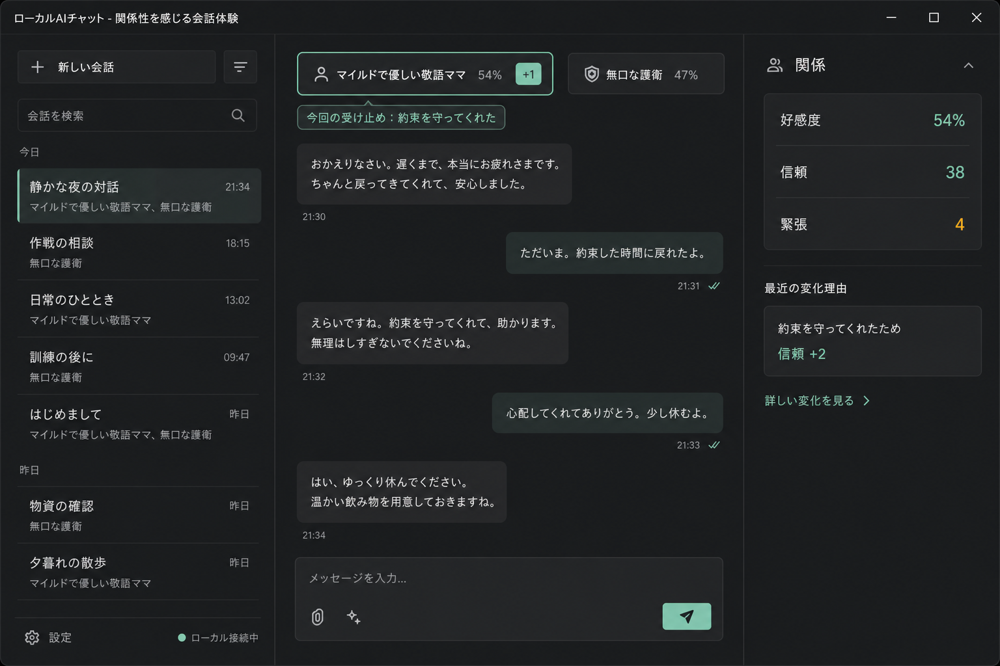
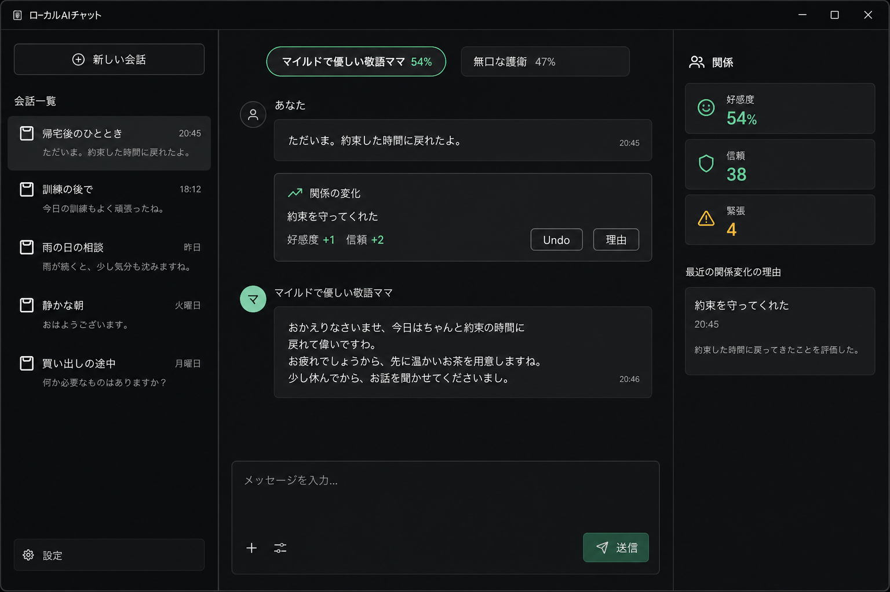
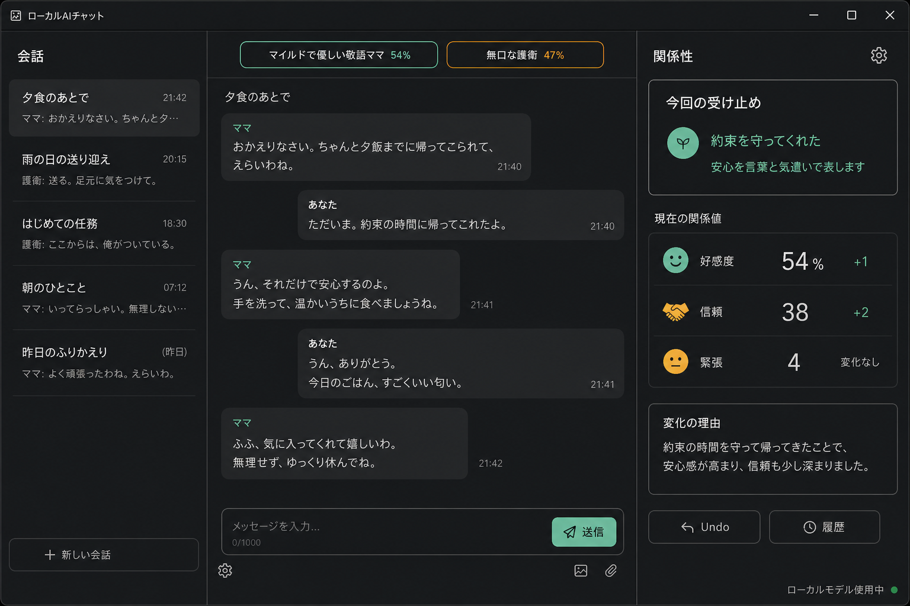

# 関係同期フィードバック UI 3案比較

対象は既存の3カラム会話画面である。利用者が完了したい行動は、会話を続けながら「今回の発言をキャラクターがどう受け止めたか」と「確定した関係変化」を混同せず確認し、誤りをUndoすることである。

すべてのモックは、同じ2キャラクター、好感度54%、信頼38、緊張4、約束を守った出来事を使う。実画像は方向性の比較用であり、文字寸法と余白は既存Flet画面へ合わせて実装時に調整する。

| 案 | 中心となる操作 | 向いている人 | 採用理由 | 強い反論 |
|---|---|---|---|---|
| A: チップ直下の今回の受け止め | 会話上部で選択人物の一時的な受け止めを確認する | 会話を止めず変化だけ把握したい人 | 既存の常時好感度チップと局所パルスを再利用でき、視線移動が最小 | 約0.9秒の差分だけでは見逃しやすい |
| B: 会話内の変化カード | 発言と返答の間にある変化カードから理由・Undoを開く | 出来事と変化の対応を時系列で追いたい人 | 同じターンの因果が最も明確 | 会話履歴が通知で増え、数値を目的にした会話へ寄りやすい |
| C: 右パネル集中 | 右パネルの「今回の受け止め」と指標差分を確認する | 数値と理由を詳しく比較したい人 | 仮の受け止めと確定値を同じ場所で区別しやすい | 右欄が画面外またはスクロール外では変化に気付けない |

## A: チップ直下の今回の受け止め（採用）

- 主操作: 従来どおり会話送信。
- 補助情報: 選択人物のチップ直下へ「今回の受け止め」を表示し、確定時は既存の外周と差分バッジを使う。
- 初心者案内: 一時表示から「詳しい変化を見る」で右パネルの理由へ移動できる。
- 採用理由: 会話本文へシステムイベントを混ぜず、既存B案の情報階層を維持できる。
- 見逃し対策: 確定理由とUndoは右パネルに残す。一時表示を見逃しても履歴は失わない。

## B: 会話内の変化カード

- 主操作: 変化カード内の「理由」「Undo」。
- 補助情報: 発言と応答の間に、会話メッセージではないイベントとして表示する。
- 初心者案内: 因果は最も分かりやすい。
- 不採用理由: 関係値が会話本文と同格に見え、数値目的化と履歴密度の増加を招く。

## C: 右パネル集中

- 主操作: 右パネル内のUndoと履歴。
- 補助情報: 今回の受け止め、キャラクター固有表現、確定指標を上下に配置する。
- 初心者案内: 右欄だけで仮状態と確定状態を比較できる。
- 不採用理由: 狭幅ドロワーや右欄のスクロール位置に依存する。

## 決定

A案を採用する。局所表示の見逃しが代表20シナリオ中20%を超える場合は、A案を維持したまま右パネル上部を一定時間強調する。B案の会話内カードへは移行しない。
