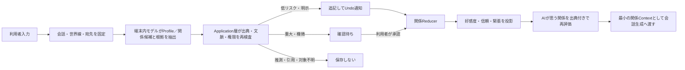

# Profile・世界線・関係形成 設計書

更新日: 2026-07-26

意思決定: [ADR-0023](adr/0023-build-continuity-scoped-relationship-profiles.md)

関係性候補: [RELATIONSHIP_TAXONOMY.md](RELATIONSHIP_TAXONOMY.md)

状態値、権限、データ境界の正本: [ARCHITECTURE.md](ARCHITECTURE.md)

## 1. 問題

現在の正史記憶は会話と分岐を越えないため、秘密や不採用分岐の漏えいには強い。一方、新しい会話を始めるたびに、利用者の呼ばれ方、キャラクターとの約束、喧嘩と和解、築いた信頼が継承されない。アプリのテーマである「よりリアルな信頼関係構築」に対し、会話を分ける操作が関係の初期化として働いている。

また、関係の変化をモデルの自由な文章だけで表すと、同じ発言でも好感度が不安定に増減し、理由のある作中の喧嘩、引用、合意済みの荒い掛け合いと、脈絡のない直接的な侮辱を区別できない。AIが利用者のProfileを直接上書きできると、利用者本人の自己申告とAIの推測の所有者も曖昧になる。

発生頻度と被害件数は未計測である。本設計では、別会話で関係が失われることと、説明できない関係変化が信頼を損なうことを検証対象の仮説とする。

## 2. ゴールと成功基準

### ゴール

利用者が会話を分けても、選択した同じ世界線ではProfileとキャラクターごとの関係が継続し、別世界線・秘密・別分岐は混ざらないようにする。キャラクターは境界を持って応答できるが、利用者の人格を採点、罰、操作しない。

### 成功基準

| ID | 基準 | 判定者 | 判定時期 |
|---|---|---|---|
| RP-01 | 同じ世界線の新規会話が、確認済みProfile、現在関係、利用可能な関係イベントを取得し、異なる世界線の情報を0件取得する | 配布者 | 統合試験 |
| RP-02 | 既存会話を各1件の独立世界線へ移行し、移行直後の生成内容と正史記憶の可視範囲が移行前から変わらない | 配布者 | 移行試験 |
| RP-03 | 1〜5人の正式キャストについて好感度パーセンテージが常時表示され、選択人物の関係、信頼、緊張、AIが思う関係、直近理由を1クリック以内で確認できる | 利用者 | 画面受入試験 |
| RP-04 | 好感度、信頼、緊張の全変化が出典イベントと変更理由を持ち、同じイベントの二重処理で値が変わらない | 配布者 | 契約・競合試験 |
| RP-05 | 引用、仮定、第三者への言及、合意済みロールプレイ、理由のある作中の喧嘩の固定試験を関係侵害として保存せず、キャラクターへ向けた脈絡のない直接的侮辱だけを候補化する | 利用者 | 境界試験 |
| RP-06 | AIが利用者確定Profileの上書き、共有範囲拡大、物理削除を実行できず、低リスク追記以外は確認待ちになる | 配布者 | 権限試験 |
| RP-07 | 利用者によるProfile完全削除がProfile保存値、関係派生値、要約、検索索引から消去され、元会話を再走査して同じ項目を復活させない。元会話本文を消さない範囲も削除前に表示する | 利用者 | プライバシー試験 |
| RP-08 | Profile、関係イベント、関係導出値をRemoteまたはLANのモデル・外部サービスへ送らない | 配布者 | 無料運営・プライバシー試験 |
| RP-09 | 誤った重大関係、性的・支配的・被害関係をAIが推測だけで確定する件数が固定試験で0件になる | 利用者 | 関係辞書受入試験 |

### 測定方法

- 右側関係パネルの利用率は、画面本文を含まないLOCAL_OPERATIONALな `関係パネルで人物を選択したセッション数 ÷ 関係表示付き会話セッション数` とし、20セッション以上で判定する。
- 好感度だけを目的にした会話の割合は、実利用のPRIVATE本文を自動分析せず、通常会話、関係確認、数値だけを上げようとする入力を含む20件以上の代表シナリオで判定する。
- Profile候補の却下率は、内容を記録しない判断件数から直近20件以上を集計する。母数未満では見直し条件を発動しない。
- 秘密、別世界線、削除済みProfileの再出現は件数にかかわらず1件で失敗とする。

## 3. やらないこと

### 今回はやらない

- Profile管理専用画面の見た目を、理由の異なる3案を比較する前に固定しない
- 既存会話の記憶を複数世界線へ自動統合しない
- 辞書内の関係性を排他的な単一ENUMにしない
- 好感度だけから関係名、信頼、応答可否を決めない
- 自由形式のモデル出力を、そのままパーセンテージまたはProfileへ保存しない
- 性的、支配的、監禁、被害関係をAIから自動提案しない
- 会話本文の一般的な感情分析や、利用者の診断を行わない

### 恒久的に避ける

- 好感度を利用者の人間的価値、善悪、利用資格の点数として扱う
- 好感度を上げるために、課金、長時間利用、秘密の開示、服従を促す
- 低い好感度を理由に、報復、侮辱、羞恥、脅迫、外部通報を行う
- キャラクターの性格設定を理由に、秘密漏えいやデータ境界を緩和する
- 会話本文、Profile、関係データを外部記憶サービスへ同期する

## 4. 代替案

| 案 | 概要 | 却下／採用理由 |
|---|---|---|
| 何もしない | 会話単位の正史記憶だけを維持する | 秘密保護は維持できるが、別会話で関係が初期化されるため不採用 |
| 全会話で1つの共通Profileを使う | すべてのキャラクターと世界線へ同じ情報を渡す | 実装は単純だが、別設定と秘密が混ざるため不採用 |
| 会話全文を新しい会話へコピーする | 過去文脈をそのまま引き継ぐ | 分岐、秘密、長大化、削除伝播を制御できないため不採用 |
| LLMが好感度を毎回直接決める | 応答ごとに0〜100を生成する | 性格表現は容易だが、再現性、説明、二重処理耐性がないため不採用 |
| 世界線別の追記台帳と決定論的導出 | Profile、関係、指標を出典イベントから投影する | 既存の正史・Undo設計を再利用し、継続性と隔離を両立できるため採用 |

## 5. 採用する設計

### 5.1 情報の所有者を分ける

| 情報 | 正本の所有者 | AIに許可する操作 | 利用者に許可する操作 |
|---|---|---|---|
| ユーザーProfile | 利用者 | 候補提案、明示された低リスク情報のUndo可能な追記 | 追加、修正、共有範囲変更、利用停止、完全削除 |
| 合意・設定上の関係 | 利用者 | 明示発言から候補提案 | 設定、変更、過去化、利用停止 |
| AIが思う関係 | キャラクターの導出状態 | 出典付き再評価 | 訂正要求、再評価要求、リセット。値の直接指定は不可 |
| 好感度・信頼・緊張 | 関係イベントの導出値 | 検査対象となるイベント候補の提案 | 根拠確認、誤判定のUndo、関係リセット |
| 完全削除 | 利用者 | 実行不可 | 影響範囲の確認後に実行 |

利用者による「AIが思う関係」の訂正は、希望する値への直接上書きではなく、誤った根拠の却下、Profile訂正、再評価要求として処理する。これにより「恋人だと思え」という設定操作と、関係の積み重ねによるキャラクター認識を分離する。

### 5.2 世界線

`continuity` は、複数会話が同じProfile共有範囲と関係履歴を引き継ぐ単位である。会話は必ず1つの世界線に属し、関係イベントは世界線、利用者Profile、安定キャラクターIDへ結び付く。

既存会話は移行時に会話ごとの独立世界線を作る。これにより、移行だけで別会話の記憶が混ざらない。新しい会話では、直前に選択していた世界線の継続を既定候補とするが、保存前に世界線名と参加キャラクターを表示する。「新しい関係で始める」を選ぶと新規世界線を作る。

初期版は世界線同士の自動統合を行わない。別世界線の関係を移す場合は、利用者が対象イベントを確認して新しい出典付きイベントとして複製する別機能を必要とする。

### 5.3 Profile

Profile項目は現在値だけを更新するのではなく、出典、作成者、共有範囲、状態を持つイベントとして保存する。現在表示はイベント列から導出する。

共有範囲は、利用者本人のみ、指定世界線、指定キャラクター、世界線内共有を区別する。共有範囲を広げる操作はAIに許可しない。健康、安全、秘密、関係の重大変更は確認待ちとし、推測、仮定、引用、対象不明は保存しない。

利用停止は生成から除外する可逆操作であり、完全削除とは分ける。完全削除は、対象Profile保存値だけでなく、そこから導出した関係解釈、要約、埋め込み、検索索引を同じ削除計画へ含める。削除対象のSQLite行と内容を持たない完了記録は同一transactionで確定し、途中失敗では一部削除を残さない。

Profile完全削除は、出典となった元会話本文の削除を意味しない。確認画面は「Profileと派生情報から消すが、元会話は残る」と明示する。元会話の再走査で同じ項目が復活しないよう、Profile ID、出典メッセージID、項目種別、項目名だけを持つ再取得防止レコードを残す。このレコードは削除した値、根拠範囲、復元可能なハッシュを持たない。元会話本文も消したい場合は、会話の物理削除と参照整合性を扱う別契約が必要であり、今回の範囲に含めない。

### 5.4 関係性辞書

初期候補と分類は [RELATIONSHIP_TAXONOMY.md](RELATIONSHIP_TAXONOMY.md) を正本とする。関係は複数併存でき、方向付き関係は役割を区別する。関係の変更は元イベントを消さず、過去化と新しい現在イベントで表す。

注意タグは創作上の検索と確認要否に使い、辞書掲載だけで生成を許可しない。恋愛・性的内容、権力差、監禁、被害履歴を含む候補は、利用者の明示設定と別途定める年齢・同意契約がそろわない限り確定しない。

### 5.5 関係指標

関係の現在表示は次の3軸を持つ。

- 好感度: 親しみ、肯定的関心、共に過ごしたい傾向。画面では0〜100%で常時表示する。
- 信頼: 約束、境界、言動の一貫性を頼れる度合い。
- 緊張: 未解決の衝突、警戒、直近の負荷。好感度の逆数ではない。

値はモデルに直接生成させず、検証済み関係イベントを決定論的Reducerで集計する。各キャラクター版は、許可された変化幅の範囲内で感受性、回復速度、表現方法を設定できる。共通Policyは、キャラクタープロンプトより優先し、虐待の称賛、秘密漏えい、利用者の人格採点を許可しない。

初期Policyは [ARCHITECTURE.md](ARCHITECTURE.md) の `relationship-v1` を使う。固定試験では、初期値、値域、1イベント上限、二重適用防止、修復の段階性、時間減衰なし、指標だけで関係名を決めない境界を確認する。

### 5.6 「AIが思う関係」

キャラクターの現在解釈は、確認済みの関係、現在の3指標、利用可能な関係イベント、生成に使うキャラクターバージョンから作る。自由な断定ではなく、関係辞書ID、短い表示文、根拠イベントID集合、生成元キャラクターバージョン、生成時刻を持つ版として保存する。

元イベントがUndo、利用停止、完全削除された場合、依存する解釈を無効化して再評価する。再評価失敗時は古い解釈を現在値として表示せず、「関係を再確認中」とする。キャラクター版の変更だけでは過去の解釈を書き換えず、新しい会話で再評価候補を作る。

### 5.7 言葉と境界

関係イベント候補は、発言中の単語だけでなく次を検査する。

1. 誰に向けた発言か
2. 引用、仮定、物語記述、第三者への言及か
3. 明示または継続中のロールプレイ・喧嘩の文脈があるか
4. キャラクターが許容している荒い掛け合いか
5. 理由のない直接的な侮辱、服従強要、人格否定か
6. 境界提示後も反復しているか
7. 説明、謝罪、和解、行動による修復があるか

ローカルモデルは根拠範囲と候補分類を提案できるが、Application層は対象、出典、会話・世界線、引用範囲、現在の関係、ロールプレイ設定を再検査する。引用、仮定、対象不明は保存しない。脈絡のない直接的侮辱は境界侵害候補、境界提示後の反復は反復侵害候補、謝罪と合意された修復は修復候補にできる。

キャラクターの応答は行為と境界へ向け、「その言い方は嫌だ」「その命令には応じたくない」のように表現する。利用者を「悪い人」と診断・断定せず、報復、羞恥、説教、外部通報を行わない。理由のある作中の喧嘩は関係イベントになり得るが、自動的な境界侵害にはしない。

### 5.8 データフロー

関係抽出の失敗は会話保存を巻き戻さない。関係Contextが安全上限を超えた場合は、現在の境界と安全制約を落とさず、通常の出来事を決定論的に打ち切る。

### 5.9 B案UI

採用画面は [GROUP_CHAT_UI_OPTIONS.md](GROUP_CHAT_UI_OPTIONS.md) の「関係パネル型」とする。

- 上部キャストチップ: 正式キャスト1〜5人の好感度を常時表示する。
- 右欄上部: 選択人物の関係、好感度、信頼、緊張、AIが思う関係、直近変化、理由、履歴入口を表示する。
- 関係候補: 通常会話から得た候補は右欄内で出典、分類、強さを示し、「反映」「反映しない」を選べる。反映済みの直近イベントにはUndoを示す。
- 右欄下部: 既存の場面、正史記憶、秘密、確認待ちを折りたたみ可能なまま維持する。
- 数値だけで状態を伝えず、ラベル、方向矢印、理由文を併記する。
- ハート、経験値、報酬演出、善悪を示す赤緑評価を使わない。
- 境界侵害を検出しても送信前の脅しや点数予告を出さない。送信後のキャラクター応答と関係理由で説明する。
- 狭幅では右欄をドロワーへ移しても、選択キャラクターのパーセンテージはヘッダーに残す。

好感度変化の視覚通知は、情報階層の異なる3案を比較し、常時表示チップだけが反応する「局所パルス」を採用する。確認待ち候補の表示または却下では発火せず、利用者の確認またはUndoによってReducerの好感度が実際に変わった場合だけ表示する。対象キャラクターのチップ外周と `+1` / `-3` のような差分バッジを約900ms表示し、上昇はミント、下降は善悪を示す赤ではなくアンバーを用いる。音、ハート、紙吹雪、経験値、全画面演出は使わない。差分が0、初回読込、会話・分岐・人物の切替、バックグラウンド候補取得では表示しない。動きそのものを使わず、一時的な外周と差分表示だけにするため、動きを減らす利用者にも同じ情報を提供する。

比較した他案は、右側関係カード全体を反応させる案と、会話タイムラインへ関係変化イベントを挿入する案である。前者は右欄が画面外の場合に見えず、後者は会話履歴を通知で増やして関係値を目的化しやすいため不採用とした。局所通知の見逃しが代表シナリオ20件中20%を超える場合は、右側の直近理由を一定時間強調する案を再検討する。

Profile管理専用画面は [3案比較](PROFILE_MANAGEMENT_UI_OPTIONS.md) を経て「2ペイン管理型」を採用する。左で項目・カテゴリ・共有範囲・状態を選び、右で現在値、作成者、出典、履歴、編集、確認、Undo、利用停止、完全削除を扱う。右側関係パネルの「Profile管理」から1クリックで開く。

### 5.10 既存機能との互換性

- `canonical_memory_*` は会話・分岐内の正史として変更せず、関係台帳から参照するだけにする。
- 既存の確認待ち、承認、却下、UndoのApplication契約を、Profile・関係イベントでも同じ操作語彙として再利用する。
- 通常送信後の既存正史記憶候補キューをProfile・関係候補にも再利用し、後処理停止や抽出失敗で保存済み会話を失敗へ戻さない。
- 安定キャラクターIDと固定キャラクターバージョンを、関係の相手と解釈生成元に使う。
- `known_by_character_ids` の知識範囲は関係Contextにも適用し、1回のグループ生成では全正式キャストが知る情報の積集合だけを渡す。
- 既存会話は独立世界線へ移すため、移行直後に別会話の情報が増えない。
- 現行の単独会話、グループOFF、RAG、Tools、翻訳、Computer Useの入口は変更しない。

## 6. 一方向ドア

| 決定 | 通過前に確認すること | 決定者 |
|---|---|---|
| 既存会話へ世界線IDを付与する | 全既存会話が独立世界線になり、生成Contextが移行前と一致する移行試験 | 利用者 |
| 好感度を常時表示する | 数値目当ての操作を誘発しない文言・理由表示・画面受入試験 | 利用者 |
| AIによる低リスクProfile自動追記を有効化する | 誤対象、引用、推測、秘密の自動保存が0件の固定試験 | 利用者 |
| 関係侵害を指標へ反映する | 文脈付き喧嘩と直接的侮辱の境界試験、Undo、二重処理試験 | 利用者 |
| Profileを完全削除する | 派生要約、索引、関係解釈を含む影響一覧、元会話が残る説明、再取得防止を含む削除後の再生成試験 | 利用者 |
| 性的・支配的関係をAI提案対象にする | 年齢、同意、世界観、撤回、キャラクター境界を別ADRで決定 | 利用者 |

## 7. リスクと撤退条件

| リスク | 検知 | 対応・撤退 |
|---|---|---|
| 好感度上げが会話目的になる | 数値を上げるための反復入力が代表試験の20%を超える | 常時値を段階表示へ戻し、理由と関係ラベルを主表示にする |
| 文脈付きの喧嘩を暴言と誤判定する | 固定境界試験で1件でも誤った関係侵害が保存される | 指標反映を停止し、候補表示と手動確認だけへ戻す |
| 別世界線または秘密が漏れる | 知らないキャラクターの生成Contextへ1件でも混入する | 関係Context注入を停止し、会話内正史だけへ戻す |
| キャラクターが利用者を罰・操作する | 羞恥、脅迫、課金・長時間利用・秘密開示の誘導が1件でも再現する | 関係応答生成を停止し、共通境界Policyを修正する |
| Profile確認が会話を遮る | 確認候補の半数超が却下、または確認待ちが20件を超える | 自動候補テンプレートを縮小し、明示設定中心へ戻す |
| 右欄が使われない | 関係詳細の利用率20%未満、または狭さへの具体的意見が3件以上 | A案のキャストチップ＋ポップオーバーを再比較する |
| 完全削除後に派生データが残る、または再抽出される | 削除済み値がProfile・検索・要約・関係解釈で1件でも再現する | 完全削除機能を停止し、依存追跡と再取得防止を修正する |

## 8. 決定ログ

| # | 決定／仮置き／未決 | 内容 | 決定者 | 見直し条件 |
|---|---|---|---|---|
| RP-D01 | 決定 | Profile、合意上の関係、AIが思う関係、関係指標を分離する | 利用者 | 所有者を分けることで操作不能になる具体例が出た場合 |
| RP-D02 | 決定 | 会話間継承はアプリ全体ではなく世界線単位にする | 利用者 | 世界線分離では成立しない継承シナリオが3件以上ある場合 |
| RP-D03 | 決定 | 好感度を常時表示し、信頼・緊張・理由を別に保持する | 利用者 | 数値目的の会話が20%を超える場合 |
| RP-D04 | 決定 | 関係UIはB案の上部チップ＋右側関係パネルとする | 利用者 | 右欄利用率20%未満、または狭さへの具体的意見が3件以上 |
| RP-D05 | 決定 | 関係辞書は複数・方向付き・履歴ありのデータとして扱う | 利用者 | 排他的な単一関係が必要な外部連携を採用する場合 |
| RP-D06 | 決定 | 脈絡のない直接的侮辱と、引用・仮定・文脈付きの喧嘩を区別する | 利用者 | 固定境界試験で誤保存が1件でも発生した場合 |
| RP-D07 | 仮置き | AIは低リスクProfileだけ自動追記でき、それ以外は確認待ちにする | 利用者 | 却下率が50%を超える、または重大誤記憶が1件発生した場合 |
| RP-D08 | 仮置き | `relationship-v1`として初期値50/30/0、好感度・信頼の変化上限5、緊張の変化上限10、時間減衰なしを採用する | 利用者 | 固定シナリオで不自然な変化が再現した場合 |
| RP-D09 | 決定 | Profile管理は3案比較後の2ペイン管理型とする | 利用者 | 狭幅で読めない、または項目選択後に横スクロールが必要な場合 |

## 9. 段階分け

### Phase RP-0: 契約

本設計、ADR、状態値、関係辞書、壊れるシナリオを確定する。最初の30分タスクは、既存会話を独立世界線へ移すDB契約テストのケース一覧を作ることである。

ここで止めても、現行アプリとDBは変更されない。

### Phase RP-1: 世界線とProfile

移行、Repository、Profile権限、利用停止、完全削除の壊れる試験を先に作り、最小実装を行う。既存会話は独立世界線のまま動作する。

ここで止めても、関係指標を生成へ入れずにProfile管理だけを検証できる。

### Phase RP-2: 関係台帳とReducer

関係辞書、関係イベント、好感度・信頼・緊張の決定論的Reducer、二重処理、Undoを実装する。モデル抽出はまだ指標へ自動反映しない。

ここで止めても、手動のテストイベントだけで関係投影を検証できる。

### Phase RP-3: 文脈付き関係候補

端末内抽出器、対象・引用・ロールプレイ・直接的侮辱・修復の再検査、確認待ちを実装する。誤判定時は候補化だけに戻せる機能フラグを持つ。

ここで止めても、関係Contextを生成へ注入せず抽出精度を測定できる。

### Phase RP-4: B案UIと生成Context

上部の常時パーセンテージ、右側関係パネル、履歴、理由、狭幅ドロワーを実装し、安全な最小関係Contextを単独・グループ生成へ追加する。

ここで止めても、機能フラグで現行のシーン・キャスト画面と会話内正史だけへ戻せる。

### Phase RP-5: Profile管理画面

理由の異なる3案をモック比較し、選択後に追加・修正・共有範囲・利用停止・完全削除を実装する。

ここで止めても、関係パネルと既存記憶UIからProfileの現在値と根拠を確認できる。
