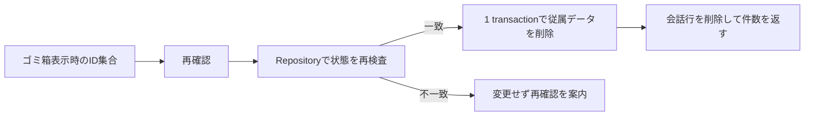

# ゴミ箱内会話の一括完全削除 設計書

この文書は完全削除の目的、画面、Application契約、SQLite削除範囲を定める。会話状態とデータ境界の正本は [ARCHITECTURE.md](ARCHITECTURE.md) とし、この文書へ重複定義しない。

## 1. 問題

ゴミ箱へ移動した会話は復元できるが、不要になった会話をアプリ内から除去できず、会話本文や派生データがローカルDBへ残り続ける。利用頻度と保存量の実測は未確認であり、困りごとの強さは利用者申告に基づく。

## 2. ゴールと成功基準

利用者がゴミ箱内の全会話を、復元不能であることと対象件数を確認した後に一括削除できる。

- ゴミ箱が空なら完全削除操作を表示しない。
- 確認を取り消した場合はDBを変更しない。
- 確認画面へ表示した会話ID集合だけを、1回のSQLite transactionで削除する。
- 確認後に対象の一部が復元・追加・削除されていた場合は、部分削除せず再確認を求める。
- 通常一覧の会話、共有キャラクター、モデル設定、RAG文書を変更しない。
- 同じ削除要求を完了後に再送した場合は0件成功とし、別データを削除しない。
- Repository、Application、Presentationの自動試験で上記を確認する。

判定者は利用者と開発者、判定時期はIssue #46の完了確認時とする。

## 3. やらないこと (Out of Scope)

- 通常一覧からの直接完全削除
- 会話を選択して一部だけ完全削除
- 保存期間による自動削除
- OSファイル、RAG原本、外部サービスの削除
- 完全削除後のUndo
- SQLiteファイルの空き領域を即時回収する `VACUUM`

## 4. 代替案

| 案 | 概要 | 却下/採用理由 |
|---|---|---|
| 何もしない | ゴミ箱移動と復元だけを維持する | データを利用者自身で除去できないため却下 |
| 1件ずつ削除 | 各会話行へ完全削除を置く | 誤操作の影響は小さいが、多数の会話を処理する目的を満たしにくいため今回は却下 |
| 選択式 | チェックした会話だけを削除・復元する | 柔軟だが操作と状態管理が増えるため初回は却下 |
| 危険領域から一括削除 | 復元一覧と分離した領域から、表示済み全件を再確認して削除する | 安全性と発見性のバランスを優先して採用 |

## 5. 採用する設計

### 5.1 画面

ゴミ箱ダイアログ下部へ、通常の「戻す」操作と分離した `完全削除` 領域を置く。領域には「削除した会話は元に戻せません」と対象件数を表示する。押下後は別の確認ダイアログで件数と復元不能を再表示し、`キャンセル` と `N件を完全に削除` を並べる。

### 5.2 Application契約

`ConversationService.empty_trash(conversation_ids: tuple[str, ...]) -> int` は、ゴミ箱表示時に取得した順序付きID集合をRepositoryへ渡し、実際に削除した件数を返す。空集合は0件成功とする。

Repositoryは次を同一transactionで行う。

1. IDの重複を拒否する。
2. 全IDが存在し、すべて `archived_at IS NOT NULL` であることを確認する。
3. 全IDが既に存在しない場合だけ、完了済み要求の再送として0を返す。
4. 一部不在、通常一覧への復元、表示後の追加を検出した場合は変更せず拒否する。
5. 会話専用データを外部キーの子から順に削除し、最後に会話行を削除する。

信頼境界はPresentationから渡る会話IDである。IDはDB由来でも再検査し、通常一覧の会話を削除しない。失敗の半径は要求された会話集合に限定し、例外時はtransaction全体をrollbackする。

### 5.3 SQLite削除範囲

削除対象は、対象会話に所属するメッセージ、分岐、Run、翻訳、観測値、RAG選択・引用、ツール許可・監査、要約、Agent/Computer Use監査、正史記憶、明示記憶、TurnBatch、キャスト、グループ設定、および対象会話を出典とするProfile・関係イベントとその派生データである。対象Profileイベントを置換元とする後続イベントも、削除済み情報を残さないため同じtransactionで削除する。手動作成または別会話を出典とするProfile・関係イベント、共有キャラクター、キャラクターバージョン、モデル設定、RAG文書とチャンクは残す。

正史記憶の通常操作は追記専用を維持する。完全削除transactionだけが一時的な削除ガードを持ち、ガードがない個別DELETEは従来どおりDB triggerで拒否する。削除ガードはtransaction内で作成・消費し、完了後に残さない。

翻訳の再利用元が削除対象を指す場合、存続する翻訳本文は維持し、復元不能になった再利用元参照だけをNULLへ変更する。

## 6. 一方向ドア

完全削除の確定だけが一方向ドアである。通過前に、対象件数、復元不能、通常一覧を含まないことを画面とRepository試験で確認する。UI確認だけを安全境界にせず、Repositoryが最終判定する。

## 7. リスクと撤退条件

| リスク | 検知 | 対応・撤退 |
|---|---|---|
| 通常会話を削除する | `archived_at IS NULL` が対象へ混入 | transactionを開始前の状態へ戻し、機能を無効化する |
| 一部だけ消える | 外部キー違反、注入した途中失敗 | transaction全体をrollbackし、削除順を修正する |
| 共有データを消す | キャラクター、モデル、文書の件数が減る | 変更をrevertし、共有表を削除対象から外す |
| 確認対象と実行対象がずれる | ID集合または状態が表示時から変化 | 削除せずゴミ箱を再表示する |
| 操作が見つからない | 利用者がゴミ箱から削除できないと再申告 | 危険領域をスクロール外へ置かない配置へ見直す |

## 8. 決定ログ

| # | 決定/仮置き/未決 | 内容 | 決定者 | 見直し条件 |
|---|---|---|---|---|
| TD-01 | 決定 | 初回からゴミ箱内の全会話を一括削除する | 利用者 | 一部だけ残したい要望が発生した場合 |
| TD-02 | 決定 | C案の分離された完全削除領域を採用する | 利用者 | 操作を発見できない実例が発生した場合 |
| TD-03 | 決定 | 表示済みID集合へ要求を束縛し、内容変更時は部分削除しない | 利用者 | なし |
| TD-04 | 仮置き | 空き領域の即時回収は行わない | 開発者 | DB容量が削除後も日常利用を妨げた場合 |

## 9. 段階分け

1. 30分以内で契約、異常系、削除対象表を文書とテストへ固定する。この時点では既存機能は変わらない。
2. Repositoryの原子的削除を実装する。この時点でUI未接続でも自動試験できる。
3. C案UIと再確認を接続し、全検査を行う。この時点で利用者が機能を完了できる。
